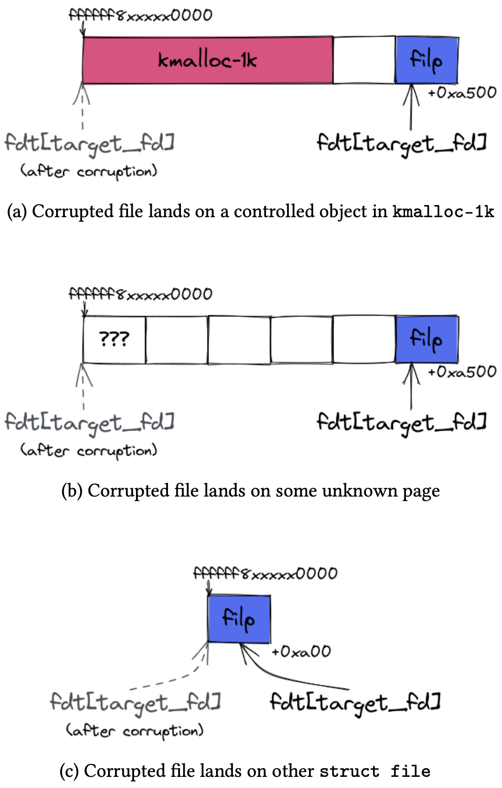

# Binder

* [参考1](https://androidoffsec.withgoogle.com/posts/attacking-android-binder-analysis-and-exploitation-of-cve-2023-20938/#binder)
* [参考2](https://0xkol.github.io/assets/files/Racing_Against_the_Lock__Exploiting_Spinlock_UAF_in_the_Android_Kernel.pdf)

Binder 是 Android 上主要的进程间通信（IPC）通道。它支持跨进程传递文件描述符和包含指针的对象等多种功能。**Binder 由 Android 平台提供的用户空间库（libbinder 和 libhwbinder）以及 Android 通用内核中的内核驱动组成**。因此，它为 Java 和本地代码提供了一个可通过 AIDL 定义的通用 IPC 接口。术语 “Binder” 常被用来泛指其实现的多个部分（Android SDK 中甚至有一个名为 Binder 的 Java 类），但在本文中，除非另有说明，“Binder” 指的是 Binder 设备驱动。

## Binder 设备驱动（/dev/binder）

Android 上所有不受信任的应用都处于沙箱中，进程间通信主要通过 Binder 进行。同时，Android 上 Chrome 的渲染进程被赋予了比不受信任应用更受限的 SELinux 上下文 `isolated_app`。尽管如此，它仍可以访问 Binder 以及一小部分 Android 服务。因此，Binder 成为一个暴露面广泛的攻击面，因为每个不受信任或受限的应用默认都可以访问它。

为了实现高性能的 IPC，Binder 拥有极其复杂的对象生命周期管理、内存管理和并发线程模型。为说明其复杂度，我们在实现驱动的 6.5k 行代码中统计出了三种不同类型的并发同步原语（5 个锁、6 个引用计数器以及一些原子变量）。Binder 的锁机制也非常细粒度，以提升性能，这进一步增加了代码的复杂性。

近年来，攻击者利用 Binder 中的多个安全问题（主要是 use-after-free 漏洞）成功发起了一系列攻击。这些漏洞源自多种根本原因，包括清理逻辑不当（CVE-2019-2215 和 CVE-2022-20421）、数据竞争（CVE-2020-0423）以及对象内部的越界访问（CVE-2020-0041）。本文介绍的 use-after-free 漏洞则源于处理 Binder 事务时清理逻辑错误，导致引用计数错误。

## Binder设备生命周期

当进程需要通过Binder进行通信时，需先用open打开Binder设备。内核中会调用`binder_open()`函数。该函数首先通过`kzalloc()`分配一个名为`binder_proc`的结构体，初始化后通过文件的`private_data`字段将其与打开的文件描述符关联。  

`binder_proc`结构体包含以下关键字段：  
* `threads`：存储该进程所属`binder_thread`对象的红黑树。  
* `nodes`：存储该进程所属`binder_node`对象的红黑树。  
* `refs_by_desc`、`refs_by_node`：按不同键排序的`binder_ref`对象红黑树。  
* `tmp_ref`：引用计数。归零时释放结构体。  
* `inner_lock`、`outer_lock`：用于线程安全的自旋锁。  

当用户态不再使用Binder服务时，关闭其Binder文件描述符：

```c
close(binder_fd);
```  

内核中会调用`binder_release()`函数。该函数不会立即清理`binder_proc`结构体，而是通过延迟工作（deferred work）机制处理。实际清理逻辑位于`binder_deferred_release(proc)`，具体步骤如下：  
1. 从全局列表移除：将`proc`从系统级`binder_procs`列表中移除。  
2. 标记终止状态：递增`proc`的引用计数，并设置其`is_dead`标志为`true`。  
3. 释放线程：调用`binder_thread_release(proc, thread)`释放所有关联的`binder_thread`。  
4. 释放节点：调用`binder_node_release(node)`释放进程拥有的所有`binder_node`。  
5. 释放引用：对每个引用调用`binder_cleanup_ref_olocked(ref)`和`binder_free_ref(ref)`。  
6. 清理工作项：  
   ```c
   binder_release_work(proc, &proc->todo);
   binder_release_work(proc, &proc->delivered_death);
   ```  
7. 最终释放：递减`proc`的引用计数，若归零则调用`binder_proc_dec_tmpref(proc)`释放结构体。  

## Binder事务

需要明确的是，Binder框架中交换的消息被称为事务（transactions）。事务除了可以包含原始数据外，还可以选择性地包含对象。Binder支持7种类型的对象，这些对象通过BINDER_TYPE_*常量来标识（参见include/uapi/linux/android/binder.h）。

这些对象包括：支持在进程间传递文件描述符的对象（FD和FDA）、支持分散-聚集（scatter-gather）功能的对象（PTR），以及最重要的，支持Binder框架本身的对象（BINDER、HANDLE及其"weak"变体）。


当内核驱动处理事务时，它会处理每个嵌入的对象，并执行所有必要的操作将其传递到另一端。这个过程被称为对象转换（object translation）。每种对象类型都需要采取不同的转换操作。例如，假设进程A想要将文件描述符10传递给进程B。为此，进程A会准备一个新事务，其中包含一个类型为FD的对象，指定fd编号为10。在事务处理过程中，内核将在进程B中分配一个新的未使用的fd（假设是54），并将这个新fd链接到与进程A相同的底层文件。当进程B读取该事务时，它将看到一个类型为FD的对象，其中包含fd编号54，可以用于进一步的交互。需要注意的是，驱动程序会改变被转换对象的细节（在本例中是fd编号），以便这些细节在另一端读取时是有意义的。

对象转换可能由于多种原因而失败，包括权限不足（SELinux检查）、用户指定的对象不正确或内部错误（例如内存分配失败或其他逻辑差异）。当某个对象转换失败时，整个事务将被视为错误，不会传递到另一端。在错误代码流程中，驱动程序会清理事务缓冲区，有效地撤销已经成功转换的对象的转换。然而，导致错误的对象不会被清理。这是合理的，因为负责转换的函数在返回错误时应该自行清理（外部代码流程不知道转换过程中的哪一步失败了）。

## Binder对象与引用

要与一个进程通信，发送方进程必须拥有一个指向目标进程所拥有的 Binder 对象的引用。（当我们说“Binder 对象”时，我们指的是一种类型为“Binder”的对象。）以这种方式，Binder 对象作为 Binder 事务的一个端点。

根据引用它的进程不同，Binder 对象的标识方式也不同。从拥有该 Binder 对象的进程的角度来看，它们通过一个称为 ptr 的 8 字节值来标识，该值对内核而言是不透明的。我们将以这种方式标识的 Binder 对象称为本地 Binder 对象。本地 Binder 对象在内核中使用 binder_node 结构表示。

其他进程使用一个称为 handle 的 32 位值来引用目标进程的 Binder 对象。当以这种方式标识时，它们被称为远程 Binder 对象。在内部，handle 值被映射到一个称为 binder_ref 的内核对象，该对象进一步引用 binder_node。见下图。


Binder 对象是唯一且不可伪造的。内核通过维护它们的身份来确保其唯一性。
* 内核确保每个进程中对于给定的 ptr 只存在一个本地 Binder 对象。
* 内核还确保一个进程只能为某个特定 Binder 对象持有一个引用。

一个进程可以将 Binder 对象传递给另一个进程，从而赋予另一个进程访问该对象的权限。该通信通过在 Binder 事务中嵌入特殊对象来完成。根据 Binder 对象是以本地方式还是远程方式标识的，所采取的步骤会有所不同，但结果是相同的：**在另一端创建一个远程 Binder 对象来引用被传递的 Binder 对象**。如果没有其他进程传递，是不可能伪造一个 Binder 对象引用的。

### 远程Binder对象传递

如前所述，远程 Binder 对象是通过 handle 值来标识的。要将一个远程 Binder 对象传递给另一个进程，必须准备一个新的事务，其中包含一个类型为 HANDLE 的对象，并指定相关的 handle 值。

当内核处理该事务并对对象进行转换时，会在目标进程中创建一个新的 Binder 引用（`binder_ref`），如果目标进程中尚不存在针对该特定 Binder 对象的引用的话。在创建新的 Binder 引用的过程中，会为其分配一个新的 handle 值（以便用户空间可以引用它）。当目标进程读取事务时，它会看到一个类型为 HANDLE 的对象，其中包含刚刚分配的新 handle 值。见下图。


（如果针对被传递的 Binder 对象已经存在一个 Binder 引用，内核就直接使用已有 Binder 引用的 handle 值。）

### 本地Binder对象传递

当传递以`ptr`标识的本地Binder对象时：
1. 发送方在事务中嵌入类型为`BINDER`的对象，并指定ptr值
2. 内核处理时：
   * 在发送方进程创建`binder_node`（若不存在）
   * 在接收方进程创建`binder_ref`（若不存在）
3. 内核将事务中的对象类型从`BINDER`改写为`HANDLE`，并附上新分配的handle值

## 强引用与弱引用

Binder 引用分为强引用和弱引用两种。
* 要向 Binder 对象发送事务，必须持有其强引用。强引用通过 BINDER（本地）和 HANDLE（远程）两种对象类型传递。  
* 弱引用适用于无需发送事务的场景，例如接收死亡通知（详见[下文](#死亡通知)）。弱引用通过 WEAK_BINDER（本地）和 WEAK_HANDLE（远程）对象类型传递。  
* 强引用可降级为弱引用，但弱引用无法直接升级为强引用，除非从通信对端获取新的强引用。（虽然 BC_ATTEMPT_ACQUIRE 命令支持此类升级，但 Android 目前未实现该功能。）

## 引用计数

一般来说，如果一个实体引用了某个对象，该对象会统计其被引用的次数。当引用数为零时，对象即可被释放。这种机制称为引用计数（refcounting），是 Android 平台（如 `sp<>`、`wp<>`）中用于自动管理对象内存的常用技术。  

由于 Binder 中存在对跨进程 Binder 对象的引用，其引用计数机制需扩展到进程边界：  

1. 用户空间对象引用内核的 `binder_ref` 对象  
   * 用户空间通过以下命令通知内核引用计数的变更：  
     * 强引用增减：`BC_ACQUIRE`（增加）、`BC_RELEASE`（减少）  
     * 弱引用增减：`BC_INCREFS`（增加）、`BC_DECREFS`（减少）  
   * 这些强/弱引用计数存储在 `binder_ref` 结构体中。  
2. `binder_ref` 引用内核的 `binder_node` 对象  
   * 内核维护的引用计数称为“内部”计数（驱动代码中的术语）：  
     * 强引用计数：通过 `binder_node` 的 `internal_strong_refs` 字段维护。  
     * 弱引用计数：隐式通过跟踪所有引用该节点的 `binder_ref` 对象列表来统计。  
3. `binder_node` 引用用户空间的对象  
   * 内核通过以下返回命令通知用户空间引用计数的变更：  
     `BR_INCREFS`、`BR_ACQUIRE`、`BR_DECREFS`、`BR_RELEASE`。  
   * 用户空间确认变更后，需响应：  
     `BC_INCREFS_DONE` 和 `BC_ACQUIRE_DONE`。  
   * 内核通过 `binder_node` 的 `local_[strong|weak]_refs` 字段部分跟踪这些计数。

## 死亡通知

死亡通知是 Binder 的一项独特功能，它允许进程在 Binder 对象销毁时收到通知。这一机制对于释放与远程 Binder 对象关联的资源非常有用，并在整个 Android 平台中广泛使用。

## 使用 Binder 发起 RPC 调用

### 初始化 Binder 端点

通过 Binder 实现 IPC 的编程方式与传统 socket（如网络 socket）有所不同。

每个客户端首先打开 Binder 设备，并使用返回的文件描述符创建内存映射：

```c
int fd = open("/dev/binder", O_RDWR, 0);
void *map = mmap(NULL, 4096, PROT_READ, MAP_PRIVATE, ctx->fd, 0);
```

这块内存用于 Binder 驱动的内存分配器，用来存储所有传入事务数据。**对客户端来说是只读的，但驱动可以写入**。

### 发送与接收事务

客户端不会直接使用 send 和 recv 系统调用进行通信，而是通过向 Binder 驱动发送 BINDER_WRITE_READ ioctl 实现大多数 IPC 交互。ioctl 的参数是一个 `binder_write_read` 结构体：

```c
struct binder_write_read bwr = {
    .write_size = ...,
    .write_buffer = ...,
    .read_size = ...,
    .read_buffer = ...
};

ioctl(fd, BINDER_WRITE_READ, &bwr);
```

其中，`write_buffer` 字段指向用户空间的缓冲区，该缓冲区包含客户端发送给驱动的一系列命令；而 `read_buffer` 字段则指向另一个用户空间缓冲区，驱动会在其中写入发送给客户端的命令。

> 注：该设计的动机在于，客户端可以通过一个 ioctl 系统调用同时发送事务并等待响应。而使用 socket 的 IPC 则需两次系统调用（send 和 recv）。

下图展示了发送事务时涉及的数据，其中目标是 Ref 0（target.handle），事务中包含一个 Node 对象（BINDER_TYPE_BINDER）：


`write_buffer` 指向一个缓冲区，其中包含一系列 `BC_*` 命令及其相关数据。`BC_TRANSACTION` 命令会指示 Binder 发送一个 `struct binder_transaction_data` 类型的事务结构体。而 `read_buffer` 指向一个预先分配好的缓冲区，当有传入事务时，Binder 会将其填充。

`struct binder_transaction_data` 包含一个目标句柄（target handle）以及两个缓冲区：`buffer` 和 `offsets`。`target.handle` 是与接收方关联的 Ref ID，后面会介绍它的创建方式。`buffer` 指向一个包含 Binder 对象与不透明数据的混合缓冲区，而 `offsets` 指向一个偏移数组，指明每个 Binder 对象在 `buffer` 中的位置。接收方在通过 `BINDER_WRITE_READ` ioctl 进行读取后，会在 `read_buffer` 中接收到该结构体的副本。

用户可以通过在事务数据中包含一个 `struct flat_binder_object`，并将其 `type` 字段设置为 `BINDER_TYPE_BINDER`，来发送一个 Node。Node 是一种 Binder 对象类型，后续将进一步讲解。

### 与其他进程建立连接

Binder 使用 Node 和 Ref 等对象来管理进程间的通信通道。

如果一个进程希望允许另一个进程与其通信，它会向该进程发送一个 Node。Binder 会在目标进程中创建一个新的 Ref，并将其与 Node 关联，从而建立连接。之后，目标进程就可以使用这个 Ref 向 Node 所属的进程发送事务。


上图说明了 App A 如何与 App B 建立连接，使 App B 可以向 App A 发送事务以执行 RPC 调用。

步骤如下：

1. App A 向 App B 发送一个事务，其中包含一个 ID 为 `0xbeef` 的 Node。该事务结构与前述类似，Node 以 `struct flat_binder_object` 表示。
2. Binder 在内部将 Node `0xbeef` 与 App A 关联，并初始化一个引用计数器，用于跟踪引用它的 Ref 数量。在实际实现中，`struct binder_node` 中包含 4 个引用计数器，后续会详细说明。
3. Binder 在 App B 内部创建一个 Ref `0xbeef`，它引用的是 App A 的 Node `0xbeef`。此步骤会使 Node `0xbeef` 的引用计数增加 1。
4. 现在，App B 可以在以后的事务中通过 `struct binder_transaction_data` 中的 `target.handle = 0xbeef` 向 App A 发送事务。当 Binder 处理 App B 发出的事务时，它会识别出 Ref `0xbeef` 所引用的是 App A 的 Node `0xbeef`，并将事务发送给 App A。

### Binder 上下文管理器

有人可能会问：如果 App A 和 App B 之间一开始没有连接，App A 如何将 Node 发送给 App B？这有两个机制：

首先，除了可以从一个进程向另一个进程发送 Node 外，也可以类似地发送 Ref。例如，假设存在另一个 App C，那么 App B 可以将上一步中创建的 Ref 发送给 App C。一旦 App C 从 App B 接收到该 Ref，就可以使用它向 App A 发送事务。

其次，Binder 允许某个特殊进程通过 `BINDER_SET_CONTEXT_MGR` ioctl 声明自己为**上下文管理器（Context Manager）**，整个系统中只能有一个进程担任该角色。上下文管理器是一个特殊的 Binder IPC 端点，所有进程都可以通过句柄（Ref）0 访问它，用于作为中介，使 Binder 的端点对其他进程可发现。

例如，Client 1 向上下文管理器发送一个 Node（例如 `0xbeef`），上下文管理器则获得一个 Ref（`0xbeef`）。然后，另一个进程 Client 2 向上下文管理器发起事务，请求获取该 Ref（`0xbeef`）。上下文管理器响应该请求并返回该 Ref（`0xbeef`）。于是，Client 2 就能使用该 Ref 向 Client 1 发送事务，从而建立了进程间连接。


在 Android 中，ServiceManager 进程在启动时声明自己为上下文管理器（Context Manager）。系统服务将它们的 Binder Node 注册到上下文管理器中，以便其他应用可以发现并访问这些服务。

# CVE-2023-20938

## 漏洞点

客户端可以在一次 Binder 事务中包含一个 Binder 对象（`struct binder_object`），该对象可以是以下任意一种：

| 名称              | 枚举值                     | 描述                                   |
|-------------------|----------------------------|----------------------------------------|
| Node              | `BINDER_TYPE_BINDER`、`BINDER_TYPE_WEAK_BINDER` | 一个 Node 对象                          |
| Ref               | `BINDER_TYPE_HANDLE`、`BINDER_TYPE_WEAK_HANDLE` | 对某个 Node 的引用                     |
| Pointer           | `BINDER_TYPE_PTR`          | 一个指向用于数据传输的内存缓冲区的指针 |
| File Descriptor   | `BINDER_TYPE_FD`           | 一个文件描述符                          |
| FD Array          | `BINDER_TYPE_FDA`          | 一组文件描述符                          |

在将所有 Binder 对象发送给接收方之前，Binder 必须在 `binder_transaction` 函数中将这些对象从发送方的上下文转换为接收方的上下文：

```c
static void binder_transaction(...)
{
  ...
  // 遍历事务中的所有 Binder 对象
  for (buffer_offset = off_start_offset; buffer_offset < off_end_offset;
       buffer_offset += sizeof(binder_size_t)) {
    // 处理/转换一个 Binder 对象
  }
  ...
}
```

例如，在客户端通过 Binder 向另一个客户端共享一个文件时，会通过发送文件描述符来实现。为了让接收方能访问该文件，Binder 会在接收方进程中安装一个新的文件描述符以指向该共享文件。

> 注意：部分对象实际上是在接收方读取事务时进行转换（当接收方调用 `BINDER_WRITE_READ` ioctl 时），而其他对象则是在发送事务时就已由发送方转换（当发送方调用 `BINDER_WRITE_READ` ioctl 时）。

当处理一个 `offsets_size` 未对齐的事务时存在一个错误处理路径 [1]。注意此时 Binder 会跳过 for 循环中处理 Binder 对象的逻辑，因此 `buffer_offset` 保持为 0，并作为参数传入 `binder_transaction_buffer_release` 函数 [2]：

```c
static void binder_transaction(..., struct binder_transaction_data *tr, ...)
{
  binder_size_t buffer_offset = 0;
  ...
  if (!IS_ALIGNED(tr->offsets_size, sizeof(binder_size_t))) {        // [1]
    goto err_bad_offset;
  }
  ...
  for (buffer_offset = off_start_offset; buffer_offset < off_end_offset;
       buffer_offset += sizeof(binder_size_t)) {
    // 处理一个 Binder 对象
  }
  ...
err_bad_offset:
  ...
  binder_transaction_buffer_release(target_proc, NULL, t->buffer,
                                    /*failed_at*/buffer_offset,    // [2]
                                    /*is_failure*/true);
  ...
}
```

`binder_transaction_buffer_release` 是一个用于撤销 Binder 在事务处理中产生的副作用的函数，例如关闭接收方进程中打开的文件描述符。在处理错误的场景下，Binder 仅应清理那些已处理过的对象，函数中的 `failed_at` 和 `is_failure` 参数用于确定需要清理多少个 Binder 对象。

但在 `offsets_size` 未对齐的错误路径中，由于 `failed_at == 0` 且 `is_failure == true`，Binder 会将 `off_end_offset` 设置为事务缓冲区的末尾，从而清理了事务中的所有 Binder 对象，尽管实际上它并未处理任何对象。这会导致引用计数不一致的问题。

```c
static void binder_transaction_buffer_release(struct binder_proc *proc,
                                              struct binder_thread *thread,
                                              struct binder_buffer *buffer,
                                              binder_size_t failed_at /*0*/,
                                              bool is_failure /*true*/)
{
  ...
  off_start_offset = ALIGN(buffer->data_size, sizeof(void *));
  off_end_offset = is_failure && failed_at ? failed_at
                                           : off_start_offset + buffer->offsets_size;
  for (buffer_offset = off_start_offset; buffer_offset < off_end_offset;
       buffer_offset += sizeof(size_t)) {
    ...
  }
  ...
}
```

造成这种行为的原因是 `failed_at` 的语义被重载：在 Binder 代码的其他部分也使用类似的逻辑清理整个缓冲区。但在这个场景中，由于我们在未处理任何对象的情况下进入该代码路径，就会导致引用计数错误。

在接下来的部分中，我们将演示如何利用这个漏洞对 Binder Node 对象实现 Use-After-Free，从而构造一个提权的 PoC。

## 利用

在 CVE-2020-004 的已公开利用中，Blue Frost Security 利用相同的清理逻辑实现了 root 提权。他们利用了一个在 Binder 处理事务之后修改事务中的对象的漏洞，并发布了在 Pixel 3（运行内核 4.9）上实现提权的 PoC。

我们借鉴了这个漏洞的思想，首先实现对 Binder 中对象的泄露与释放控制。由于新内核版本中 SLUB 分配器的缓存结构发生了变化，我们采用了不同的方法来实现目标对象的 Use-After-Free，后文将解释这些变化以及应对方法。

### Binder Node 的 Use-After-Free

一个 Node（`struct binder_node`）在事务中表现为一个 `struct flat_binder_object`，其头部类型为 `BINDER_TYPE_BINDER` 或 `BINDER_TYPE_WEAK_BINDER`。当客户端向另一个客户端发送一个 Node 时，Binder 会在内部创建一个 Node，并通过多个引用计数器管理其生命周期。

我们将展示如何通过上述漏洞使某个 Node 的引用计数不一致，从而提前释放该对象，导致悬垂指针，并触发 Use-After-Free。

在 `binder_transaction_buffer_release` 函数中，若遍历过程中遇到类型为 `BINDER_TYPE_BINDER` 或 `BINDER_TYPE_WEAK_BINDER` 的对象，Binder 会调用 `binder_get_node` 以获取目标进程中 ID 匹配的 Node 对象 [1]，然后调用 `binder_dec_node` 函数减少其引用计数 [2]：

```c
static void binder_transaction_buffer_release(...)
{
  ...
  for (buffer_offset = off_start_offset; buffer_offset < off_end_offset;
       buffer_offset += sizeof(size_t)) {
    ...
    case BINDER_TYPE_BINDER:
    case BINDER_TYPE_WEAK_BINDER: {
      ...
      // [1]
      node = binder_get_node(proc, fp->binder);
      ...
      // [2]
      binder_dec_node(node, /*strong*/ hdr->type == BINDER_TYPE_BINDER, /*internal*/ 0);
      ...
    } break;
    ...
  }
  ...
}
```

`binder_dec_node` 会进一步调用 `binder_dec_node_nilocked` 来减少 `binder_node` 的引用计数 [1]，若该函数返回 true，就会调用 `binder_free_node` 释放该 Node [2]：

```c
static void binder_dec_node(struct binder_node *node, int strong /*1*/, int internal /*0*/)
{
  bool free_node;

  binder_node_inner_lock(node);
  free_node = binder_dec_node_nilocked(node, strong, internal); // [1]
  binder_node_inner_unlock(node);
  if (free_node)
    binder_free_node(node); // [2]
}
```

在 `binder_dec_node_nilocked` 中，如果 `strong == 1` 且 `internal == 0`，则会减少 `local_strong_refs` 字段：

```c
static bool binder_dec_node_nilocked(struct binder_node *node,
                                     int strong /*1*/, int internal /*0*/)
{
  ...
  if (strong) {
    if (internal)
      ...
    else
      node->local_strong_refs--;
    ...
  } else {
    ...
  }
  ...
}
```

**因此，要触发该漏洞，我们只需构造一个事务，包含一个 `BINDER_TYPE_BINDER` 类型的 Node 对象，`binder` 字段设置为目标 Node 的 ID，即可在未正确处理的情况下对其引用计数进行错误地减一**。

如下图所示，我们可以通过构造一个包含两个 Node（`struct flat_binder_object`）且 `offsets_size` 未对齐的恶意事务，实现对目标客户端中 Node（如 0xbeef）引用计数的两次减少，从而最终触发 Use-After-Free。


未对齐的 offsets_size 会导致 Binder 走向 binder_transaction 函数中的漏洞错误处理路径，从而跳过对事务中两个 Node 的处理。这利用了 binder_transaction_buffer_release 函数去清理这两个 Node，每个 Node（0xbeef）的 local_strong_refs 被减少一次，总共减少两次 —— 对应事务中 2 个 struct flat_binder_object 对象。

接下来，我们分析在 binder_dec_node 函数中释放 struct binder_node 所需满足的条件（即在何种条件下，binder_dec_node_nilocked 返回 true，从而迫使 binder_dec_node 释放 binder_node）。根据下面代码片段，binder_dec_node_nilocked 根据 struct binder_node 中多个字段的值来返回 true。

```c
static bool binder_dec_node_nilocked(struct binder_node *node,
                                     int strong /*1*/, int internal /*0*/)
{
  ...
  if (strong) {
    if (internal)
      ...
    else
      node->local_strong_refs--;
    if (node->local_strong_refs || node->internal_strong_refs)
      return false;
  } else {
    ...
  }

  if (proc && (node->has_strong_ref || node->has_weak_ref)) {
    ...
  } else {
    if (hlist_empty(&node->refs) && !node->local_strong_refs &&
        !node->local_weak_refs && !node->tmp_refs) {
      ...
      return true;
    }
  }
  return false;
}
```

为了确保在减少 local_strong_refs 后，binder_dec_node_nilocked 返回 true，我们必须传入满足以下条件的 node：

- **引用计数条件（struct binder_node 内部）**  
  - local_strong_refs        == 1 （在调用 binder_dec_node_nilocked 前）  
  - local_weak_refs          == 0  
  - internal_strong_refs     == 0  
  - tmp_refs                 == 0  
  - has_strong_ref           == 0  
  - has_weak_ref             == 0  
  - hlist_empty(&node->refs) == true  

因此，要在 binder_dec_node 函数中释放一个 binder_node 对象，我们必须构造一个没有任何 Ref 对象引用它，并且所有引用计数均为 0（除了 local_strong_refs 为 1）的 binder_node。然后，我们可以利用漏洞将 local_strong_refs 递减至 0，从而由 binder_free_node 释放该对象。

构造这样的 binder_node 的一种简单方法如下：

1. Client A 与 Client B 之间建立连接，双方均使用 Node 0xbeef 与 Ref 0xbeef（参考前面的示意图）。此时，Node 的 local_strong_refs 初始为 1，因为只有 Ref 对象引用着该 Node。
2. Client B 发送一个 target.handle 设置为 0xbeef 的事务。Binder 处理该事务，在 Client A 侧分配一个 binder_buffer，并将事务数据复制到该缓冲区中。此时，由于 Ref 对象和事务都引用了该 Node，使得 Node 的 local_strong_refs 增加到 2。
3. Client B 关闭 Binder 文件描述符，从而释放 Ref 对象，并使 local_strong_refs 减少 1。此时，Node 的 local_strong_refs 恢复为 1，因为只有事务仍引用着它。

下图展示了在利用漏洞释放 binder_node 前后的设置情况：


**在利用该漏洞释放了 `binder_node` 后，会在 `binder_buffer` 的 `target_node` 中留下一个悬空指针（dangling pointer）**。在接下来的章节中，我们会多次利用这个 Use-After-Free（UAF）来获取一系列漏洞利用原语（primitive），最终实现对 Android 设备的提权。

我们首先获取了一个有限的信息泄露原语，使我们能够从内核堆中泄露 16 字节（两个 8 字节的值）。在此基础上，我们进一步构造了解链原语，使我们能够用攻击者控制的数据覆盖内核内存。接着，我们结合信息泄露和解链两个原语，获得了任意内核内存读取能力，从而可以识别我们想要覆盖的内核结构地址，最终实现对设备的提权。

### 信息泄露原语（Leak Primitive）

我们首先通过在 `binder_thread_read` 函数中对已释放的 `binder_node` 对象进行 Use-After-Free 读取，构造了一个有限的内核信息泄露原语，能够泄露内核堆中 16 字节（两个 8 字节值）。当客户端调用 `BINDER_WRITE_READ` ioctl 读取传入事务时，Binder 会调用 `binder_thread_read`，并将事务数据从内核复制到用户空间。**该函数会从 `binder_node` 中拷贝两个字段（`ptr` 和 `cookie`）到事务结构体中（见 [1] 和 [2]），然后再将事务结构体拷贝回用户空间（见 [3]）。这就实现了一个内核堆内存读取的 UAF 漏洞**。

```c
static int binder_thread_read(...)
{
    ...
    struct binder_transaction_data_secctx tr;
    struct binder_transaction_data *trd = &tr.transaction_data;
    ...
    struct binder_transaction *t = NULL;
    ...
    t = container_of(w, struct binder_transaction, work);
    ...
    if (t->buffer->target_node) {
        struct binder_node *target_node = t->buffer->target_node;

        trd->target.ptr = target_node->ptr;     // [1]
        trd->cookie = target_node->cookie;      // [2]
    }
    ...
    if (copy_to_user(ptr, &tr, trsize)) {       // [3]
        ...
    }
}
```

`binder_node` 是从 `kmalloc-128` SLAB 分配的，对象中的两个泄露字段偏移如下：

```gdb
gdb> ptype /o struct binder_node
/* offset  | size */ type = struct binder_node {
  ...
  /*   88   |   8  */ binder_uintptr_t ptr;
  /*   96   |   8  */ binder_uintptr_t cookie;
}
```

> 注意：到此为止，UAF读能够泄漏kmalloc-128的[88, 96)数据。

### 解链原语（Unlink Primitive）

`binder_dec_node_nilocked` 函数中的解链操作（`hlist_del()`）存在 Use-After-Free 漏洞（见 [1]）。不过，在触发该操作之前存在多个校验条件。

```c
static bool binder_dec_node_nilocked(struct binder_node *node,
                                     int strong, int internal)
{
    struct binder_proc *proc = node->proc;
    ...
    if (strong) {
        ...
        if (node->local_strong_refs || node->internal_strong_refs)
            return false;
    }
    ...
    if (proc && (node->has_strong_ref || node->has_weak_ref)) {
        ...
    } else {
        if (hlist_empty(&node->refs) && !node->local_strong_refs &&
            !node->local_weak_refs && !node->tmp_refs) {
            if (proc) {
                ...
            } else {
                BUG_ON(!list_empty(&node->work.entry));
                ...
                if (node->tmp_refs)
                    return false;
                hlist_del(&node->dead_node); // [1]
            }
            return true;
        }
    }
    return false;
}
```

`__hlist_del()` 函数修改两个内核指针，将其互相指向：

```c
static inline void __hlist_del(struct hlist_node *n)
{
    struct hlist_node *next = n->next;
    struct hlist_node **pprev = n->pprev;

    WRITE_ONCE(*pprev, next);
    if (next)
        WRITE_ONCE(next->pprev, pprev);
}
```

换言之：

```
*pprev = next
*(next + 8) = pprev
```

为了触发解链操作，我们需使用带有恶意伪造数据的 fake `binder_node` 重占释放空间，可使用经典的 `sendmsg` 堆喷技术。

伪造 binder_node 需满足以下条件：

```c
node->proc == 0;
node->has_strong_ref == 0;
node->has_weak_ref == 0;
node->local_strong_refs == 0;
node->local_weak_refs == 0;
node->tmp_refs == 0;
hlist_empty(&node->refs);  // node->refs == NULL
list_empty(&node->work.entry); // node->work.entry = &node->work.entry
```

最后一项要求较难满足，因为我们需要提前知道 `binder_node` 的地址，以正确设置 `&node->work.entry`。幸运的是，我们可以通过前面提到的泄露原语来泄露该地址。

> 注意：此时我们距离unlink操作还差一步：泄露出binder_node的地址。

#### 泄露 binder_node 地址

`binder_ref` 结构也从 `kmalloc-128` SLAB 分配，其第 88 字节即为指向对应 `binder_node` 的指针（再回忆一下我们的泄露原语，正好泄露偏移 88 和 96 的内容）：

```gdb
gdb> ptype /o struct binder_ref
/* offset | size */ type = struct binder_ref {
  ...
  /*   88  |   8  */ struct binder_node *node;
  /*   96  |   8  */ struct binder_ref_death *death;
}
```

因此，我们可以通过以下步骤泄露一个指向 `binder_node` 的地址：
- 利用漏洞释放一个 `binder_node`。
- 在已释放的 `binder_node` 上分配一个 `binder_ref`。
- 使用信息泄露原语从 `binder_ref` 中泄露出一个指向 `binder_node` 的地址。

一旦我们泄露了已释放的 `binder_node` 对象的地址，我们就拥有了构造 `unlink` 原语所需的所有数据。在使用 `sendmsg` 重新分配我们的伪造 `binder_node` 之后，我们发送一个 `BC_FREE_BUFFER` Binder 命令来释放包含悬空 `binder_node` 的 transaction，从而触发 `unlink` 操作。在此时，我们实现了一个有限的任意写原语——由于 `__hlist_del` 函数的实现细节，我们会将内核内存覆盖为一个有效的内核指针或 `NULL`。

> 注意：此时结合泄露操作，已经可以实现unlink操作，从而实现写入两个指针值，写入位置由攻击者控制（堆喷）。

### 任意读取原语

对 CVE-2020-0041 的利用使用了 `FIGETBSZ` 的 `ioctl` 实现任意读取原语。`FIGETBSZ` ioctl 会将内核中的 `struct super_block` 结构中的 `s_blocksize` 成员所对应的 4 字节数据复制到用户空间，如下所示的代码 [1] 所示。

```c
static int do_vfs_ioctl(struct file *filp, ...) {
...
  struct inode *inode = file_inode(filp);
...
    case FIGETBSZ:
...
      return put_user(inode->i_sb->s_blocksize, (int __user *)argp); // [1]
...
}
```

```c
ioctl(fd, FIGETBSZ, &value); // &value == argp
```

下图展示了 `struct file` 和 `struct inode` 结构体中 `s_blocksize` 字段的引用位置。


我们可以通过解除链接写入来修改inode指针，使其指向已知地址的epitem结构体。由于我们可以通过epoll_ctl直接控制epitem结构体中的event.data字段（位于该结构体起始偏移40字节处），使其指向内核地址空间的任意位置，那么我们就可以轻松地将上述i_sb字段（同样位于偏移40字节处）修改为任意值。


然后，我们可以使用FIGETBSZ ioctl和epoll_ctl作为任意读取原语，从内核地址空间的任意位置读取4字节的值。但首先，我们必须知道struct file和struct epitem对象的内核地址。

> 注意：这步操作通过unlink实现，要求伪造的binder_node中next/pprev指针字段填入epitem和file的对应地址。

#### 泄露struct file地址

struct epitem在偏移88和96处分别包含两个内核指针（next和prev）。

```bash
gdb> ptype /o struct epitem
/* offset      |    size */  type = struct epitem {
...
/*     88      |      16 */    struct list_head {
/*     88      |       8 */        struct list_head *next
/*     96      |       8 */        struct list_head *prev;
                               } fllink;
```

这两个内核指针（next和prev）构成一个struct epitem对象的链表。链表的头位于struct file.f_ep_links。当我们利用泄露原语将这些内核指针泄露回用户空间时，其中一个指针将指向一个struct file对象。


在针对内核版本4.9的CVE-2020-0041漏洞利用中，在已释放的binder_node上分配struct epitem是直接可行的。由于缓存别名（cache aliasing）和kmalloc-128 SLAB缓存采用FIFO机制，struct epitem和binder_node都是从同一个kmalloc-128 SLAB缓存中分配的。因此，在释放binder_node后，我们可以从binder_node原先的内存位置分配一个struct epitem。

缓存别名是内核的一项特性，出于效率考虑会将多个SLAB缓存合并为单个SLAB缓存。当这些SLAB缓存存储大小相似的对象并具有相似属性时，就会发生这种情况。更多关于缓存别名的细节可以参考《2022年Linux内核堆风水》[博客文章](https://duasynt.com/blog/linux-kernel-heap-feng-shui-2022)。

在内核版本5.10中，一个提交为eventpoll_epi SLAB缓存添加了SLAB_ACCOUNT标志，因此eventpoll_epi和kmalloc-128不再共享同一个SLAB缓存。换句话说，struct epitem不再从kmalloc-128 SLAB缓存分配，这阻止了我们直接在已释放的binder_node上分配它。

#### 跨缓存攻击

跨缓存攻击是一种技术，可以在从不同缓存分配的对象之上分配另一个对象。这是可行的，因为内核中存在多级内存分配器，并且同一级别的缓存共享其层次结构中更高级别的相同内存分配器。SLUB分配器（kmem_cache）中的缓存从页分配器获取页面并将其用作slab。如果一个kmem_cache将页面释放回页分配器，另一个在分配期间需要额外内存的kmem_cache将会获取它。

> 注意：页分配器是一个伙伴分配器，它为不同阶数的连续空闲页面维护缓存。不同的kmem_cache使用不同数量的连续页面作为其slab。幸运的是，kmalloc-128和eventpoll_epi kmem_cache都使用order-0（2^0 = 1）页面作为slab。因此，在执行跨缓存攻击时我们不需要对页分配器进行整理，可以安全地假设页分配器对于分配和释放的每个页面都采用FIFO方式运作。

下图展示了如何从先前释放的binder_node使用的相同内存区域分配struct epitem。


要实施跨缓存攻击，我们必须将kmalloc-128的一个slab（4K页面）释放回页分配器的每CPU页面缓存，以便能被eventpoll_epi重新分配。kmalloc-128和eventpoll_epi的每个slab都是4K页面，可容纳32个内核对象（4096/128）。

要完全控制整个slab，我们需要分配32个binder_object。然后利用漏洞一次性释放所有binder_node，并保留指向它们的悬空指针。但SLUB分配器不会立即将空slab的页面释放回页分配器，而是将其放入kmalloc-128缓存的partial列表并标记为冻结（通过设置struct page.frozen字段）。

> 注意：SLUB分配器使用slab的struct page存储元数据，如使用中的对象数量、partial列表中的下一页等。

每个kmem_cache会在partial列表中保留若干slab（空或部分空），直到将完全空的slab释放回页分配器。SLUB分配器通过partial列表首个slab的page.pobjects字段跟踪空闲槽位数量。当pobjects值超过kmem_cache.cpu_partial值时（对kmalloc_128该值为30），分配器会解冻并将空slab释放回页分配器。

但实际发现partial列表需要超过30个slab（而非30个空闲槽）才会触发释放，这是因SLUB存在统计错误——pobjects实际记录的是partial列表中的slab数量而非空闲槽位。因此我们需分配36×32个binder_node并一次性释放，然后分配超过32个struct epitem以耗尽eventpoll_epi partial列表的空闲槽，迫使eventpoll_epi从页分配器获取新页面。

在我们的漏洞利用中，我们分配36\*32（slab数量\*每个slab中的对象数量）个binder_node，然后一次性全部释放。接着，我们分配超过32个struct epitem来耗尽eventpoll_epi的partial列表中的所有空闲槽位，这样eventpoll_epi将不得不从页分配器分配新的页面。

最后，我们对所有悬空节点使用泄露原语来读取偏移88和96处的这两个字段值。如果我们成功地在已释放的binder_node上分配了struct epitem，我们将在这些字段中找到内核地址，其中一个是struct file的内核地址。

#### Binder缓冲区分配器🌟

我们希望用binder_node填满整个kmalloc-128 slab，这样我们就可以通过利用漏洞为slab中的每个对象创建悬空指针，但这存在一个挑战。

```
      slab
+---------------+
| *binder_node* |<---- 悬空指针
+---------------+
| *binder_node* |<---- 悬空指针
+---------------+
|      ...      |
+---------------+
```

当我们发送一个事务时，Binder还会从kmalloc-128缓存分配其他内核对象，比如struct binder_buffer对象。binder_buffer对象持有关于事务缓冲区的信息，以及指向接收方客户端的binder_proc所拥有的binder_node的指针。利用该漏洞会使该指针变成指向已释放binder_node的悬空指针。

```
      slab
+---------------+
|      ...      |
+---------------+
| binder_buffer |----+
+---------------+    | 悬空指针
| *binder_node* |<---+
+---------------+
|      ...      |
+---------------+
```

然而，我们现在还不能释放这个binder_buffer，因为我们需要它来触发用于泄露和解链原语的use-after-free。因此，我们必须确保binder_buffer不能与binder_node从同一个kmalloc-128 slab中分配。

Binder实现了自己的内存分配器来为每个传入事务分配内存，并将其映射到接收方的内存映射空间。该内存分配器采用最佳适应分配策略，并使用binder_buffer对象来跟踪所有已分配和空闲的内存区域。当分配新的事务缓冲区时，它会搜索相同大小的空闲binder_buffer进行重用。**如果没有可用的，它会将一个较大的空闲binder_buffer分割成两部分**：一个具有请求的大小，另一个保留剩余的大小。

为了防止Binder为每个事务都分配新的binder_buffer，我们可以通过制造内存碎片来预先分配许多空闲的binder_buffer。我们可以通过发送多个不同大小的事务并有选择地释放其中一些来实现这一点。这个过程会在内存分配器中产生间隙，从而产生许多可在未来事务中重用的空闲binder_buffer。

Binder缓冲区分配器示意图：

```
+-----------------+----------+-----------------+----------+---------+
|    空闲(24)     | 使用中(8)|    空闲(24)     | 使用中(8)|   ...   |
+-----------------+----------+-----------------+----------+---------+
```

### 提权

获取root权限需要执行以下步骤：

1. 使用任意读取原语定位当前进程的task_struct和cred结构体：
    ```
    struct binder_node *node;
    struct binder_proc *proc = node->proc; 
    struct task_struct *task = proc->tsk;
    struct cred *cred = task->cred;
    ```
2. 将struct cred对象中的所有ID字段覆写为0（root用户的UID值）
3. 通过将selinux.enforcing字段覆写为0来禁用SELinux
4. 在当前任务标志中启用TIF_SECCOMP，并将seccomp的掩码覆写为0以绕过seccomp限制

> 注意：如何篡改cred的ID字段？unlink设置指针字段为cred的地址。

### 任意写原语

虽然我们的PoC中不需要任意写原语就能获取root权限，但出于参考目的，我们仍将介绍如何实现"任意地址写任意值"的原语。

我们的解链原语虽然可以向内核中任意可写地址写入数据，但只能写入0或有效的内核地址值。为实现更强大的任意写能力，我们参考了360 Alpha实验室在台风"山竹"漏洞利用链中提出的技术（参见[相关幻灯片](https://i.blackhat.com/USA21/Wednesday-Handouts/us-21-Typhoon-Mangkhut-One-Click-Remote-Universal-Root-Formed-With-Two-Vulnerabilities.pdf)），选择利用struct seq_file对象中的buf指针字段：

```
struct seq_file {
  char *buf;
  ...
};
```

struct seq_file被Linux的seq_file接口实现文件所使用，例如/proc/self/comm文件。当打开/proc/self/comm时，内核会创建struct seq_file并调用comm_open函数。comm_open将comm_show函数传递给single_open函数，用于定义读取文件时显示的字符串内容：

```c
// fs/proc/base.c
static int comm_open(struct inode *inode, struct file *filp)
{
  return single_open(filp, comm_show, inode);
}
```

comm_show函数会将当前任务名称复制到seq_file->buf缓冲区中（如下代码中的[1]标记处）：

```c
// fs/proc/base.c
static int comm_show(struct seq_file *m, void *v)
{
  ...
  proc_task_name(m, p, false);
  ...
}

// fs/proc/array.c
void proc_task_name(struct seq_file *m, struct task_struct *p, bool escape)
{
  char *buf;
  size_t size;
  char tcomm[64];
  ...
  // `tcomm`填充当前任务名称
  ...
  size = seq_get_buf(m, &buf); // buf = m->buf
  if (escape) {
    ...
  } else {
    ret = strscpy(buf, tcomm, size); // [1]
  }
}
```

我们可以通过两次打开/proc/self/comm文件，在内核中分配两个struct seq_file实例。然后使用解链原语覆写第一个实例的struct seq_file->buf字段，使其指向第二个实例的struct seq_file->buf字段。

这样就能通过修改当前任务名称为8字节的目标地址值，并对第一个seq_file的文件描述符调用lseek（如下代码中的[2]标记处），实现对第二个实例中struct seq_file->buf字段的覆写，使其指向任意内核地址。调用lseek会触发comm_show函数，从而导致第二个结构体实例的buf字段被覆写为目标地址：

```c
// [2] 将`seq_file->buf`指向任意内核地址
prctl(PR_SET_NAME,"\xef\xbe\xad\xde\xff\xff\xff\xff\0", 0, 0, 0);
lseek(comm_fd1, 1, SEEK_SET); // comm_fd1 = 第一个seq_file的文件描述符
```

下图展示了struct seq_file实例的布局，其中struct seq_file->buf字段指向攻击者选择的目标地址。


然后，我们可以在第二个seq_file的文件描述符上执行类似操作：通过设置当前任务名称来写入我们控制的数据。最终，这使我们能够在内核内存中实现更强大的任意写（写任意值到任意地址）原语。

### Binder节点引用计数解析🌟

让我们分析struct binder_node的4个引用计数器。

local_strong_refs和local_weak_refs用于记录所有引用该Node的事务中Node的数量。请注意**事务中的Node（struct flat_binder_object）与Binder内部为记账创建的Node（struct binder_node）具有不同的数据结构**。Binder确保当存在引用它的Node事务时，对应的binder_node不会被释放。

在打开Binder设备文件后，我们调用mmap来提供共享内存映射，Binder使用该映射来存储传入事务的数据。Binder实现了一个缓冲区分配器来管理该共享内存映射，它会分配struct binder_buffer来占用部分内存映射空间以存储传入事务数据。struct binder_buffer中的target_node字段引用了属于接收客户端的binder_node，这会增加该binder_node的local_strong_refs引用计数。

internal_strong_refs用于记录其他客户端有多少个Ref引用该Node。

下图展示了一个场景：客户端A有一个包含两个Node的传入事务，客户端B有一个引用客户端A的Node 0xbeef（binder_node）的Ref 0xbeef（binder_ref）。最重要的是，它展示了这些数据结构如何增加Node 0xbeef的引用计数器。


当Binder将一个变量赋值为指向binder_node的指针时，它会使用tmp_refs来确保只要该指针在其作用域内被使用，对应的binder_node就会保持活跃。以下代码展示了一个基本示例：

```c
struct binder_node *node = ...;
binder_inc_node_tmpref(node);

// 安全地访问`node`

binder_dec_node_tmpref(node); // 此后不能再使用`node`
                              // 否则可能会出现竞态条件
```

当至少存在一个引用该binder_node的Ref时，Binder还会设置has_strong_ref和has_weak_ref标志位。

binder_node->refs指向Refs链表的头部。

> TODO: 学习[Binder Internals](https://androidoffsec.withgoogle.com/posts/binder-internals/)

# CVE-2022-20421

具体而言，我们构建了一个可以将内核指针的最低两个有效字节清零的原语，并将其发展为类型混淆。然后利用这种类型混淆绕过kASLR和所有其他相关防护措施，获得任意内核读写能力。使用我们的技术，我们在三款Android设备（三星Galaxy S21 Ultra、三星Galaxy S22和谷歌Pixel 6）上成功利用了该Binder漏洞，假设攻击者已获得untrusted_app SELinux上下文下的代码执行权限。根据设备和后台活动情况，我们的攻击成功率可达4/5。

本论文的主要贡献包括：
1. 对我们新的自旋锁UAF利用技术的完整描述
2. 对Binder漏洞的根因分析，包括扩大竞争窗口的技术
3. [利用代码](https://github.com/0xkol/badspin)，该代码使用我们的技术在三种Android设备（三星Galaxy S21 Ultra、三星Galaxy S22和谷歌Pixel 6）上从untrusted_app SELinux上下文运行时获得任意读写原语

## 漏洞点


根据上图所示传输事务通过两步完成：
1. 1326-1333行：为目标进程创建一个新的Binder引用。
2. 1335行：在其Binder节点上增加引用计数。

这里存在一个竞态问题：如果第二步失败了，新的引用是不会被清理的。

```c
/* A */                                   /* B */
int binder_transaction(...) {
  Allocate buffer in target process
  Copy transaction data
                                          exit(0)
                                          > binder_deferred_release()
                                          ==> Cleanup all references
  Translate each object
  Schedule transaction
}
```

Binder漏洞（CVE-2022-20421） 是针对 `binder_proc` 对象的释放后使用（use-after-free）漏洞。其触发过程概括如下：  
1. 发送事务：通过发送包含 HANDLE 或 WEAK_HANDLE 类型对象的事务。  
2. 进程并行终止：在事务传输过程中，目标进程（事务接收方）被并行终止（例如被杀死）。  
3. 残留对象：此时，内核会为正在退出的目标进程创建一个新的 `binder_ref` 对象，但 Binder 驱动未清理该对象。  
4. 释放后指针残留：当目标进程的 `binder_proc` 对象被释放后，新创建的 `binder_ref` 仍保留一个指向已释放内存的内核指针。  
5. 非法访问：随后，当该 `binder_ref` 引用的 `binder_node` 被释放时，内核会尝试对已释放的 `binder_proc` 执行 `spin_lock()` 操作，从而触发释放后使用（use-after-free）。  


在进程C退出的过程中，会先释放所有的Binder节点，迭代释放节点的所有引用。

这会导致在释放引用的过程中，触发进程B的binder_proc的UAF。

```c
static int binder_node_release(struct binder_node *node, int refs) {
  ...
  hlist_for_each_entry(ref, &node->refs, node_entry) {
		refs++;
		/*
		 * Need the node lock to synchronize
		 * with new notification requests and the
		 * inner lock to synchronize with queued
		 * death notifications.
		 */
		binder_inner_proc_lock(ref->proc);      [1]
		if (!ref->death) {
			binder_inner_proc_unlock(ref->proc);  [2]
			continue;
		}
    ...
  }
  ...
}
```

这里[1]和[2]涉及的锁为spinlock。

### 设置

为了触发这个漏洞，我们需要在三个进程之间建立 Binder IPC，分别命名为 A、B 和 C，这三个进程都在我们的控制之下。为此，我们滥用了 `/dev/hwbinder` 上下文中可以访问的 `ITokenManager` 服务。  
这种方法是一种已知技巧，详细内容可以参考文献 [1]。

### 在即将退出的进程中创建引用

这一阶段，我们的目标是让进程 B 在**关闭 Binder 文件描述符**后，**依然收到一个新的引用（`binder_ref`）**。也就是说，尽管 B 进程的内部 Binder 结构已经经过了清理，但我们仍然可以为它创建新的引用。  
需要注意的是，这一步本身并不足以直接触发漏洞，但却是后续攻击中非常关键的一步。

要在进程 B 中创建新的 Binder 引用，需要向它发送一个包含特殊对象的事务。  
正如背景介绍中讨论过的，新建 Binder 引用有两种方式：**传递一个本地 Binder 对象**，或者**传递一个远程 Binder 对象**。而本漏洞只能通过发送远程 Binder 对象来触发，且对象类型必须是 `HANDLE` 或 `WEAK_HANDLE`。  
本节我们主要讲解如何通过 `WEAK_HANDLE` 来触发漏洞。

由于新的引用只能通过事务来创建，而又无法向一个已经死亡的进程发送新事务，表面上看我们似乎无法达成目标。  
这里，我们利用了驱动程序中的一个**竞态条件漏洞**来实现：
- 让进程 A 向进程 B 发送一个包含 `WEAK_HANDLE` 对象的事务；
- 同时安排进程 B 在接收事务的过程中**关闭自己的 Binder 文件描述符**。

由于 A 已经开始处理事务，并且认为 B 仍然是活跃的，因此在事务处理期间不会意识到 B 已经死亡。  
直到最后一步：当 A 尝试把新的事务挂到 B 某个 Binder 线程的工作队列上时，系统才会发现 B 已经死亡。  
不过在那之前，事务中的所有对象（包括引用）已经完成了解析，这就足够支持我们的攻击了。

值得一提的是，这个竞态窗口相当大，竞态从以下一系列调用开始：

```c
ref = binder_get_ref_olocked(proc, tr->target.handle, true); [1]
if (ref)
  target_node = binder_get_node_refs_for_txn(ref->node, &target_proc, &return_error); [2]
```

在步骤 [1] 中，系统会在进程 A 的数据结构中查找对应于进程 B 的节点（即事务目标节点）的 handle 值。如果找到，就会返回一个 `binder_ref` 结构体。

在步骤 [2] 中，系统会验证进程 B 的 `binder_proc` 是否仍然存活（通过检查 `node->proc` 是否为非 NULL 来间接判断）。如果确定进程 B 还活着，就会分别对目标节点和进程 B 的 `binder_proc` 增加引用计数（refcount），以确保它们在事务处理期间不会被释放。

这个竞态窗口会在驱动程序转换完 `WEAK_HANDLE` 对象时结束。因此，要成功利用这个竞态条件，我们必须确保：
- 在步骤 [2] 调用之前，进程 B 必须是存活状态；
- 在 `WEAK_HANDLE` 对象被转换时，进程 B 必须已经死亡（即 `binder_deferred_release()` 已经完成）。

**总结一下**：如果成功获得这个竞态，那么进程 A 就能在进程 B 的 `binder_deferred_release()` 完成之后，继续执行对象转换的代码。由于事务中携带了一个 `WEAK_HANDLE` 类型的对象，因此会在进程 B 已经死亡的上下文中为它创建一个新的 Binder 引用。

### 造成转换错误

到目前为止，我们还没有真正达到 use-after-free（释放后使用） 的条件。仅仅关闭 Binder 文件描述符并不会立刻释放内部的 `binder_proc` 结构体，**因为它是带有引用计数的**。当进程 A 向进程 B 发送事务时，它会检查进程 B 是否存活，并增加 B 的 `binder_proc` 的引用计数。<font color="red">当进程 A 完成了事务处理（无论是成功还是错误流程），它都会释放掉这个引用计数，从而有可能导致 `binder_proc` 结构被 `kfree()`</font>。

如果我们赢得了上面描述的那个竞态，那么我们可以保证事务处理将会走到错误处理（error flow）的路径。在释放 B 的 `binder_proc` 的最后一个引用之前，错误处理流程会清理已经转换完成的对象残留（也就是撤销每个转换动作的副作用）。  
这个清理过程是在 `binder_transaction_buffer_release()` 函数中完成的，它会删除在进程 B 中新建的那个引用（即 `WEAK_HANDLE` 转换所产生的引用）。

> 注意：到这里一切正常，还不会发生内存破坏。

问题出在这样一种情况：<font color="red">如果在转换 `WEAK_HANDLE` 对象时发生了转换错误（即 `binder_translate_handle()` 返回错误），那么在错误处理流程中，只有那些成功转换过的对象会被清理。而那个转换失败的 `WEAK_HANDLE` 对象就不会被清理掉</font>。

更糟糕的是，`binder_translate_handle()` 函数本身在某些错误条件下，也没有正确清理已经分配的引用。而这个“**binder_translate_handle() 未清理引用**”的问题，正是这个漏洞的**根本原因**。

将这个事实与上面的竞态条件结合，我们就可以制造出一个不会被驱动程序清理掉的新建 Binder 引用。

该漏洞的触发利用了**弱引用句柄的转换错误**。为了更好地理解弱引用句柄的转换是如何导致错误以及未清理的，我们需要了解转换远程 Binder 对象时所执行的步骤：
1. 发送者（进程 A）指定的句柄值会被映射为一个 Binder 引用（`binder_ref`），从中可以获得指向 Binder 对象的 `binder_node` 结构的指针。
2. 如果事务的目标进程（进程 B）与 Binder 对象的所有者（进程 C）不同：
   - 在目标进程中（本例中为进程 B）查找与之通信的 Binder 对象的引用。如果尚不存在，就会分配一个新的引用，并插入到目标进程的相关数据结构中。
   - 对 `binder_ref` 进行引用计数操作，无论它是新创建的还是已经存在的。

如果最后一步（增加引用计数）出错，那么整个转换过程会被认为是失败的，且新创建的 `binder_ref` 不会被清理。

接下来我们还需要说明最后一步是如何可能失败的，以及这种失败是如何被触发的。

最后一步由函数 `binder_inc_ref_for_node()` 执行，它接收一个指向新创建的 `binder_ref` 的指针作为参数。
在 `binder_inc_ref_olocked()` 中，会对这个新引用增加一个弱引用。由于这是一个新引用，因此也会对它所指向的节点（`node`）增加一个弱引用。
错误条件就是在这一点被注入的：

```c
static int binder_inc_node_nilocked(
    struct binder_node *node,   // 目标节点
    int strong,                 // 强引用标记
    int internal,               // 内部调用标记
    struct list_head *target_list)
{
    struct binder_proc *proc = node->proc;  // 关联的进程
    
    if (strong) {               // 强引用逻辑
        ...
    } else {                    // 弱引用逻辑
        if (!internal)          // 非内部调用时
            node->local_weak_refs++;  // 增加弱引用计数
        
        if (!node->has_weak_ref &&            // [1] 无弱引用标记
            list_empty(&node->work.entry)) {  // [2] 工作队列为空
            
            if (target_list == NULL) {    // 目标列表为空
                return -EINVAL;               // [3] 错误返回
            }
            binder_enqueue_work_ilocked(&node->work, target_list);  // 加入工作队列
        }
    }
    return 0;
}
```

在我们的流程中，`strong` 为 `false`，且 `target_list` 为 `NULL`。因此，要使该函数返回 `-EINVAL` 错误（如注释 [3] 所示），必须满足以下两个条件：
1. `node->has_weak_ref == 0`（如注释 [1] 所示）
2. `node` 的工作链表（work list）为空（如注释 [2] 所示）

当传递弱 Binder 引用时，可以同时实现这些条件，这就是第三个进程（进程 C）发挥作用的地方。

接下来介绍如何**创建错误的 Binder 引用**。在竞争条件被触发（由进程 A 和 B）之前，进程 A 会确保其拥有一个能引发错误流程的 Binder 引用。这个错误的 Binder 引用将指向进程 C 中的一个 node。进程 C 按如下步骤使这个 Binder 引用变得有问题：
1. C 创建一个新线程，称为 T。
2. C 向 A 发送一个包含类型为 `BINDER`（强本地 Binder 对象）的事务。当该对象被转换时，会在 C 中创建一个新的 `binder_node`，并在 A 中创建一个新的 `binder_ref`。
3. 进程 A 接受这个新的引用并获取一个强引用（以保持其存活）。
4. 此时，新的 `binder_node` 的 `has_weak_ref` 字段为 0。然而，在其创建过程中，该 node 被插入到创建它的 Binder 线程（即 T）的工作链表中。当 T 处理其工作链表（通过对 `BINDER_READ_WRITE` ioctl 发起带读缓冲的调用）时，它会将 `node->has_weak_ref` 设置为 1。我们希望避免这种情况，并且将该 node 从任何链表中移除。为此，T 发起一个 ioctl 命令 `BINDER_THREAD_EXIT`。此 ioctl 会释放 T 的工作链表，从而将 node 从链表中删除，并且不会设置 `has_weak_ref` 字段。正是我们所希望的。

**总结一下**，进程 A 与进程 C 之间的通信最终在 A 中创建了一个有缺陷的 Binder 引用。这个有缺陷的引用随后被传递给进程 B，同时，进程 B 关闭了它的文件描述符。如果竞争条件被赢得，一个新的 Binder 引用（`binder_ref`）会被插入到进程 B 中，尽管此时它已经死亡（即 `binder_deferred_release()` 已完成）。更重要的是，这个引用永远不会被驱动程序清除。

### 总结

`binder_ref` 结构中包含一个名为 `proc` 的字段，它指向所属的 `binder_proc`。在我们的场景中，这个过期的 Binder 引用归进程 B 所有，因此 `ref->proc` 指向 B 的 `binder_proc`。
当 B 的 `binder_proc` 的最后一个引用计数被释放时，它将被 `kfree()`。而 `binder_deferred_release()` 完成后，B 的 `binder_proc` 的最后一个引用计数是由进程 A 保持的（因为 A 正在处理一个指向 B 的事务）。因此，当进程 A 完成对 B 的事务处理后，它将释放对 B 的 `binder_proc` 的最后一个引用，进而释放该结构。这意味着 `ref->proc` 此时将指向一个已被释放的内存位置，即一个悬空指针。

如果 `ref->proc` 没有被使用，这还不是一个 use-after-free 漏洞。但确实存在一条代码路径会使用它：当进程 C 关闭其 Binder 文件描述符（或退出）时会触发这一情况。

当进程 C 关闭其 Binder 文件描述符时，将会调用 `binder_deferred_release()`。该函数会释放所有属于 C 的 Binder 节点，通过对每一个节点调用 `binder_node_release()` 实现。在节点释放过程中，节点的所有引用会被枚举，以处理死亡通知。所以UAF的use点就在`binder_node_release()`的`spin_lock()`和`spin_unlock()`。

## 原语

为了利用 use-after-free 漏洞，我们将通过以下步骤构建有用的攻击原语：

1. **释放漏洞对象**：第一步是触发漏洞并释放漏洞对象，同时保留对它的指针。在我们的案例中，漏洞对象是 `binder_proc`，触发漏洞的步骤已在上一节中描述。

2. **重新分配对象**：在漏洞对象被释放后，我们重新分配内存给不同的对象或数据结构。这允许我们创建一个类型混淆漏洞（代码将数据解释为不同的类型）。

3. **利用类型混淆**：最后，我们利用类型混淆来提取有用的攻击原语。在我们的案例中，如果我们使用一个对象 `Foo` 来重新分配内存，使其与 `binder_proc` 的 `inner_lock` 字段发生重叠，那么当我们触发 use-after-free 时，`bar` 将被解释为一个自旋锁。这可能会导致严重的后果，具体取决于 `bar` 原本的类型（指针、长度、引用计数等）。

在本节中，我们将仔细研究 Android 内核中的自旋锁实现。令我们惊讶的是，这个实现比我们预想的要复杂，我们成功地从中提取出了强大的内存破坏原语。

### 自旋锁

请参考[spinlock](./spinlock.md)。

从利用开发的角度来看，我们可以得出以下观察结果：
* 解锁操作只会影响 `locked` 字节，其他字节保持不变。
* 在步骤 [4]中的自旋操作仅检查 `locked` 字节，其他锁字节此时不被检查。
* 如果锁处于争用状态，即 `(tail, pending) ≠ (0, 0)`，我们会在步骤 [2] 中跳转到排队标签。进入排队逻辑时，若 `tail` 字节是任意的，会导致不可控的内存损坏，可能导致崩溃。因此，我们应该避免跳转到排队逻辑。

通过利用这些观察，我们设计了 3 个利用原语，呈现不同的强度级别。对于原语的描述，我们将锁值表示为元组 `(tail, pending, locked)`。

**半递增原语**：对于这个原语，我们将锁值设置为 `(0, 0, x)`，其中 `x > 0`（即锁处于已锁定状态）。然后，我们触发“使用”操作，试图获取锁。由于锁处于已锁定状态，`pending` 位将被置1，锁的值变为 `(0, 1, x)`。这是一个半递增原语，因为它使得与锁重叠的值增加了 0x100。

需要注意的是，获取锁的 CPU 会自旋，直到 `locked` 值（`x`）变为 0。这是双刃剑：我们可以利用这个情况，因为它为接下来的漏洞利用提供了足够的时间。然而，如果问题没有得到解决，在 10-20 秒后看门狗会导致内核崩溃。

**半递减原语**：考虑另一种情况，当其他代码流程将 `locked` 字段设置为 0，而某个 CPU 正在自旋等待时。在这种情况下，CPU 会停止自旋并获取锁，锁的值变为 `(0, 0, 1)`。它将在临界区内保持这种状态，在我们的情况下这个临界区非常短。`spin_unlock()` 会将锁值变为 `(0, 0, 0)`。这是一个半递减原语，因为初始值为 `x > 0`，我们成功地将其减少为 0。

半递减原语可用于递减一个引用计数字段（refcount）。其思想是：我们使用一个在 `inner_lock` 偏移处正好有一个 refcount 字段的对象来重分配该位置。我们首先将 refcount 增加到 `0xff`。接着调用 `spin_lock()`，refcount 会变成 `0x1ff`（因为 `pending` 位被设置了）。然后我们再将 refcount 增加一次，使其变为 `0x200`。此时最低有效字节（LSB）变为 0，CPU 会停止自旋，并且我们在极短时间内得到了一个值为 `0x1` 的 refcount。随后 `unlock` 函数会将 refcount 字段设置为 0。最后，我们通过再一次的“增加+减少”操作来释放对象，从而对这个新对象造成一个 use-after-free（释放后使用）漏洞。

这种方法存在两个问题：
1. 是我们必须找到一个结构体，它的 refcount 字段刚好在 `binder_proc.inner_lock` 的偏移处。此外，我们还必须能随意地增加和减少它。碰巧的是，在 `kmalloc-1k` 中，只有极少数对象的特定偏移处存在 refcount 类字段。虽然可以使用跨缓存攻击（cross-cache attack）来增加可利用对象的数量，但这会降低利用的可靠性。而且无论是否可靠，如果 `inner_lock` 的偏移在不同设备间不同，这种利用技术就无法通用。
2. 是最后一步：在 refcount 为 0 时增加它。为了对新对象造成 use-after-free，我们需要能在 refcount 为 0 时增加它，然后再减少以释放对象。但问题是，当配置了 `CONFIG_REFCOUNT_FULL` 时，`refcount_t` 类型会检查 refcount 是否为 0，从而阻止这种操作。因此，我们只能寻找那些不使用 `refcount_t` 的对象，这样即使在 refcount 为 0 时也可以增加它。

值得注意的是，`CONFIG_REFCOUNT_FULL` 在 Linux ≥ 5.7 的内核中被移除，因此对较新的设备而言这是一个可行的方法，但仍然面临偏移和通用性的问题。

**归零低两位原语（Nullifying 2 LSBs Primitive）**：这个原语的开局与前一个类似：初始的锁值为 `(0, 0, x)`，其中 `x > 0`。在触发“使用”（use）之后，锁的值变为 `(0, 1, x)`，CPU 开始自旋，直到最低有效字节（locked 字节）变为 0。

假设此时其他 CPU 将这个内存位置覆盖为 `(z, y, 0)`，其中 `z` 和 `y` 是任意值。在这种情况下，最低有效字节（LSB）为 0，所以正在自旋的 CPU 会停止循环，并尝试获取锁，此时锁的值变为 `(z, 0, 1)`（注意此处 `y` 被覆盖为了 0）。随后 `spin_unlock()` 将其设置为 `(z, 0, 0)`。

从利用角度来看，这个原语非常有吸引力，因为它有潜力将一个指针的**最低两个字节归零**。

## 利用

基于归零低两位原语（2 LSBs nullifying primitive），我们构建了一种健壮且稳定的利用技术，它具有足够的通用性，可以适用于任何 8 字节对齐的 spinlock 偏移。利用该技术，我们成功绕过了现代 Android 内核的安全缓解机制，并实现了任意内核读写能力。此外，我们在三款 Android 设备上成功验证了该技术，包括多个厂商（Samsung、Google）、不同的 Android 版本（12、13）和不同的内核版本（5.4.x、5.10.x）。

### 限制

尽管该技术具有明显优势，但也存在一些缺点和局限性：
* 首先，该技术要求内核为可抢占（preemptive）并运行在多核系统（SMP）上。这是实现 2 LSBs 归零原语的前提，如前文所述。
* 其次，我们的利用假设 `GFP_KERNEL_ACCOUNT` 与 `GFP_KERNEL` 分配来自同一个 `kmem_cache`。这个假设在内核版本 5.10 上是成立的，并且在启用了 `CONFIG_MEMCG_KMEM` 的 5.4 内核上，如果通过内核启动参数 `cgroup.memory=nokmem` 禁用了内存控制组（cgroup）内存记账功能，同样成立。我们调查的多款 Samsung 设备（包括测试设备 Samsung Galaxy S21 Ultra，运行内核版本 5.4.129）都符合这一假设。
* 最后，相比其他利用技术，我们的技术可能更难实施和执行。

### 目标对象分配

为了使利用手法在 `inner_lock` 的偏移变化下具有一定的抗性，一个理想的对象是一个指针数组。通过这种方式，我们可以调整利用方式以始终破坏一个指针（即将其低两位清零），前提是 `inner_lock` 的偏移是 8 字节对齐的。

内核中有多条代码路径会分配一个指针数组。其中一个有趣的例子是文件描述符表（file descriptor table）。文件描述符表是一个 `struct file` 指针的数组，每个 `struct file` 表示一个打开的文件（包含其位置、标志、inode 等信息）。文件描述符表通过进程的 `files_struct` 结构中的 `fdt` 字段进行关联。

文件描述符（fd）只是进程文件描述符表中的索引。

在 Linux 中，`files_struct` 本身包含一个内联的文件描述符表版本，可以存储 64 个打开的文件，而不需要分配一个更大的文件描述符表。这样做是为了优化，在进程使用少量文件描述符时减少内存占用。如果一个进程使用超过 64 个文件，文件描述符表就会以不同的结构进行分配，通过调用 `alloc_fdtable(nr)` 完成。

有两种情况会分配文件描述符表。
1. 是当一个新进程通过 `fork()`（或不带 `CLONE_FILES` 的 `clone()`）创建时。如果父进程拥有超过 64 个文件描述符，则会为子进程调用 `alloc_fdtable(nr)`；否则使用内联的 fdtable。
2. 第二种情况是当 `expand_files()` 被调用以扩展一个进程的文件描述符表时。我们可以通过 `dup2()` 系统调用触发该函数：

```c
int dup2(int oldfd, int newfd);
```

`dup2()` 系统调用创建一个新的文件描述符（`newfd`），它指向与已有描述符（`oldfd`）相同的打开文件。如果 `newfd` 已经是打开状态，则会在被复用前先关闭它。

如果一个进程从启动开始时拥有的文件描述符数量 ≤ 64，那么当我们调用 `dup2(oldfd, newfd)` 且 `newfd ≥ 64` 时，它的文件描述符表就必须被扩展以容纳新的 `newfd`，因此会分配一个更大的文件描述符表。

无论出于什么原因，只要需要为文件描述符表进行较大的分配，都会通过 `alloc_fdtable(nr)` 函数来完成：

```c
struct fdtable *alloc_fdtable(unsigned int nr)
{
    struct fdtable *fdt;
    void *data;
    nr /= (1024 / sizeof(struct file *));
    nr = roundup_pow_of_two(nr + 1);
    nr *= (1024 / sizeof(struct file *));                    // 1
    ...
    fdt = kmalloc(sizeof(struct fdtable), GFP_KERNEL_ACCOUNT);
    if (!fdt)
        goto out;
    fdt->max_fds = nr;
    data = kvmalloc_array(nr, sizeof(struct file *),
                          GFP_KERNEL_ACCOUNT);              // 2
    if (!data)
        goto out_fdt;
    fdt->fd = data;
    ...
    return fdt;
out_fdt:
    kfree(fdt);
out:
    return NULL;
}
```

当 `nr < 128` 时，在注释 1 处会被向上取整为 128。然后在注释 2 处会分配一个包含 128 个 `struct file` 指针的数组（共 1024 字节）。这次分配会使用通用缓存 `kmalloc-1k`，这对我们来说是理想的，因为它使用的缓存与我们的漏洞对象 `binder_proc` 相同。

在后续的利用过程中，我们将使用 `dup2()` 函数来触发这个分配。通过这种方法，我们可以支持 `inner_lock` 偏移 ≥ 512 的情况。这对我们来说是可以接受的，因为我们没有遇到偏移小于这个值的情况。否则，我们将采用 `fork()` 方法。

### 清零文件指针的低 2 字节

在本节中，我们将调整「低 2 字节清零」原语以破坏一个 `struct file` 指针。

回顾一下，要触发该原语，我们需要以锁值为 `(0, 0, 𝑥)`（其中 𝑥 > 0）的状态进入 `spin_lock()`。为此，我们将使用值为 `0x00000041` 的数据反复填充来重新分配 `binder_proc`，该数据存储在 TTY 写缓冲区中。当我们首次向打开的伪终端（PTY）写入数据时，TTY 写缓冲区会使用 `kmalloc()` 分配。它的一个有用属性是：我们可以将任意的二进制数据写入其中。下面的代码片段会在 `kmalloc-1k` 通用缓存中分配一个 TTY 写缓冲区：

```c
char data[1024];
int pty_fd = open("/dev/ptmx", O_RDWR);
write(pty_fd, data, 1024);
```

> 注意：这一步是堆喷填充，以修改锁的四字节值。

在重新分配之后，我们会通过关闭进程 C 来触发 use-after-free，使得 `spin_lock()` 被调用。TTY 写缓冲区中的一个 `0x00000041` 值将与锁值重叠，并变为 `0x00000141`（pending 位被设置）。此时 CPU 将持续自旋，直到 LSB（此时是 `0x41`）变为 0。

接下来，在另一个 CPU 上，我们将释放该 TTY 写缓冲区，并通过 `dup2()` 技术将其重新分配为文件描述符表。但这个方法存在一个障碍：文件描述符表的分配虽然是通过普通的 `kmalloc()`（而不是 `kzalloc()`），但由于 **Android 内核默认启用了 `init_on_alloc` 策略**，因此其内容会被初始化为 0。

这很糟糕，因为值为 0 会导致正在自旋的 CPU 过早退出自旋循环，甚至在 `struct file` 指针还未写入该位置前就退出了。

为了解决这个问题，我们会**通过中断让正在自旋的 CPU 承受更多压力，从而尽可能减缓它的执行速度**。这样，我们就有机会赢得一个极小的竞争窗口：即文件描述符表被初始化为 0 后，在自旋 CPU 发现之前，`struct file` 指针已经被写入目标位置。

我们发现 Jann Horn 提出的 timerfd 技术可以很好地实现这一目标。

即使我们通过中断赢得了这个微小的竞争条件，也无法保证与锁重叠的 `struct file` 指针的最低字节（LSB）正好为 0。然而，LSB 为 0 对该原语是否成功至关重要，否则 CPU 将会无限自旋。

为了解决这个问题，我们反复执行如下操作：
`dup2(random_fd, target_fd)`，其中 `target_fd` 是通过 `binder_proc` 的 `inner_lock` 偏移除以 8 计算得出的（即，使得 `fdt[target_fd]` 与锁值重叠）。

根据 `filp_cache` 的大小以及 `struct file` 的大小，我们可以计算出一个随机 `struct file` 指针的 LSB 为 0 的概率。例如，若 `filp_cache` 大小为 2 个页面，`struct file` 的大小为 `0x140` 字节，则每个 slab 中将有 25 个 `struct file` 对象，其中有 7 个的 LSB 为 0。因此，重复执行 16 次 `dup2(random_fd, target_fd)` 可保证成功率大于 99%。

一旦某个 `struct file` 的 LSB 为 0 被放置在该位置，自旋的 CPU 将会退出自旋循环，同时使第二个最低字节被清零——这正是我们想要实现的指针破坏。

总结：为了将一个 `struct file` 指针的低 2 字节清零，我们需要执行以下步骤：
1. 触发漏洞，使得进程 B 的 `binder_proc` 结构被释放，并且有一个指向它的指针保留在 `ref->proc` 中。此时还不要触发 “use”（即不要关闭进程 C）。
2. 通过喷射 TTY 写缓冲区来重新分配 `binder_proc` 结构。让这些 TTY 写缓冲区反复填充 `0x00000041`（即 LSB 非零，其余为零）。
3. 在 CPU 4 上触发 “use”：关闭进程 C，从而调用 `spin_lock()`，并锁定到某个值为 `0x00000041` 的位置。这会将值变为 `0x00000141`，随后 CPU 4 会持续自旋，直到该位置的 LSB 变为 0。
4. 在 CPU 4 上提升 timerfd 中断频率，使其在 `spin_lock()` 中自旋时显著变慢。这能让我们有机会在分配 `fdtable` 并被初始化为 0 时抢先将其覆盖。
5. 释放 TTY 写缓冲区，并使用 `dup2()` 技术重新分配为 `fdtable`（即目标分配对象）。
6. 持续调用 `dup2(random_fd, target_fd)`，直到某个 `struct file` 指针的 LSB 为 0 并被放置到该偏移位置。一旦发生，CPU 4 会停止自旋并退出 `spin_lock()`。随后，在 `spin_unlock()` 之后，该 `struct file` 指针将被破坏（其低 2 字节变为 0）。

### 利用策略


我们的前提是：我们可以破坏（即将低两位字节清零）一个位于已知文件描述符编号的 `struct file` 指针。接下来我们将按以下步骤实现任意的内核读/写（R/W）能力：
1. 塑造物理内存布局：确保从一个 **16 页对齐** 的地址开始，内存布局依次为：一个 `kmalloc-1k` slab（其中包含我们可控的对象），紧接着是 4 个 `filp` slab（见上图所示）。
   这样一来，如果我们破坏了位于这些 `filp` 缓存之一中的某个 `struct file` 指针，它将指向 `kmalloc-1k` slab 中的第一个对象。
2. 填充 `kmalloc-1k` slab：使用 TTY 写缓冲区填充该 slab，使我们可以用任意数据控制其内容。每个 TTY 写缓冲区都将填入一个伪造的 `struct file`。
3. 调用 `close()`：对被破坏的 fd 调用 `close()`，最终会释放 TTY 写缓冲区。
4. 捕获被释放的 TTY 写缓冲区：通过分配一个 `struct pipe_buffer` 数组来占据该已释放内存。
5. 泄露某个 `pipe_buffer`：借此绕过内核地址空间随机化（kASLR）。
6. 伪造一个 `pipe_buffer` 并使用管道实现对线性映射（linear mapping）的任意 R/W 操作。
7. 覆写 `addr_limit`：从而获取完整的任意 R/W 能力，并绕过 AArch64 架构下的 UAO（用户访问禁止）机制。

下面我们将详细描述每一个步骤。

### 塑造物理内存

本漏洞利用的其余部分假设：被破坏的 struct file 指针指向一个由我们控制的 TTY 写缓冲区。在本步骤中，我们将塑造物理内存，使该假设极有可能成立。（不要将此 TTY 写缓冲区与用于触发清零 2 LSBs 原语的缓冲区混淆。）

为了判断此类假设是否可行，我们需要查看用于分配 struct file 和 TTY 写缓冲区的 slab 的物理特性。

struct file 是从一个名为 filp\_cache 的专用内存池中分配的。每个 filp\_cache slab 使用两个物理页，并且每个 slab 最多可以容纳 25 个 struct file。

TTY 写缓冲区是从通用用途缓存 kmalloc-1k 中分配的。kmalloc-1k 缓存每个 slab 最多包含 32 个对象。每个对象大小为 1024 字节，因此每个 slab 使用总共 8 页。

我们的总体计划是以特定方式喷射大量 struct file 和 TTY 写缓冲区，使得在一个 16 页对齐地址的开头我们有包含可控内容的 TTY 写缓冲区，而 struct file 位于其后，如上图所示。

请注意，如果我们破坏的是上图中任何 filp 缓存中的 struct file，则结果指针将指向 kmalloc-1k slab 的起始地址（该地址充满了我们控制内容的 TTY 写缓冲区）。因此，在执行 dup2(random\_fd, target\_fd) 操作时，我们设计漏洞利用方案以使用这些 filp 中的随机文件。

我们的喷射策略是尽可能多地重复以下操作：分配 32 个 TTY 写缓冲区，然后打开 25 × 4 = 100 个文件。通过这样做，我们希望首先分配的 32 个对象会为 kmalloc-1k 创建一个新的 slab。接着，我们期望随后 100 次文件分配操作会为 filp\_cache 创建 4 个新的 slab。

需要注意的是，系统对于打开伪终端的数量是有限制的（在 Android 上默认值为 4096；参见 `/proc/sys/kernel/pty/max`）。因此，我们最多可以重复上述操作 4096/32 = 128 次。

显然，愿望不一定总能实现。为了提高命中概率并确保在喷射过程中能够分配新的 slab，我们执行了一些“预热”轮次。在预热阶段，我们会大量分配 filp\_cache 和 kmalloc-1k 中的对象。在这一阶段，我们不会使用 TTY 写缓冲区进行喷射 —— 因为这是一个有限且宝贵的资源。我们改为简单地打开 `/dev/hwbinder` 设备 —— 这将分别从 filp\_cache 和 kmalloc-1k 中分配 struct file 和 binder\_proc。

关于预热阶段，需要注意的是，每个进程在打开文件描述符的数量上也有上限（Android 上为 32768；参见 `/proc/[pid]/limits`）。因此，我们将预热阶段分布到多个进程中进行。

### 处理物理内存构造失败



为了使利用更可靠，我们必须检测内存构造是否成功。为此，我们需要区分以下几种情况（见上图）：
1. **损坏的文件指针指向我们在 kmalloc-1k 中的 TTY 写缓冲区**。这是我们期望的情况。
2. **损坏的文件指针指向某个未知的页面**。在这种情况下，对该文件执行的任何操作都可能导致系统混乱。因此，我们会小心地阻塞持有该损坏文件的进程，直到利用成功并且我们能够修复这种情况。
3. **损坏的文件指针指向某个 struct file**。在这种情况下，我们也可以保留损坏文件对应进程的存活。但为了减少每次失败尝试对系统负载的累积，我们将该文件发送到一个专门的“墓地”进程中（通过 UNIX 套接字实现）。该文件将在墓地进程中维持存在，直到利用成功并能进行修复。

我们通过间接推断损坏文件指针的某些位值来对每种情况进行分类。其思路如下：我们对损坏的 fd 执行某个操作（系统调用），并从其结果中推断出若干位的值。例如，我们曾使用的一种方法是调用 `timerfd_gettime()`，以判断 `fdget()` 是否会在该 struct file 上成功：

```c
bool fdget_succeed(int fd) {
    int ret = timerfd_gettime(fd, NULL);
    if (ret == -1 && errno == EBADF)
        return false;
    else if (ret == -1 && errno == EINVAL)
        return true;
    /* 不可达。“fd” 不是 timerfd 文件。 */
}
```

假设损坏的 fd 没有碰巧落在一个 timerfd 类型的文件上，那么此方法可以告诉我们 `fdget()` 是否通过。如果通过了，这表明该文件的引用计数大于 0，且其文件模式未设置 `FMODE_PATH` 位。这给了我们两个 bit 的信息。我们以类似方式继续提取更多关于该文件的位信息。

需要注意的是，我们对损坏文件执行的任何操作都必须避免对其任何指针的解引用，因为可能存在“未知页面”的情况。这极大地限制了我们能调用的系统调用的数量。例如，这排除了诸如读取 `/proc/[pid]/fdinfo/[fd]` 这样的简单方法。此外，任何在实现中调用了 LSM hook 的系统调用（例如 `fcntl()`）也无法使用，因为这些 hook 会解引用 `f_security`。

总之，如果构造失败，我们会重启利用流程并重试。一旦成功，我们会关闭该损坏的文件描述符并进入下一步骤。

### 关闭损坏的文件描述符

我们的策略是对损坏的 fd 调用 `close()`，以释放 TTY 写缓冲区。为实现这一点，我们需要构造一个伪造的 `struct file`，使内核“心甘情愿”地释放我们控制的对象。

当调用 `close()` 时，最终会调用函数 `filp_close()`（位于 `fs/open.c`）：

```c
int filp_close(struct file *filp, fl_owner_t id)
{
    int retval = 0;
    if (!file_count(filp)) {                       // ①
        printk("VFS: Close: file count is 0\n");
        return 0;
    }
    if (filp->f_op->flush)                         // ②
        retval = filp->f_op->flush(filp, id);
    if (likely(!(filp->f_mode & FMODE_PATH))) {    // ③
        dnotify_flush(filp, id);
        locks_remove_posix(filp, id);
    }
    fput(filp);                                    // ④
    return retval;
}
```

我们的目标是进入函数 `fput(filp)` ④， 因为它会将文件计数减 1，如果计数变为 0，就会释放文件结构。为此，我们需要满足以下三个条件：
1. 文件计数必须为 1：这确保我们通过条件 ①，且在 `fput()` 中会释放文件结构（而不仅仅是将引用计数减 1）。
2. 文件操作指针 `f_op` 必须是一个有效的内核指针，且 `f_op->flush` 必须为 0：这是为了确保我们通过条件 ②。我们可以将 `f_op` 指向一个内核中已知包含 8 字节全为 0 的固定地址。
3. 文件模式 `f_mode` 必须设置了 `FMODE_PATH` 位：这是为了避免进入条件 ③ 中的分支。

如果满足上述条件，`fput()` 将调用实际释放文件结构的函数 `__fput()`：

```c
static void __fput(struct file *file)
{
    struct dentry *dentry = file->f_path.dentry;
    struct vfsmount *mnt = file->f_path.mnt;
    struct inode *inode = file->f_inode;
    fmode_t mode = file->f_mode;
    if (unlikely(!(file->f_mode & FMODE_OPENED)))  // ①
        goto out;
    ...
out:
    file_free(file);                                // ②
}
```

如果没有设置 `FMODE_OPENED` 位 ①，我们会立即进入 `file_free(file)` ②（定义在 `fs/file_table.c`）：

```c
static inline void file_free(struct file *f)
{
    security_file_free(f);
    if (!(f->f_mode & FMODE_NOACCOUNT))
        percpu_counter_dec(&nr_files);
    call_rcu(&f->f_u.fu_rcuhead, file_free_rcu);
}
```

其中，`security_file_free(f)` 会在释放之前检查 `f_security` 是否为 NULL，因此我们设置 `f->f_security = NULL`，它将立即返回。之后，在 RCU 宽限期结束后，将调用 `file_free_rcu()`：

```c
static void file_free_rcu(struct rcu_head *head)
{
    struct file *f = container_of(head, struct file, f_u.fu_rcuhead);
    put_cred(f->f_cred);
    kmem_cache_free(filp_cachep, f);               // ①
}
```

调用 `kmem_cache_free()` 将释放文件结构 `f`。重要的是，`f` 会被释放回其原始分配所在的 slab，而不是传入参数 `filp_cachep` 所指的 slab。换句话说，它的行为等价于 `kfree(f)`，除了会在内核消息（kmsg）中输出一条警告：

```
cache_from_obj: Wrong slab cache. filp but object is from kmalloc-1k
```

造成这种行为的原因在于：**Linux 的 SLUB 分配器是根据对象的虚拟地址（而不是 `kmem_cache_free()` 的参数）来确定目标 slab 的**。

最终结果是：在关闭损坏的 fd 后，一个 TTY 写缓冲区被释放，但该缓冲区还有其他引用（如 TTY 文件描述符）指向这个（已释放的）地址。

> 注意：此时成功地将利用阶段升级为一个 对 TTY 写缓冲区的 Use-After-Free（UAF）。

### 泄露 Pipe Buffer

我们将利用这个 Use-After-Free 情况来泄露结构体 `pipe_buffer` 的内容：

```c
/**
* struct pipe_buffer - 一个 Linux 内核的管道缓冲区
* @page: 包含管道缓冲区数据的页
* @offset: 数据在 @page 中的偏移
* @len: 数据在 @page 中的长度
* @ops: 与该缓冲区相关联的操作
* @flags: 管道缓冲区标志
* @private: 被 ops 拥有的私有数据
**/
struct pipe_buffer {
    struct page *page;
    unsigned int offset, len;
    const struct pipe_buf_operations *ops;
    unsigned int flags;
    unsigned long private;
};
```

我们对这个结构体感兴趣，是因为通过泄露它我们可以获得一个指向 `struct page` 的指针，并且最重要的是获得一个指向 pipe 操作（`ops`）的指针，该指针存储在内核数据段中。这意味着 `ops` 相对于内核镜像起始位置有一个固定偏移。（这个“固定偏移”可能在不同的内核版本和配置之间会变化，但在每个设备的每个内核上是相同的。）因此，在泄露了 `ops` 之后，我们可以从中减去一个固定偏移量，从而计算出内核镜像的基地址，进而绕过 kASLR 缓解措施。

当使用系统调用 `pipe()` 分配一个管道时，会通过 `kcalloc()` 分配一个包含 16 个 `struct pipe_buffer` 的数组（位于 fs/pipe.c）：

```c
struct pipe_inode_info *alloc_pipe_info(void)
{
    struct pipe_inode_info *pipe;
    unsigned long pipe_bufs = PIPE_DEF_BUFFERS;
    pipe = kzalloc(sizeof(struct pipe_inode_info),
        GFP_KERNEL_ACCOUNT);
    ...
    pipe->bufs = kcalloc(pipe_bufs, sizeof(struct
        pipe_buffer), GFP_KERNEL_ACCOUNT);  // ①
    ...
}
```

`struct pipe_buffer` 的大小为 40 字节，因此 `pipe->bufs` 数组的大小为 16 × 40 = 640 字节，因此它将被分配在 `kmalloc-1k` 通用缓存中。

这对我们来说非常完美，因为我们可以用这个 pipe buffer 数组来覆盖先前被释放的 TTY 写缓冲区。

现在，我们的思路是确保单个 pipe buffer 的 `page` 和 `ops` 字段被填充，然后使用我们从 TTY 文件描述符的第二个引用读取该 pipe buffer 的内容。

可以通过向管道写入，比如 0x1000 字节，来轻松填充一个 pipe buffer。我们确保该操作不会阻塞，通过让 pipe 的写端进入非阻塞模式。

> 注意：为什么要确保不阻塞？如果管道的写端是阻塞模式，内核会在管道缓冲区满的时候让调用进程睡眠（blocking），直到有读取发生、缓冲区腾出空间为止。

从被重叠的 TTY 写缓冲区中读取数据比直接调用 `read()` 读取 TTY 文件描述符更复杂。

当向 TTY 写入数据时，数据会写入到一个 TTY 写缓冲区（见 `drivers/tty/tty_io.c` 中的 `do_tty_write()`）。然后，该写缓冲区会被传递给 `n_tty_write()`（位于 `drivers/tty/n_tty.c`），该函数内部调用 `pty_write()`（在 `drivers/tty/pty.c` 中）。在 `pty_write()` 中，写缓冲区的数据被复制到 TTY 的另一端。在我们的情况下，另一端由我们控制，因此我们可以通过**在 TTY 文件描述符上调用 `read()` 来读取已复制的数据**。

我们得出的结论是：我们无法直接读取 TTY 写缓冲区的内容，因为我们**读取的是之前写入数据的副本**。然而，考虑这样一种情况：在数据被写入写缓冲区之后、但在写缓冲区中的数据被复制到另一端之前，我们阻塞写入线程。在这种情况下，当写入线程被阻塞时，任何写入该内存位置的新数据都将在写入线程解除阻塞后被复制到另一端。

因此，为了泄露一个 pipe buffer，我们向 TTY 写缓冲区写入全零，并在写缓冲区被复制之前阻塞写入线程。在线程阻塞期间，我们使用另一个线程向损坏的 pipe 写入数据（比如 0x1000 字节）。回忆一下，这个操作会向写缓冲区填充某个 `pipe_buffer` 的 `struct page` 和 `ops` 指针。然后我们解除写入线程的阻塞，让写缓冲区中保存的数据被复制到 TTY 的另一端 —— 此时这些数据将包含 `pipe_buffer` 的内容。接着我们从 TTY 文件描述符中读取，从而泄露 `pipe_buffer`。

剩下的问题是**如何精确地在我们想要的位置阻塞写入线程**。为此，我们使用 TTY 驱动的软件流控制功能。可以使用 `ioctl` 命令 `TCXONC` 作用于 TTY 文件描述符来挂起数据的发送或接收。如果参数是 `TCIOFF`，那么写入线程将在 `n_tty_write()` 中被阻塞。要解除写入线程的阻塞，我们使用 `TCION` 替代 `TCIOFF`。这正是我们想要的功能。

> 注意：此时泄漏pipe buffer则可绕过kASLR。

### 对线性映射的任意读写

到目前为止，情况如下：我们已经绕过了 kASLR（通过泄露 pipe buffer 的内容），并且我们拥有两个指向同一内存位置的引用：TTY 写缓冲区和 pipe buffer 数组。通过向 TTY 文件描述符写数据，我们实际上是向 TTY 写缓冲区写入 —— 从而修改了 pipe buffer 数组的内容。

我们可以利用被破坏的 pipe 实现 “写任意数据到任意地址”（write-what-where） 和 “任意读” 的能力。其核心思想是：使用 TTY fd 覆盖某个 pipe buffer，使其指向我们希望读取/写入的物理页地址。随后，通过对该 pipe 执行读/写操作，可以将目标页的内容读出到用户空间缓冲区，或将用户空间的数据写入目标页。

为了实现这个思路，我们需要**将线性映射中的内核虚拟地址转换为 `struct page` 的地址**。理解这种转换方式，首先需要了解内核是如何管理物理内存的。

内核使用 `struct page` 来描述单个物理页。PFN（页帧号）和 `struct page` 之间是一一对应的。然而，不同架构可能会将某些内存区域保留，不被内核使用。Linux 通过 SPARSEMEM 内存模型支持这一点。在启用了 `CONFIG_SPARSEMEM_VMEMMAP` 的 AArch64 Linux 上，内核在启动时会分配一段连续的虚拟内存区域用于存储 `struct page` 数组，这些结构体用于表示内核可以使用的每一页物理内存。这段区域被称为 `vmemmap`。

这样做的目的是为了加快页与虚拟地址之间的转换。给定**线性映射中的一个虚拟地址 `x`**，我们可以通过如下方式计算其对应的 `struct page` 地址：

```c
struct page *virt_to_page(void *x) {
    u64 index = ((u64)x - PAGE_OFFSET) / PAGE_SIZE;
    u64 addr = VMEMMAP_START + index * sizeof(struct page);
    return (struct page *)addr;
}
```

在 AArch64 Linux ≥ v5.4（配置为 39 位虚拟地址）的系统中，`PAGE_OFFSET` 通常为 `0xffffff8000000000`。`VMEMMAP_START` 定义在 `arch/arm64/include/asm/memory.h` 中，它是指向 `vmemmap` 起始地址的固定虚拟地址。

### 任意读写

我们通过覆盖当前任务的 `addr_limit` 并绕过 UAO（用户访问覆盖）机制，实现了对任意内核虚拟地址的读写能力。

**定位 task\_struct**

要修改 `addr_limit`，首先需要找到当前任务的 `task_struct` 指针。我们采用一个朴素的方法，从内核镜像数据段中的 `init_task` 开始遍历任务链表。

利用我们前面实现的读写原语，可以可靠地对线性映射（linear mapping）中的任意地址进行读写，而 `task_struct` 就存储在内核堆中，也就是线性映射范围内。

但对内核镜像地址（比如 `init_task`）的读写需要先转换为线性映射地址。这个转换方式会根据设备不同而不同，取决于内核镜像是否进行了物理地址随机化（physical KASLR）。

> 注意：什么是物理地址随机化？参考[mem.md](./mem.md#物理地址随机化)。

在测试的 Samsung 设备上，虚拟 KASLR 和物理 KASLR 滑动量相等。因此，如果我们已知虚拟 KASLR 滑动量，那么该转换就变成了减去一个常数。

在 Google Pixel 6 上没有启用物理 KASLR，因此地址转换如下：

```c
u64 kimg_to_lm(u64 x){
    return PAGE_OFFSET + (x - kimg_base);
}
```

**UAO 简介**

UAO（User Access Override）是 Armv8.2 引入的一项特性，用于控制非特权 load/store 指令（如 `ldtr*` / `sttr*`）的行为。

这些指令在 EL1（内核态）执行时，会表现得就像在 EL0（用户态）执行一样。这允许内核在不临时关闭 PAN（Privilege Access Never）的情况下访问用户空间内存。因此，内核的用户访问函数如 `copy_from_user()` 和 `copy_to_user()` 会使用这些指令。

但有些场景下，内核会使用 `copy_[from|to]_user()` 去操作内核地址而非用户地址。如果使用非特权指令访问内核地址，就会引发访问错误。UAO 正是为了解决这种情况而设计的。

启用 UAO 后，非特权指令的行为被覆盖为普通指令（如 `ldr*` / `str*`），即不再模拟用户态访问。这样，在启用了 UAO 的情况下，`copy_from_user()` 之类的函数可以安全地操作内核地址，但此时 PAN 是开启的，因此无法访问用户地址。

在 Linux 中，只有当任务的 `addr_limit` 设置为 `KERNEL_DS`（内核地址空间）时，才会启用 UAO，否则就会禁用。

**绕过 UAO**

为了实现完全的任意读写能力，我们采用以下策略：

* 创建两个线程 T1 和 T2。
* 使用前面获得的 R/W 原语，将 T2 的 `addr_limit` 设置为 `KERNEL_DS`，从而启用 UAO。
* T1 和 T2 共享一段内存区域，并通过管道（pipe）进行内核数据读写。

例如，实现 `kernel_read(addr, size)` 操作时：
* 让 T2 执行 `write(pipe[1], addr, size)`，将内核地址 `addr` 处的数据写入管道。
  * 由于 T2 的 UAO 已启用，因此此操作不会失败。
* 然后，T1 调用标准的 `read()` 从管道中读取数据。

类似地，`kernel_write(addr, size)` 的实现思路相同，只是反过来写。

共享内存用于 T1 与 T2 之间的同步和信息传递，使得 T2 无需执行系统调用就能传递（只包含内核地址的）数据缓冲区。

### 提权

存在多种技术手段可以以 root 用户身份执行代码，并禁用或绕过 SELinux 以及其他安全防护机制。具体的技术因设备厂商、内核版本、Android 版本等而异。

在 **Samsung Galaxy S22** 和 **Google Pixel 6** 设备上，`selinux_state` 结构体中包含了一个 `enforce` 字段（因为内核启用了 `SECURITY_SELINUX_DEVELOP` 选项），因此，在这些设备上绕过 SELinux 的方法就是将该字段的值覆盖为 `0`。

要在 **Pixel 6** 上获取 root 权限，我们只需将当前任务的 `task_struct` 中的 `cred` 和 `real_cred` 字段替换为 init 进程的凭据（credentials）。
