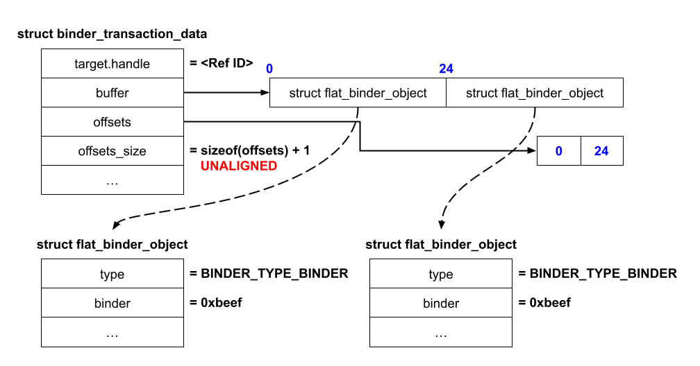

# Binder

* [参考](https://androidoffsec.withgoogle.com/posts/attacking-android-binder-analysis-and-exploitation-of-cve-2023-20938/#binder)

Binder 是 Android 上主要的进程间通信（IPC）通道。它支持跨进程传递文件描述符和包含指针的对象等多种功能。**Binder 由 Android 平台提供的用户空间库（libbinder 和 libhwbinder）以及 Android 通用内核中的内核驱动组成**。因此，它为 Java 和本地代码提供了一个可通过 AIDL 定义的通用 IPC 接口。术语 “Binder” 常被用来泛指其实现的多个部分（Android SDK 中甚至有一个名为 Binder 的 Java 类），但在本文中，除非另有说明，“Binder” 指的是 Binder 设备驱动。

## Binder 设备驱动（/dev/binder）

Android 上所有不受信任的应用都处于沙箱中，进程间通信主要通过 Binder 进行。同时，Android 上 Chrome 的渲染进程被赋予了比不受信任应用更受限的 SELinux 上下文 `isolated_app`。尽管如此，它仍可以访问 Binder 以及一小部分 Android 服务。因此，Binder 成为一个暴露面广泛的攻击面，因为每个不受信任或受限的应用默认都可以访问它。

为了实现高性能的 IPC，Binder 拥有极其复杂的对象生命周期管理、内存管理和并发线程模型。为说明其复杂度，我们在实现驱动的 6.5k 行代码中统计出了三种不同类型的并发同步原语（5 个锁、6 个引用计数器以及一些原子变量）。Binder 的锁机制也非常细粒度，以提升性能，这进一步增加了代码的复杂性。

近年来，攻击者利用 Binder 中的多个安全问题（主要是 use-after-free 漏洞）成功发起了一系列攻击。这些漏洞源自多种根本原因，包括清理逻辑不当（CVE-2019-2215 和 CVE-2022-20421）、数据竞争（CVE-2020-0423）以及对象内部的越界访问（CVE-2020-0041）。本文介绍的 use-after-free 漏洞则源于处理 Binder 事务时清理逻辑错误，导致引用计数错误。

## 使用 Binder 发起 RPC 调用

### 初始化 Binder 端点

通过 Binder 实现 IPC 的编程方式与传统 socket（如网络 socket）有所不同。

每个客户端首先打开 Binder 设备，并使用返回的文件描述符创建内存映射：

```c
int fd = open("/dev/binder", O_RDWR, 0);
void *map = mmap(NULL, 4096, PROT_READ, MAP_PRIVATE, ctx->fd, 0);
```

这块内存用于 Binder 驱动的内存分配器，用来存储所有传入事务数据。**对客户端来说是只读的，但驱动可以写入**。

### 发送与接收事务

客户端不会直接使用 send 和 recv 系统调用进行通信，而是通过向 Binder 驱动发送 BINDER_WRITE_READ ioctl 实现大多数 IPC 交互。ioctl 的参数是一个 `binder_write_read` 结构体：

```c
struct binder_write_read bwr = {
    .write_size = ...,
    .write_buffer = ...,
    .read_size = ...,
    .read_buffer = ...
};

ioctl(fd, BINDER_WRITE_READ, &bwr);
```

其中，`write_buffer` 字段指向用户空间的缓冲区，该缓冲区包含客户端发送给驱动的一系列命令；而 `read_buffer` 字段则指向另一个用户空间缓冲区，驱动会在其中写入发送给客户端的命令。

> 注：该设计的动机在于，客户端可以通过一个 ioctl 系统调用同时发送事务并等待响应。而使用 socket 的 IPC 则需两次系统调用（send 和 recv）。

下图展示了发送事务时涉及的数据，其中目标是 Ref 0（target.handle），事务中包含一个 Node 对象（BINDER_TYPE_BINDER）：


`write_buffer` 指向一个缓冲区，其中包含一系列 `BC_*` 命令及其相关数据。`BC_TRANSACTION` 命令会指示 Binder 发送一个 `struct binder_transaction_data` 类型的事务结构体。而 `read_buffer` 指向一个预先分配好的缓冲区，当有传入事务时，Binder 会将其填充。

`struct binder_transaction_data` 包含一个目标句柄（target handle）以及两个缓冲区：`buffer` 和 `offsets`。`target.handle` 是与接收方关联的 Ref ID，后面会介绍它的创建方式。`buffer` 指向一个包含 Binder 对象与不透明数据的混合缓冲区，而 `offsets` 指向一个偏移数组，指明每个 Binder 对象在 `buffer` 中的位置。接收方在通过 `BINDER_WRITE_READ` ioctl 进行读取后，会在 `read_buffer` 中接收到该结构体的副本。

用户可以通过在事务数据中包含一个 `struct flat_binder_object`，并将其 `type` 字段设置为 `BINDER_TYPE_BINDER`，来发送一个 Node。Node 是一种 Binder 对象类型，后续将进一步讲解。

### 与其他进程建立连接

Binder 使用 Node 和 Ref 等对象来管理进程间的通信通道。

如果一个进程希望允许另一个进程与其通信，它会向该进程发送一个 Node。Binder 会在目标进程中创建一个新的 Ref，并将其与 Node 关联，从而建立连接。之后，目标进程就可以使用这个 Ref 向 Node 所属的进程发送事务。


上图说明了 App A 如何与 App B 建立连接，使 App B 可以向 App A 发送事务以执行 RPC 调用。

步骤如下：

1. App A 向 App B 发送一个事务，其中包含一个 ID 为 `0xbeef` 的 Node。该事务结构与前述类似，Node 以 `struct flat_binder_object` 表示。
2. Binder 在内部将 Node `0xbeef` 与 App A 关联，并初始化一个引用计数器，用于跟踪引用它的 Ref 数量。在实际实现中，`struct binder_node` 中包含 4 个引用计数器，后续会详细说明。
3. Binder 在 App B 内部创建一个 Ref `0xbeef`，它引用的是 App A 的 Node `0xbeef`。此步骤会使 Node `0xbeef` 的引用计数增加 1。
4. 现在，App B 可以在以后的事务中通过 `struct binder_transaction_data` 中的 `target.handle = 0xbeef` 向 App A 发送事务。当 Binder 处理 App B 发出的事务时，它会识别出 Ref `0xbeef` 所引用的是 App A 的 Node `0xbeef`，并将事务发送给 App A。

### Binder 上下文管理器

有人可能会问：如果 App A 和 App B 之间一开始没有连接，App A 如何将 Node 发送给 App B？这有两个机制：

首先，除了可以从一个进程向另一个进程发送 Node 外，也可以类似地发送 Ref。例如，假设存在另一个 App C，那么 App B 可以将上一步中创建的 Ref 发送给 App C。一旦 App C 从 App B 接收到该 Ref，就可以使用它向 App A 发送事务。

其次，Binder 允许某个特殊进程通过 `BINDER_SET_CONTEXT_MGR` ioctl 声明自己为**上下文管理器（Context Manager）**，整个系统中只能有一个进程担任该角色。上下文管理器是一个特殊的 Binder IPC 端点，所有进程都可以通过句柄（Ref）0 访问它，用于作为中介，使 Binder 的端点对其他进程可发现。

例如，Client 1 向上下文管理器发送一个 Node（例如 `0xbeef`），上下文管理器则获得一个 Ref（`0xbeef`）。然后，另一个进程 Client 2 向上下文管理器发起事务，请求获取该 Ref（`0xbeef`）。上下文管理器响应该请求并返回该 Ref（`0xbeef`）。于是，Client 2 就能使用该 Ref 向 Client 1 发送事务，从而建立了进程间连接。


在 Android 中，ServiceManager 进程在启动时声明自己为上下文管理器（Context Manager）。系统服务将它们的 Binder Node 注册到上下文管理器中，以便其他应用可以发现并访问这些服务。

# CVE-2023-20938

## 漏洞点

客户端可以在一次 Binder 事务中包含一个 Binder 对象（`struct binder_object`），该对象可以是以下任意一种：

| 名称              | 枚举值                     | 描述                                   |
|-------------------|----------------------------|----------------------------------------|
| Node              | `BINDER_TYPE_BINDER`、`BINDER_TYPE_WEAK_BINDER` | 一个 Node 对象                          |
| Ref               | `BINDER_TYPE_HANDLE`、`BINDER_TYPE_WEAK_HANDLE` | 对某个 Node 的引用                     |
| Pointer           | `BINDER_TYPE_PTR`          | 一个指向用于数据传输的内存缓冲区的指针 |
| File Descriptor   | `BINDER_TYPE_FD`           | 一个文件描述符                          |
| FD Array          | `BINDER_TYPE_FDA`          | 一组文件描述符                          |

在将所有 Binder 对象发送给接收方之前，Binder 必须在 `binder_transaction` 函数中将这些对象从发送方的上下文转换为接收方的上下文：

```c
static void binder_transaction(...)
{
  ...
  // 遍历事务中的所有 Binder 对象
  for (buffer_offset = off_start_offset; buffer_offset < off_end_offset;
       buffer_offset += sizeof(binder_size_t)) {
    // 处理/转换一个 Binder 对象
  }
  ...
}
```

例如，在客户端通过 Binder 向另一个客户端共享一个文件时，会通过发送文件描述符来实现。为了让接收方能访问该文件，Binder 会在接收方进程中安装一个新的文件描述符以指向该共享文件。

> 注意：部分对象实际上是在接收方读取事务时进行转换（当接收方调用 `BINDER_WRITE_READ` ioctl 时），而其他对象则是在发送事务时就已由发送方转换（当发送方调用 `BINDER_WRITE_READ` ioctl 时）。

当处理一个 `offsets_size` 未对齐的事务时存在一个错误处理路径 [1]。注意此时 Binder 会跳过 for 循环中处理 Binder 对象的逻辑，因此 `buffer_offset` 保持为 0，并作为参数传入 `binder_transaction_buffer_release` 函数 [2]：

```c
static void binder_transaction(..., struct binder_transaction_data *tr, ...)
{
  binder_size_t buffer_offset = 0;
  ...
  if (!IS_ALIGNED(tr->offsets_size, sizeof(binder_size_t))) {        // [1]
    goto err_bad_offset;
  }
  ...
  for (buffer_offset = off_start_offset; buffer_offset < off_end_offset;
       buffer_offset += sizeof(binder_size_t)) {
    // 处理一个 Binder 对象
  }
  ...
err_bad_offset:
  ...
  binder_transaction_buffer_release(target_proc, NULL, t->buffer,
                                    /*failed_at*/buffer_offset,    // [2]
                                    /*is_failure*/true);
  ...
}
```

`binder_transaction_buffer_release` 是一个用于撤销 Binder 在事务处理中产生的副作用的函数，例如关闭接收方进程中打开的文件描述符。在处理错误的场景下，Binder 仅应清理那些已处理过的对象，函数中的 `failed_at` 和 `is_failure` 参数用于确定需要清理多少个 Binder 对象。

但在 `offsets_size` 未对齐的错误路径中，由于 `failed_at == 0` 且 `is_failure == true`，Binder 会将 `off_end_offset` 设置为事务缓冲区的末尾，从而清理了事务中的所有 Binder 对象，尽管实际上它并未处理任何对象。这会导致引用计数不一致的问题。

```c
static void binder_transaction_buffer_release(struct binder_proc *proc,
                                              struct binder_thread *thread,
                                              struct binder_buffer *buffer,
                                              binder_size_t failed_at /*0*/,
                                              bool is_failure /*true*/)
{
  ...
  off_start_offset = ALIGN(buffer->data_size, sizeof(void *));
  off_end_offset = is_failure && failed_at ? failed_at
                                           : off_start_offset + buffer->offsets_size;
  for (buffer_offset = off_start_offset; buffer_offset < off_end_offset;
       buffer_offset += sizeof(size_t)) {
    ...
  }
  ...
}
```

造成这种行为的原因是 `failed_at` 的语义被重载：在 Binder 代码的其他部分也使用类似的逻辑清理整个缓冲区。但在这个场景中，由于我们在未处理任何对象的情况下进入该代码路径，就会导致引用计数错误。

在接下来的部分中，我们将演示如何利用这个漏洞对 Binder Node 对象实现 Use-After-Free，从而构造一个提权的 PoC。

## 利用

在 CVE-2020-004 的已公开利用中，Blue Frost Security 利用相同的清理逻辑实现了 root 提权。他们利用了一个在 Binder 处理事务之后修改事务中的对象的漏洞，并发布了在 Pixel 3（运行内核 4.9）上实现提权的 PoC。

我们借鉴了这个漏洞的思想，首先实现对 Binder 中对象的泄露与释放控制。由于新内核版本中 SLUB 分配器的缓存结构发生了变化，我们采用了不同的方法来实现目标对象的 Use-After-Free，后文将解释这些变化以及应对方法。

### Binder Node 的 Use-After-Free

一个 Node（`struct binder_node`）在事务中表现为一个 `struct flat_binder_object`，其头部类型为 `BINDER_TYPE_BINDER` 或 `BINDER_TYPE_WEAK_BINDER`。当客户端向另一个客户端发送一个 Node 时，Binder 会在内部创建一个 Node，并通过多个引用计数器管理其生命周期。

我们将展示如何通过上述漏洞使某个 Node 的引用计数不一致，从而提前释放该对象，导致悬垂指针，并触发 Use-After-Free。

在 `binder_transaction_buffer_release` 函数中，若遍历过程中遇到类型为 `BINDER_TYPE_BINDER` 或 `BINDER_TYPE_WEAK_BINDER` 的对象，Binder 会调用 `binder_get_node` 以获取目标进程中 ID 匹配的 Node 对象 [1]，然后调用 `binder_dec_node` 函数减少其引用计数 [2]：

```c
static void binder_transaction_buffer_release(...)
{
  ...
  for (buffer_offset = off_start_offset; buffer_offset < off_end_offset;
       buffer_offset += sizeof(size_t)) {
    ...
    case BINDER_TYPE_BINDER:
    case BINDER_TYPE_WEAK_BINDER: {
      ...
      // [1]
      node = binder_get_node(proc, fp->binder);
      ...
      // [2]
      binder_dec_node(node, /*strong*/ hdr->type == BINDER_TYPE_BINDER, /*internal*/ 0);
      ...
    } break;
    ...
  }
  ...
}
```

`binder_dec_node` 会进一步调用 `binder_dec_node_nilocked` 来减少 `binder_node` 的引用计数 [1]，若该函数返回 true，就会调用 `binder_free_node` 释放该 Node [2]：

```c
static void binder_dec_node(struct binder_node *node, int strong /*1*/, int internal /*0*/)
{
  bool free_node;

  binder_node_inner_lock(node);
  free_node = binder_dec_node_nilocked(node, strong, internal); // [1]
  binder_node_inner_unlock(node);
  if (free_node)
    binder_free_node(node); // [2]
}
```

在 `binder_dec_node_nilocked` 中，如果 `strong == 1` 且 `internal == 0`，则会减少 `local_strong_refs` 字段：

```c
static bool binder_dec_node_nilocked(struct binder_node *node,
                                     int strong /*1*/, int internal /*0*/)
{
  ...
  if (strong) {
    if (internal)
      ...
    else
      node->local_strong_refs--;
    ...
  } else {
    ...
  }
  ...
}
```

**因此，要触发该漏洞，我们只需构造一个事务，包含一个 `BINDER_TYPE_BINDER` 类型的 Node 对象，`binder` 字段设置为目标 Node 的 ID，即可在未正确处理的情况下对其引用计数进行错误地减一**。

如下图所示，我们可以通过构造一个包含两个 Node（`struct flat_binder_object`）且 `offsets_size` 未对齐的恶意事务，实现对目标客户端中 Node（如 0xbeef）引用计数的两次减少，从而最终触发 Use-After-Free。



未对齐的 offsets_size 会导致 Binder 走向 binder_transaction 函数中的漏洞错误处理路径，从而跳过对事务中两个 Node 的处理。这利用了 binder_transaction_buffer_release 函数去清理这两个 Node，每个 Node（0xbeef）的 local_strong_refs 被减少一次，总共减少两次 —— 对应事务中 2 个 struct flat_binder_object 对象。

接下来，我们分析在 binder_dec_node 函数中释放 struct binder_node 所需满足的条件（即在何种条件下，binder_dec_node_nilocked 返回 true，从而迫使 binder_dec_node 释放 binder_node）。根据下面代码片段，binder_dec_node_nilocked 根据 struct binder_node 中多个字段的值来返回 true。

```c
static bool binder_dec_node_nilocked(struct binder_node *node,
                                     int strong /*1*/, int internal /*0*/)
{
  ...
  if (strong) {
    if (internal)
      ...
    else
      node->local_strong_refs--;
    if (node->local_strong_refs || node->internal_strong_refs)
      return false;
  } else {
    ...
  }

  if (proc && (node->has_strong_ref || node->has_weak_ref)) {
    ...
  } else {
    if (hlist_empty(&node->refs) && !node->local_strong_refs &&
        !node->local_weak_refs && !node->tmp_refs) {
      ...
      return true;
    }
  }
  return false;
}
```

为了确保在减少 local_strong_refs 后，binder_dec_node_nilocked 返回 true，我们必须传入满足以下条件的 node：

- **引用计数条件（struct binder_node 内部）**  
  - local_strong_refs        == 1 （在调用 binder_dec_node_nilocked 前）  
  - local_weak_refs          == 0  
  - internal_strong_refs     == 0  
  - tmp_refs                 == 0  
  - has_strong_ref           == 0  
  - has_weak_ref             == 0  
  - hlist_empty(&node->refs) == true  

因此，要在 binder_dec_node 函数中释放一个 binder_node 对象，我们必须构造一个没有任何 Ref 对象引用它，并且所有引用计数均为 0（除了 local_strong_refs 为 1）的 binder_node。然后，我们可以利用漏洞将 local_strong_refs 递减至 0，从而由 binder_free_node 释放该对象。

构造这样的 binder_node 的一种简单方法如下：

1. Client A 与 Client B 之间建立连接，双方均使用 Node 0xbeef 与 Ref 0xbeef（参考前面的示意图）。此时，Node 的 local_strong_refs 初始为 1，因为只有 Ref 对象引用着该 Node。
2. Client B 发送一个 target.handle 设置为 0xbeef 的事务。Binder 处理该事务，在 Client A 侧分配一个 binder_buffer，并将事务数据复制到该缓冲区中。此时，由于 Ref 对象和事务都引用了该 Node，使得 Node 的 local_strong_refs 增加到 2。
3. Client B 关闭 Binder 文件描述符，从而释放 Ref 对象，并使 local_strong_refs 减少 1。此时，Node 的 local_strong_refs 恢复为 1，因为只有事务仍引用着它。

下图展示了在利用漏洞释放 binder_node 前后的设置情况：


**在利用该漏洞释放了 `binder_node` 后，会在 `binder_buffer` 的 `target_node` 中留下一个悬空指针（dangling pointer）**。在接下来的章节中，我们会多次利用这个 Use-After-Free（UAF）来获取一系列漏洞利用原语（primitive），最终实现对 Android 设备的提权。

我们首先获取了一个有限的信息泄露原语，使我们能够从内核堆中泄露 16 字节（两个 8 字节的值）。在此基础上，我们进一步构造了解链原语，使我们能够用攻击者控制的数据覆盖内核内存。接着，我们结合信息泄露和解链两个原语，获得了任意内核内存读取能力，从而可以识别我们想要覆盖的内核结构地址，最终实现对设备的提权。

### 信息泄露原语（Leak Primitive）

我们首先通过在 `binder_thread_read` 函数中对已释放的 `binder_node` 对象进行 Use-After-Free 读取，构造了一个有限的内核信息泄露原语，能够泄露内核堆中 16 字节（两个 8 字节值）。当客户端调用 `BINDER_WRITE_READ` ioctl 读取传入事务时，Binder 会调用 `binder_thread_read`，并将事务数据从内核复制到用户空间。**该函数会从 `binder_node` 中拷贝两个字段（`ptr` 和 `cookie`）到事务结构体中（见 [1] 和 [2]），然后再将事务结构体拷贝回用户空间（见 [3]）。这就实现了一个内核堆内存读取的 UAF 漏洞**。

```c
static int binder_thread_read(...)
{
    ...
    struct binder_transaction_data_secctx tr;
    struct binder_transaction_data *trd = &tr.transaction_data;
    ...
    struct binder_transaction *t = NULL;
    ...
    t = container_of(w, struct binder_transaction, work);
    ...
    if (t->buffer->target_node) {
        struct binder_node *target_node = t->buffer->target_node;

        trd->target.ptr = target_node->ptr;     // [1]
        trd->cookie = target_node->cookie;      // [2]
    }
    ...
    if (copy_to_user(ptr, &tr, trsize)) {       // [3]
        ...
    }
}
```

`binder_node` 是从 `kmalloc-128` SLAB 分配的，对象中的两个泄露字段偏移如下：

```gdb
gdb> ptype /o struct binder_node
/* offset  | size */ type = struct binder_node {
  ...
  /*   88   |   8  */ binder_uintptr_t ptr;
  /*   96   |   8  */ binder_uintptr_t cookie;
}
```

> 注意：到此为止，UAF读能够泄漏kmalloc-128的[88, 96)数据。

### 解链原语（Unlink Primitive）

`binder_dec_node_nilocked` 函数中的解链操作（`hlist_del()`）存在 Use-After-Free 漏洞（见 [1]）。不过，在触发该操作之前存在多个校验条件。

```c
static bool binder_dec_node_nilocked(struct binder_node *node,
                                     int strong, int internal)
{
    struct binder_proc *proc = node->proc;
    ...
    if (strong) {
        ...
        if (node->local_strong_refs || node->internal_strong_refs)
            return false;
    }
    ...
    if (proc && (node->has_strong_ref || node->has_weak_ref)) {
        ...
    } else {
        if (hlist_empty(&node->refs) && !node->local_strong_refs &&
            !node->local_weak_refs && !node->tmp_refs) {
            if (proc) {
                ...
            } else {
                BUG_ON(!list_empty(&node->work.entry));
                ...
                if (node->tmp_refs)
                    return false;
                hlist_del(&node->dead_node); // [1]
            }
            return true;
        }
    }
    return false;
}
```

`__hlist_del()` 函数修改两个内核指针，将其互相指向：

```c
static inline void __hlist_del(struct hlist_node *n)
{
    struct hlist_node *next = n->next;
    struct hlist_node **pprev = n->pprev;

    WRITE_ONCE(*pprev, next);
    if (next)
        WRITE_ONCE(next->pprev, pprev);
}
```

换言之：

```
*pprev = next
*(next + 8) = pprev
```

为了触发解链操作，我们需使用带有恶意伪造数据的 fake `binder_node` 重占释放空间，可使用经典的 `sendmsg` 堆喷技术。

伪造 binder_node 需满足以下条件：

```c
node->proc == 0;
node->has_strong_ref == 0;
node->has_weak_ref == 0;
node->local_strong_refs == 0;
node->local_weak_refs == 0;
node->tmp_refs == 0;
hlist_empty(&node->refs);  // node->refs == NULL
list_empty(&node->work.entry); // node->work.entry = &node->work.entry
```

最后一项要求较难满足，因为我们需要提前知道 `binder_node` 的地址，以正确设置 `&node->work.entry`。幸运的是，我们可以通过前面提到的泄露原语来泄露该地址。

> 注意：此时我们距离unlink操作还差一步：泄露出binder_node的地址。

#### 泄露 binder_node 地址

`binder_ref` 结构也从 `kmalloc-128` SLAB 分配，其第 88 字节即为指向对应 `binder_node` 的指针（再回忆一下我们的泄露原语，正好泄露偏移 88 和 96 的内容）：

```gdb
gdb> ptype /o struct binder_ref
/* offset | size */ type = struct binder_ref {
  ...
  /*   88  |   8  */ struct binder_node *node;
  /*   96  |   8  */ struct binder_ref_death *death;
}
```

因此，我们可以通过以下步骤泄露一个指向 `binder_node` 的地址：
- 利用漏洞释放一个 `binder_node`。
- 在已释放的 `binder_node` 上分配一个 `binder_ref`。
- 使用信息泄露原语从 `binder_ref` 中泄露出一个指向 `binder_node` 的地址。

一旦我们泄露了已释放的 `binder_node` 对象的地址，我们就拥有了构造 `unlink` 原语所需的所有数据。在使用 `sendmsg` 重新分配我们的伪造 `binder_node` 之后，我们发送一个 `BC_FREE_BUFFER` Binder 命令来释放包含悬空 `binder_node` 的 transaction，从而触发 `unlink` 操作。在此时，我们实现了一个有限的任意写原语——由于 `__hlist_del` 函数的实现细节，我们会将内核内存覆盖为一个有效的内核指针或 `NULL`。

> 注意：此时结合泄露操作，已经可以实现unlink操作，从而实现写入两个指针值，写入位置由攻击者控制（堆喷）。

### 任意读取原语

对 CVE-2020-0041 的利用使用了 `FIGETBSZ` 的 `ioctl` 实现任意读取原语。`FIGETBSZ` ioctl 会将内核中的 `struct super_block` 结构中的 `s_blocksize` 成员所对应的 4 字节数据复制到用户空间，如下所示的代码 [1] 所示。

```c
static int do_vfs_ioctl(struct file *filp, ...) {
...
  struct inode *inode = file_inode(filp);
...
    case FIGETBSZ:
...
      return put_user(inode->i_sb->s_blocksize, (int __user *)argp); // [1]
...
}
```

```c
ioctl(fd, FIGETBSZ, &value); // &value == argp
```

下图展示了 `struct file` 和 `struct inode` 结构体中 `s_blocksize` 字段的引用位置。


我们可以通过解除链接写入来修改inode指针，使其指向已知地址的epitem结构体。由于我们可以通过epoll_ctl直接控制epitem结构体中的event.data字段（位于该结构体起始偏移40字节处），使其指向内核地址空间的任意位置，那么我们就可以轻松地将上述i_sb字段（同样位于偏移40字节处）修改为任意值。


然后，我们可以使用FIGETBSZ ioctl和epoll_ctl作为任意读取原语，从内核地址空间的任意位置读取4字节的值。但首先，我们必须知道struct file和struct epitem对象的内核地址。

> 注意：这步操作通过unlink实现，要求伪造的binder_node中next/pprev指针字段填入epitem和file的对应地址。

#### 泄露struct file地址

struct epitem在偏移88和96处分别包含两个内核指针（next和prev）。

```bash
gdb> ptype /o struct epitem
/* offset      |    size */  type = struct epitem {
...
/*     88      |      16 */    struct list_head {
/*     88      |       8 */        struct list_head *next
/*     96      |       8 */        struct list_head *prev;
                               } fllink;
```

这两个内核指针（next和prev）构成一个struct epitem对象的链表。链表的头位于struct file.f_ep_links。当我们利用泄露原语将这些内核指针泄露回用户空间时，其中一个指针将指向一个struct file对象。


在针对内核版本4.9的CVE-2020-0041漏洞利用中，在已释放的binder_node上分配struct epitem是直接可行的。由于缓存别名（cache aliasing）和kmalloc-128 SLAB缓存采用FIFO机制，struct epitem和binder_node都是从同一个kmalloc-128 SLAB缓存中分配的。因此，在释放binder_node后，我们可以从binder_node原先的内存位置分配一个struct epitem。

缓存别名是内核的一项特性，出于效率考虑会将多个SLAB缓存合并为单个SLAB缓存。当这些SLAB缓存存储大小相似的对象并具有相似属性时，就会发生这种情况。更多关于缓存别名的细节可以参考《2022年Linux内核堆风水》[博客文章](https://duasynt.com/blog/linux-kernel-heap-feng-shui-2022)。

在内核版本5.10中，一个提交为eventpoll_epi SLAB缓存添加了SLAB_ACCOUNT标志，因此eventpoll_epi和kmalloc-128不再共享同一个SLAB缓存。换句话说，struct epitem不再从kmalloc-128 SLAB缓存分配，这阻止了我们直接在已释放的binder_node上分配它。

#### 跨缓存攻击

跨缓存攻击是一种技术，可以在从不同缓存分配的对象之上分配另一个对象。这是可行的，因为内核中存在多级内存分配器，并且同一级别的缓存共享其层次结构中更高级别的相同内存分配器。SLUB分配器（kmem_cache）中的缓存从页分配器获取页面并将其用作slab。如果一个kmem_cache将页面释放回页分配器，另一个在分配期间需要额外内存的kmem_cache将会获取它。

> 注意：页分配器是一个伙伴分配器，它为不同阶数的连续空闲页面维护缓存。不同的kmem_cache使用不同数量的连续页面作为其slab。幸运的是，kmalloc-128和eventpoll_epi kmem_cache都使用order-0（2^0 = 1）页面作为slab。因此，在执行跨缓存攻击时我们不需要对页分配器进行整理，可以安全地假设页分配器对于分配和释放的每个页面都采用FIFO方式运作。

下图展示了如何从先前释放的binder_node使用的相同内存区域分配struct epitem。


要实施跨缓存攻击，我们必须将kmalloc-128的一个slab（4K页面）释放回页分配器的每CPU页面缓存，以便能被eventpoll_epi重新分配。kmalloc-128和eventpoll_epi的每个slab都是4K页面，可容纳32个内核对象（4096/128）。

要完全控制整个slab，我们需要分配32个binder_object。然后利用漏洞一次性释放所有binder_node，并保留指向它们的悬空指针。但SLUB分配器不会立即将空slab的页面释放回页分配器，而是将其放入kmalloc-128缓存的partial列表并标记为冻结（通过设置struct page.frozen字段）。

> 注意：SLUB分配器使用slab的struct page存储元数据，如使用中的对象数量、partial列表中的下一页等。

每个kmem_cache会在partial列表中保留若干slab（空或部分空），直到将完全空的slab释放回页分配器。SLUB分配器通过partial列表首个slab的page.pobjects字段跟踪空闲槽位数量。当pobjects值超过kmem_cache.cpu_partial值时（对kmalloc_128该值为30），分配器会解冻并将空slab释放回页分配器。

但实际发现partial列表需要超过30个slab（而非30个空闲槽）才会触发释放，这是因SLUB存在统计错误——pobjects实际记录的是partial列表中的slab数量而非空闲槽位。因此我们需分配36×32个binder_node并一次性释放，然后分配超过32个struct epitem以耗尽eventpoll_epi partial列表的空闲槽，迫使eventpoll_epi从页分配器获取新页面。

在我们的漏洞利用中，我们分配36\*32（slab数量\*每个slab中的对象数量）个binder_node，然后一次性全部释放。接着，我们分配超过32个struct epitem来耗尽eventpoll_epi的partial列表中的所有空闲槽位，这样eventpoll_epi将不得不从页分配器分配新的页面。

最后，我们对所有悬空节点使用泄露原语来读取偏移88和96处的这两个字段值。如果我们成功地在已释放的binder_node上分配了struct epitem，我们将在这些字段中找到内核地址，其中一个是struct file的内核地址。

#### Binder缓冲区分配器🌟

我们希望用binder_node填满整个kmalloc-128 slab，这样我们就可以通过利用漏洞为slab中的每个对象创建悬空指针，但这存在一个挑战。

```
      slab
+---------------+
| *binder_node* |<---- 悬空指针
+---------------+
| *binder_node* |<---- 悬空指针
+---------------+
|      ...      |
+---------------+
```

当我们发送一个事务时，Binder还会从kmalloc-128缓存分配其他内核对象，比如struct binder_buffer对象。binder_buffer对象持有关于事务缓冲区的信息，以及指向接收方客户端的binder_proc所拥有的binder_node的指针。利用该漏洞会使该指针变成指向已释放binder_node的悬空指针。

```
      slab
+---------------+
|      ...      |
+---------------+
| binder_buffer |----+
+---------------+    | 悬空指针
| *binder_node* |<---+
+---------------+
|      ...      |
+---------------+
```

然而，我们现在还不能释放这个binder_buffer，因为我们需要它来触发用于泄露和解链原语的use-after-free。因此，我们必须确保binder_buffer不能与binder_node从同一个kmalloc-128 slab中分配。

Binder实现了自己的内存分配器来为每个传入事务分配内存，并将其映射到接收方的内存映射空间。该内存分配器采用最佳适应分配策略，并使用binder_buffer对象来跟踪所有已分配和空闲的内存区域。当分配新的事务缓冲区时，它会搜索相同大小的空闲binder_buffer进行重用。**如果没有可用的，它会将一个较大的空闲binder_buffer分割成两部分**：一个具有请求的大小，另一个保留剩余的大小。

为了防止Binder为每个事务都分配新的binder_buffer，我们可以通过制造内存碎片来预先分配许多空闲的binder_buffer。我们可以通过发送多个不同大小的事务并有选择地释放其中一些来实现这一点。这个过程会在内存分配器中产生间隙，从而产生许多可在未来事务中重用的空闲binder_buffer。

Binder缓冲区分配器示意图：

```
+-----------------+----------+-----------------+----------+---------+
|    空闲(24)     | 使用中(8)|    空闲(24)     | 使用中(8)|   ...   |
+-----------------+----------+-----------------+----------+---------+
```

### 提权

获取root权限需要执行以下步骤：

1. 使用任意读取原语定位当前进程的task_struct和cred结构体：
    ```
    struct binder_node *node;
    struct binder_proc *proc = node->proc; 
    struct task_struct *task = proc->tsk;
    struct cred *cred = task->cred;
    ```
2. 将struct cred对象中的所有ID字段覆写为0（root用户的UID值）
3. 通过将selinux.enforcing字段覆写为0来禁用SELinux
4. 在当前任务标志中启用TIF_SECCOMP，并将seccomp的掩码覆写为0以绕过seccomp限制

> 注意：如何篡改cred的ID字段？unlink设置指针字段为cred的地址。

### 任意写原语

虽然我们的PoC中不需要任意写原语就能获取root权限，但出于参考目的，我们仍将介绍如何实现"任意地址写任意值"的原语。

我们的解链原语虽然可以向内核中任意可写地址写入数据，但只能写入0或有效的内核地址值。为实现更强大的任意写能力，我们参考了360 Alpha实验室在台风"山竹"漏洞利用链中提出的技术（参见[相关幻灯片](https://i.blackhat.com/USA21/Wednesday-Handouts/us-21-Typhoon-Mangkhut-One-Click-Remote-Universal-Root-Formed-With-Two-Vulnerabilities.pdf)），选择利用struct seq_file对象中的buf指针字段：

```
struct seq_file {
  char *buf;
  ...
};
```

struct seq_file被Linux的seq_file接口实现文件所使用，例如/proc/self/comm文件。当打开/proc/self/comm时，内核会创建struct seq_file并调用comm_open函数。comm_open将comm_show函数传递给single_open函数，用于定义读取文件时显示的字符串内容：

```c
// fs/proc/base.c
static int comm_open(struct inode *inode, struct file *filp)
{
  return single_open(filp, comm_show, inode);
}
```

comm_show函数会将当前任务名称复制到seq_file->buf缓冲区中（如下代码中的[1]标记处）：

```c
// fs/proc/base.c
static int comm_show(struct seq_file *m, void *v)
{
  ...
  proc_task_name(m, p, false);
  ...
}

// fs/proc/array.c
void proc_task_name(struct seq_file *m, struct task_struct *p, bool escape)
{
  char *buf;
  size_t size;
  char tcomm[64];
  ...
  // `tcomm`填充当前任务名称
  ...
  size = seq_get_buf(m, &buf); // buf = m->buf
  if (escape) {
    ...
  } else {
    ret = strscpy(buf, tcomm, size); // [1]
  }
}
```

我们可以通过两次打开/proc/self/comm文件，在内核中分配两个struct seq_file实例。然后使用解链原语覆写第一个实例的struct seq_file->buf字段，使其指向第二个实例的struct seq_file->buf字段。

这样就能通过修改当前任务名称为8字节的目标地址值，并对第一个seq_file的文件描述符调用lseek（如下代码中的[2]标记处），实现对第二个实例中struct seq_file->buf字段的覆写，使其指向任意内核地址。调用lseek会触发comm_show函数，从而导致第二个结构体实例的buf字段被覆写为目标地址：

```c
// [2] 将`seq_file->buf`指向任意内核地址
prctl(PR_SET_NAME,"\xef\xbe\xad\xde\xff\xff\xff\xff\0", 0, 0, 0);
lseek(comm_fd1, 1, SEEK_SET); // comm_fd1 = 第一个seq_file的文件描述符
```

下图展示了struct seq_file实例的布局，其中struct seq_file->buf字段指向攻击者选择的目标地址。


然后，我们可以在第二个seq_file的文件描述符上执行类似操作：通过设置当前任务名称来写入我们控制的数据。最终，这使我们能够在内核内存中实现更强大的任意写（写任意值到任意地址）原语。

### Binder节点引用计数解析🌟

让我们分析struct binder_node的4个引用计数器。

local_strong_refs和local_weak_refs用于记录所有引用该Node的事务中Node的数量。请注意**事务中的Node（struct flat_binder_object）与Binder内部为记账创建的Node（struct binder_node）具有不同的数据结构**。Binder确保当存在引用它的Node事务时，对应的binder_node不会被释放。

在打开Binder设备文件后，我们调用mmap来提供共享内存映射，Binder使用该映射来存储传入事务的数据。Binder实现了一个缓冲区分配器来管理该共享内存映射，它会分配struct binder_buffer来占用部分内存映射空间以存储传入事务数据。struct binder_buffer中的target_node字段引用了属于接收客户端的binder_node，这会增加该binder_node的local_strong_refs引用计数。

internal_strong_refs用于记录其他客户端有多少个Ref引用该Node。

下图展示了一个场景：客户端A有一个包含两个Node的传入事务，客户端B有一个引用客户端A的Node 0xbeef（binder_node）的Ref 0xbeef（binder_ref）。最重要的是，它展示了这些数据结构如何增加Node 0xbeef的引用计数器。


当Binder将一个变量赋值为指向binder_node的指针时，它会使用tmp_refs来确保只要该指针在其作用域内被使用，对应的binder_node就会保持活跃。以下代码展示了一个基本示例：

```c
struct binder_node *node = ...;
binder_inc_node_tmpref(node);

// 安全地访问`node`

binder_dec_node_tmpref(node); // 此后不能再使用`node`
                              // 否则可能会出现竞态条件
```

当至少存在一个引用该binder_node的Ref时，Binder还会设置has_strong_ref和has_weak_ref标志位。

binder_node->refs指向Refs链表的头部。

> TODO: 学习[Binder Internals](https://androidoffsec.withgoogle.com/posts/binder-internals/)