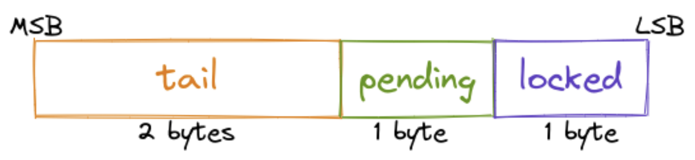

# 自旋锁

自旋锁是 Linux 内核中的关键同步机制，用于保护共享资源免受并发访问。当一个线程需要访问共享资源时，它首先获取与该资源关联的自旋锁。如果自旋锁已被其他线程占用，请求线程将进行自旋（循环），直到锁被释放。

自旋锁通常用于临界区较短的情况。原因是**自旋锁会隐式禁用 CPU 的抢占**，因此较长的临界区会增加系统延迟。当其他类型的锁（例如休眠锁）不适用时（例如中断处理程序），也会使用自旋锁。

在某些情况下，多个线程可能会尝试同时获取相同的自旋锁。为了防止这些线程饥饿（即无限自旋并浪费 CPU 周期）并提高缓存利用率，Linux 实现了排队自旋锁，它比传统实现的自旋锁更高效。

排队自旋锁自 Android 内核 4.19 版本起成为默认实现（通过内核配置项 `CONFIG_QUEUED_SPINLOCKS` 控制）。它通过维护一个等待获取锁的线程队列来工作。当一个线程尝试获取一个已经被其他线程占用的自旋锁时，它会被放置在队列的末尾。队列头部的线程会在锁变得可用时被授予锁，其他所有线程则继续自旋，直到轮到它们获取锁。



排队自旋锁是通过 `qspinlock` 结构来实现的，这是一个 4 字节的值，用于存储锁的状态。它被分为 3 个子字段，如上图所示。锁的状态可以是以下三种之一：

* **未锁定**：锁当前没有被任何线程占用。所有子字段的值为 0。
* **已锁定**：锁当前被某个线程占用。在这种情况下，`locked` 子字段非零。
* **争用中**：锁当前被某个线程占用，并且有其他线程等待获取锁。在这种情况下，`(tail, pending) ≠ (0, 0)`。

接下来，我们将更详细地查看实现。

## 队列自旋锁实现

通用函数 `spin_lock()` 首先**通过禁用 CPU 的抢占来开始**，然后调用特定于排队自旋锁的函数：

```c
void queued_spin_lock(struct qspinlock *lock);
```

同样，`spin_unlock()` 调用排队自旋锁的特定实现：

```c
void queued_spin_unlock(struct qspinlock *lock);
```

然后函数结束时会重新启用 CPU 的抢占。

Linux 中的排队自旋锁实现使用原子操作和内存屏障来确保正确的行为。为了避免困扰低层次的细节，我们将重点关注实现的核心逻辑，目的是提取有用的利用原语。以下是排队自旋锁实现的核心逻辑。它经过大幅编辑，应视为伪代码：

```c
void queued_spin_lock(struct qspinlock *lock) {
    if (*(u32 *)lock == 0) { [1]
        lock->locked = 1;
        return;
    }
    if (lock->tail != 0 || lock->pending != 0) [2]
        goto queue;
    lock->pending = 1; [3]
    while (lock->locked != 0); [4]
    lock->pending = 0;
    lock->locked = 1; [5]
    return;
queue: ...
}

void queued_spin_unlock(struct qspinlock *lock) {
    lock->locked = 0; [6]
}
```

当锁处于未锁定状态时（步骤 [1]），`locked` 字节被设置为 1，并且函数返回——表示锁已成功获取，线程将继续执行临界区。

假设在临界区执行期间且锁被持有时，另一个 CPU 尝试获取锁。在这种情况下，新的 CPU 会看到 `(tail, pending, locked) = (0, 0, 1)`，因此步骤 [1] 和 [2] 将被跳过。新的 CPU 将在步骤 [3] 中设置 `pending` 位，并在步骤 [4] 中自旋，直到 `locked` 字节变为 0。

当第一个线程完成其临界区后，它将通过调用 `spin_unlock()` 来释放锁，`locked` 字节被设置为 0（步骤 [6]）。此时，自旋的 CPU 会看到 `locked` 字节变为 0，并且会停止忙等待。在返回之前，它会清除 `pending` 位，并将 `locked` 字节设置为 1（步骤 5），表示锁的拥有权。

请注意，如果一个 CPU 尝试获取一个正在争用的锁（即当前被一个 CPU 持有，并且有其他 CPU 在等待它），锁定过程将进入排队标签 [2]。这个排队逻辑会将 tail 设置为等待锁的最后一个 CPU 的 ID，并进入忙等待，直到前一个 CPU 释放锁。