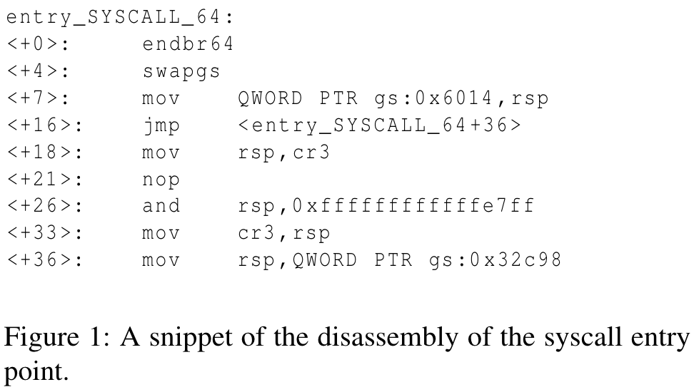
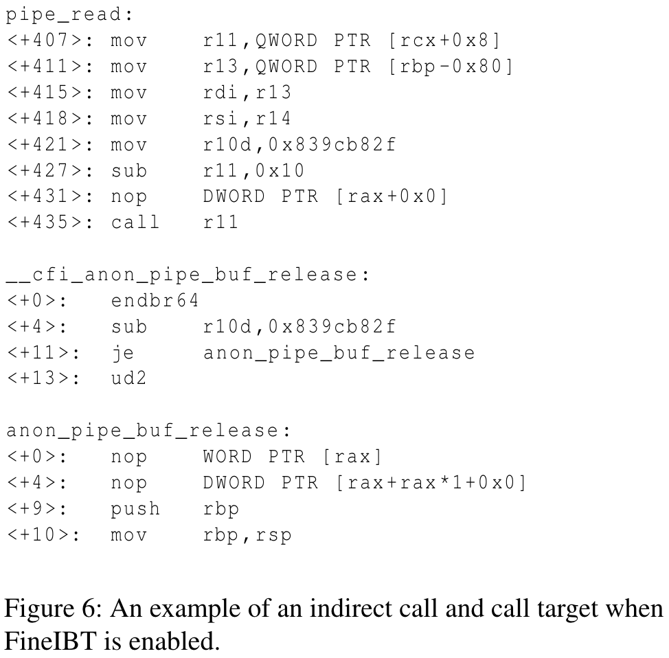
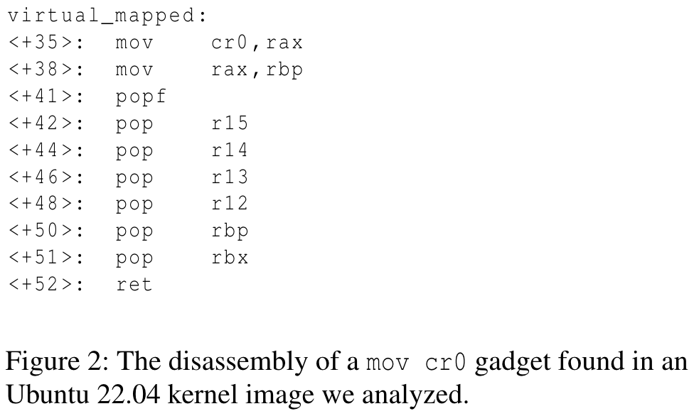
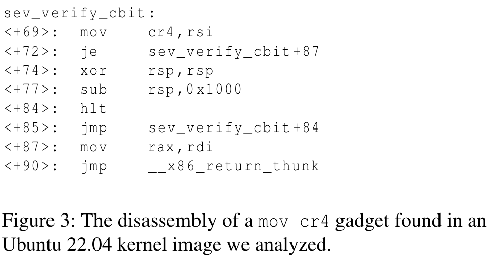
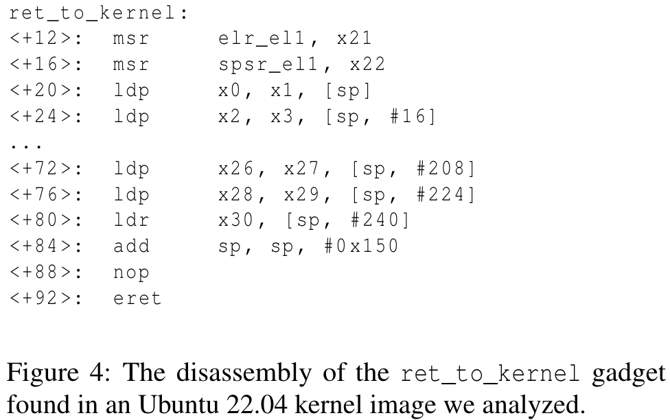
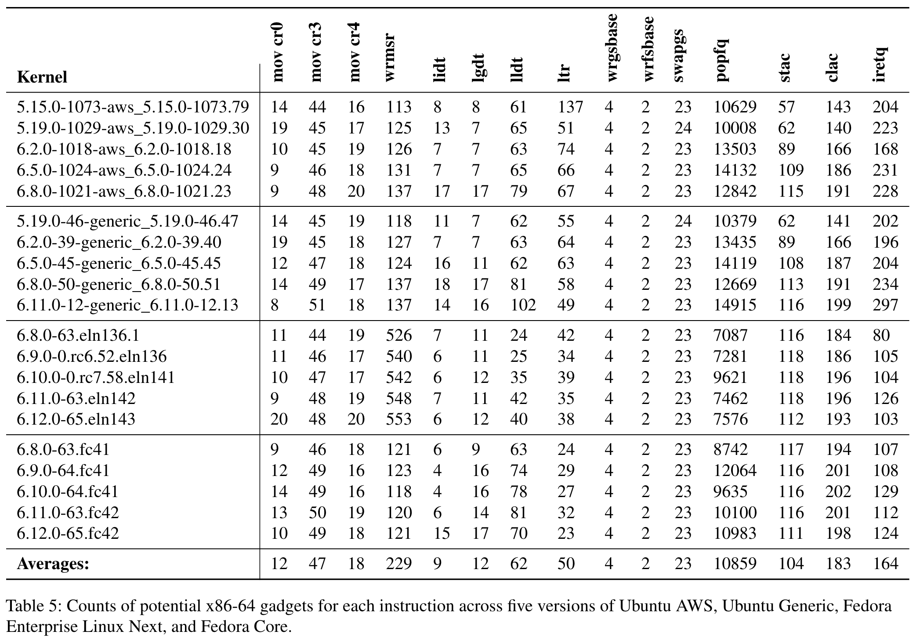
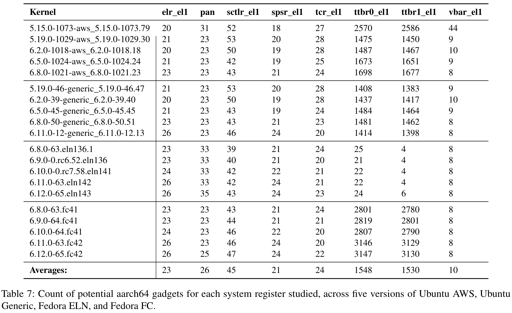
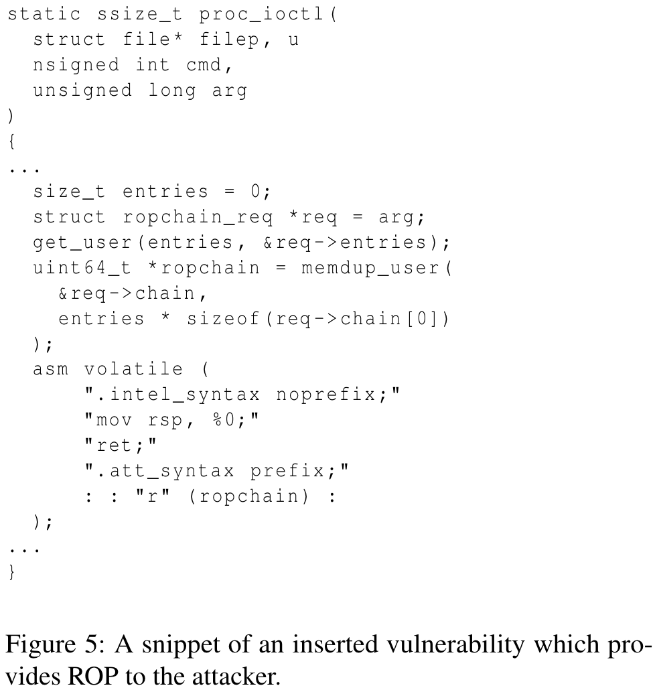
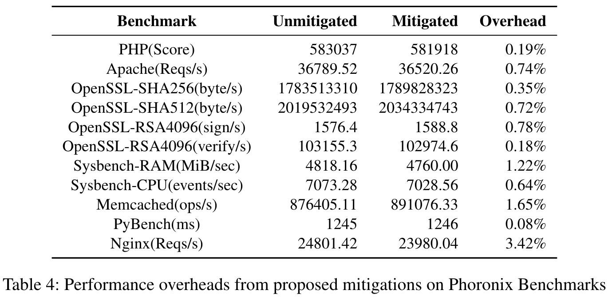
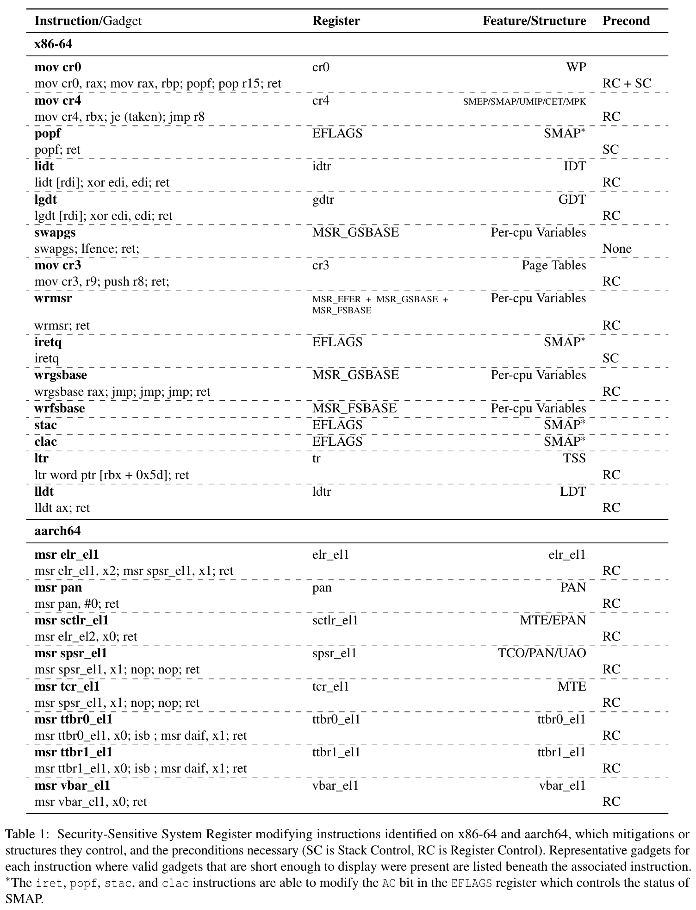

# SRH 学习笔记（System Register Hijacking）

### 1. 为什么这篇论文值得读

读这篇论文时，我把自己放在“已经能通过一个漏洞把控制流引到少量 gadget、但不一定能稳住长链”的实际攻防场景里。SRH 的价值，在于把这种“一步之遥”的控制，借助对系统寄存器的写操作，转成对安全特性或关键地址的直接影响。它不是再去堆更长的 ROP，而是换个发力点：在恰当的位置写对寄存器，很多防护自然松动。论文同时提醒，x86-64 与 AArch64 的内核代码里，能落地这种“写寄存器”的片段并不少见，因此这条路线值得系统性学习与练手。尤其关键的是：**基于 swapgs 的 SRH 是首个能绕过 FineIBT 的通用前向边绕过技术**，而且**它既不需要控制通用寄存器也不需要控制栈**。

### 2. 必要背景与假设

过去内核提权的“常规路径”大都围绕控制流本身打转：ret2usr、pivot2usr、ret2dir、RetSpill……这些都在跟 SMEP/SMAP、KPTI、甚至 FineIBT/kCFI 博弈。加固越来越多，靠“跳到哪里去”的空间被压缩时，换一个问题“把内核此刻认为的系统状态改成什么样”，就顺理成章地成为突破口。系统寄存器正好掌管这些状态：x86-64 上的 cr0/cr4、gsbase/idtr，AArch64 上的 pan、spsr_el1、ttbr*_el1 等。一旦在可控路径上执行到“写它们”的指令，效果不止是绕过一处校验，往往是整体攻防版图的重排。

在 CFI 背景下需要把几个事实先强调清楚：**IBT 要求前向跳转目标必须以 endbr64 开头**；Linux 还引入了更细粒度的 **FineIBT**，对间接调用点增加软件校验，但**入口胶水代码处一般没有“来路校验”**，这是 swapgs 能绕过 FineIBT 的结构性原因。另一方面，**kCFI 在 Android 已默认启用，桌面/服务器普遍尚未开启**，且它主要保护前向边，**不覆盖后向边**。

在地址与访问约束上，**KASLR 在本地提权场景可以忽略**；即便是 **FG-KASLR 也没有随机化入口点相对内核基址的位置**。**SMAP/PAN 可以通过 physmap（identity-mapped 内存）变相绕过**，当能定位到与用户可控页同义的 physmap 区域时，内核可能“误用”用户数据。**KPTI 主要针对 Meltdown 类问题，对 Retbleed/Phantom/BHI 等并不奏效**。而对 SRH 至关重要的一点是 **FSGSBASE 默认启用后，wrgsbase/wrfsbase 在用户态写 GS/FSBase 不进行完整性检查**，这为 swapgs 链路提供了起跑线。最后，**per-CPU 访问依赖 GS:offset 进行寻址，其中包含内核栈指针、stack canary 与 task_struct 指针等关键数据**，这解释了为什么“换基址”能直接带来栈转换能力。

### 3. 主线技术：swapgs 栈转换

我把论文里的技术分几类记忆，但更像连贯的几段体验。第一个、也是最值得花时间复现的是 swapgs 相关的栈转换。在内核入口或中断胶水代码处，常见的序列会执行 swapgs，然后紧接着从 gs 相对地址读取当前内核栈指针或任务指针。如果我们能在用户态通过 FSGSBASE 控制 GSBase，那么 swapgs 会把内核这次访问的 per-CPU 基址换成我们伪造的区域，于是后续“从 gs:offset 取值”的操作就会被我们带偏，稳稳地完成一次 stack pivot。实践里我会先在内核地址空间伪造最小 per-CPU 片段（至少栈指针与 task_struct 指针两个关键偏移），用 THP 在物理映射里喷射一片受控内存，再结合泄露或侧信道确定 physmap 基址与落点，最后把入口挑在“swapgs; 接着从 gs 取栈”的那类路径上。如下图所示，swapgs 的关键在于基址的交换使得 per-CPU 访问“改道”。

完成 pivot 之后，我更倾向于尽早恢复原 GSBase（比如用一个包含 swapgs; ret 的短片段），然后再去做 commit_creds(init_cred) 这类熟悉的提权原语，最后用 iret/sysret 回到用户态。这个顺序能减少对“伪 per-CPU”长期停留带来的连锁影响，也更稳。论文的一个亮点在于：即便启用了 FineIBT，这条路径依然适用。原因并不玄妙——入口点虽然以 endbr64 起头成为 IBT 的合法目标，但该处并没有对“来路”做软件校验，而 swapgs-pivot 恰好把我们送到这里，如下图所示。

### 4. 其他几条可用路径

第二类是直接写控制寄存器。CR0 的 WP 位、CR4 里的 SMEP/SMAP 等，都是“开关型”的高价值目标。早年的 native_write_cr4 被加固（CR-Pinning）后，很多人以为这条路封死了，论文给出的测量与验证表明，**内核里仍能找到可执行的 mov cr4, reg 或写 CR0 的片段**。我的阅读体验是：这类片段不像 swapgs 那样“环境依赖小”，但一旦命中，能一键把多道门全关掉，后续的 ROP 路线会骤然开阔。下面两张图是论文中对 CR0/CR4 路径的代表性片段示意。

第三类是 popf 配合 RetSpill 的“临时借路”。当可控的栈数据很短时，RetSpill 的技巧能把这点“碎片”堆进内核栈，接着用一个 popf; ret 把 **EFLAGS.AC 置位（可临时禁用 SMAP 检查）**，再把栈转去用户态的长链里。它不是最优雅、也不是最普适的方案，但在“数据不够、链要长”的时候，确实能救场。

第四类是把 IDT 重定位。通过 native_load_idt / lidt 把 IDT 指向用户可控页，触发某个异常/中断时就能让内核在我们的“伪 handler/跳板”里继续执行。它有点像把“崩溃/错误处理的后果”改道，既能维持现场不被 panic 终止，也能在需要时把控制权拉回。风险当然存在：系统稳定性会受影响，所以我只在虚拟化隔离的环境里尝试。

AArch64 上，论文提供了两条我认为“够实用”的思路。其一是直接写 PAN（msr pan, #0），其二是利用 ret_to_kernel 类片段同时设置 SPSR_EL1 与通用寄存器，通过 eret 恢复时禁用 PAN，再接后续链式调用。下图是论文中 ret_to_kernel 相关的片段示意，它让我意识到“设置状态+设参+返回”的一体化片段在 AArch64 上同样是“通路”。

### 5. 指令片段测量与验证的启发

为了判断这些想法是在“想得通”还是“真能用”，作者用 Capstone 对运行时的 .text 做逐字节反汇编，再用字符串/模式匹配去找“写敏感寄存器”的片段；随后用 angrop 验证可执行性，并过滤那些虽然写了但会被随后写覆盖的“无效写”。这里有两处经验需要特别记住：**alternatives 机制会在运行时按 CPU 特性动态替换指令（例如 stac/clac 并不在原始 .text，而是运行时植入）**；以及 **angrop 基于 angr，对系统指令语义支持不完备（例如不支持 stac/clac），还无法自动把系统调用入口识别为有效 gadget**。数量层面，x86-64 的有效片段在不同发行版与版本的内核里都不算少；AArch64 因为 4 字节对齐总体更少，但高价值点依然存在。下图的两张表可以帮助建立“分布直觉”。

### 6. 从 PoC 到真实利用

落地验证方面，作者先写了一个带“控制流劫持 + 短 ROP + 地址泄露”的概念验证模块，逐个把上面的技术跑通；然后把公开的 KernelCTF 提权利用改造成 swapgs-pivot 版本。**在 40 个已公开 kCTF 利用样本里，仅有 5 个属于纯数据攻击，绝大多数依赖控制流劫持，在 IBT/FineIBT 下会显著失效**。而把 6 个样本迁移为 swapgs 版本后，只要能完全控制 GSBase，适配基本都能成功。自己在看 PoC 结构时，我重点关注两件事：一是“回到用户态前恢复现场”，二是“尽量减少对 per-CPU 的长期侵占”。如下图的示意那样，能把“伪造-利用-恢复”收敛在几步内，整体稳定性会更好。

### 7. FineIBT 绕过的要点

绕过 FineIBT 是论文最吸引我的部分。它不是去对抗 IBT 的硬件规则（endbr64 依然要满足），而是选择那些“虽然有 endbr64、但没有做源校验”的入口点，正如前面所说，swapgs-pivot 天然把我们送到这种位置。**启用 FineIBT 时，入口点必须以 endbr64 开头但通常缺少来路校验，这是当前架构与实现共同造成的“薄弱处”**。理解了这一点，移植的重点就从“找任意 gadget”变成“找带 swapgs 且紧跟 per-CPU 访问的入口胶水”。这在大型内核里并不罕见。

### 8. 防护与性能（现实可行的对策）

防护角度，作者给出的建议也很务实。针对 swapgs，直接在系统调用路径对来自用户态的 GSBase 做范围校验，异常时返回一个新的错误码给用户态。**该防护已在 v6.11-rc7 合入，并在 Phoronix 的基准里显示平均约 0.91% 的开销**，对生产环境足够友好。下面的表格是论文给出的性能节选。

除此之外，还可以把 CR-Pinning 的覆盖面再拉广，照顾那些散落的 mov cr0/cr4 路径；对 lidt 可在执行后立即校验并重置到固定虚拟地址；AArch64 上则强制 uaccess_enable_privileged 与 uaccess_disable_privileged 的配对、并在 ret_to_kernel 这类入口引入指针认证保护。popf 带来的“AC 位合法性”识别问题比较棘手，基本不存在不伤及正常路径的通用化缓解，这是当前现实状态。

### 9. 练习路线与心智模型

如果把这篇论文当成练习清单，我会这样安排节奏：先在虚拟化环境里准备一套带 FSGSBASE/IBT 的可控内核，通读符号与入口粘合代码；优先复现 swapgs-pivot（含 THP 喷射、per-CPU 伪造、入口点选择、现场恢复）；在短链场景试一次 popf 扩链；再去寻找 CR0/CR4 的写路径做一次“关闭-利用-回滚”的完整实验；最后换到 AArch64 目标机上，用 msr pan, #0 与 ret_to_kernel 验证 eret 时对 PSTATE 的影响。整个过程更像“把控一条通路”，而不是在堆砌 gadget。

需要警惕的局限也很现实：多数技术仍需要一个可到达、可控的劫持点；swapgs 虽然移植门槛低，但稳定性仍取决于入口选择与 per-CPU 伪造的“贴合度”；工具链（比如 angrop）对系统指令的建模并不完备，漏报与误报都可能发生，必须结合手工审计与运行时验证；而像 IDT 重定位、写 CR0/CR4 这类操作本身对系统稳定性影响较大，更应该在隔离环境里完成。

与既有工作的关系上，SRH 并不试图发现新的内存漏洞类型，它更像“在已有劫持基础上，最大化控制面”的方法论，可与 DirtyCred 的对象交换、FUZE 的上下文扰动互补；在链长受限时，配合 RetSpill 与 popf 的临时扩链，也能把一次短促的机会放大到足以完成提权。把这些拼在一起看，会更像是一套“把控入口—改变状态—快速恢复—安全返回”的作业流程。

最后留一张方便回忆的图。我的心智模型里，这条路线就是：选中带 endbr64 的入口点，依靠 swapgs 把 per-CPU 基址换成伪造区域，从 gs 取到我们准备好的栈，起跳 ROP，及时恢复 GSBase，完成提权原语，再由 iret/sysret 返回用户态，整条路径收敛干净、副作用可控。**这条路径的两句“强记”：入口点 endbr64 合法但缺少来路校验；FSGSBASE 让我们可以在用户态把 GSBase 预设为“通向伪 per-CPU”的地址。**

更多细节、表格与代码片段，建议直接对照同目录的 `trans.md` 阅读，本文引用的图片均来自该译文。与本文配套的重要知识点还包括：**kCFI Android 默认启用、桌面/服务器未启用；KPTI 对多种瞬态执行侧信道无效；FG-KASLR 未随机化入口点；angrop 无法识别系统调用入口作为 gadget**——这些在实际复现与评估时都值得反复对照。