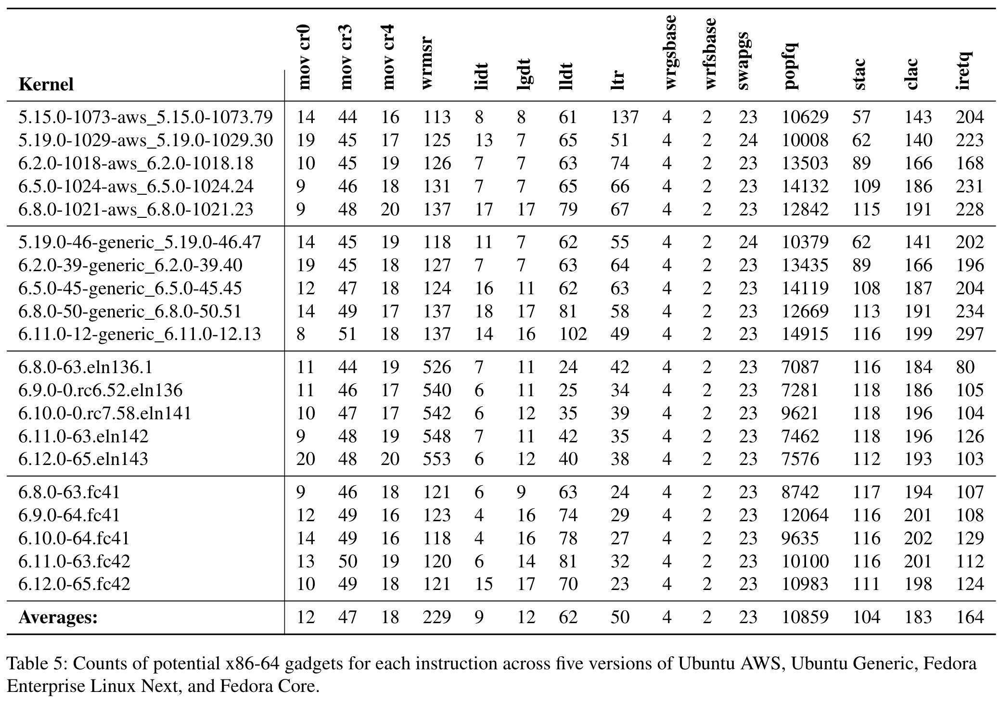
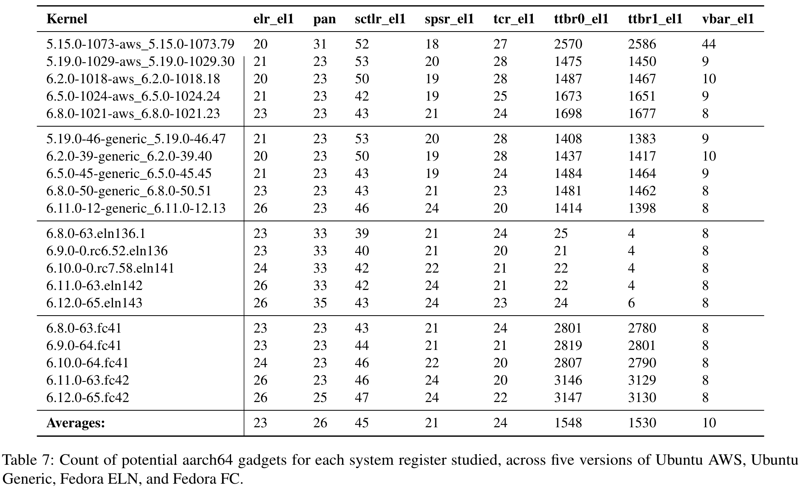
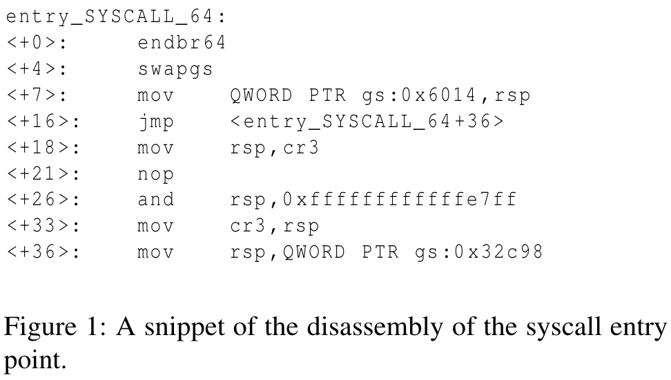
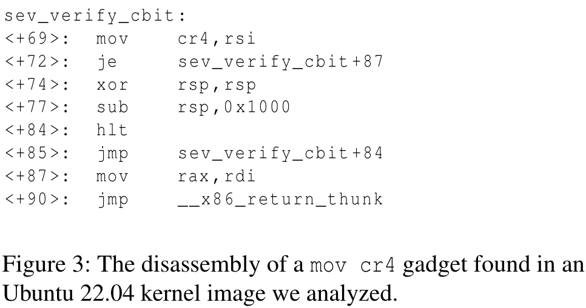
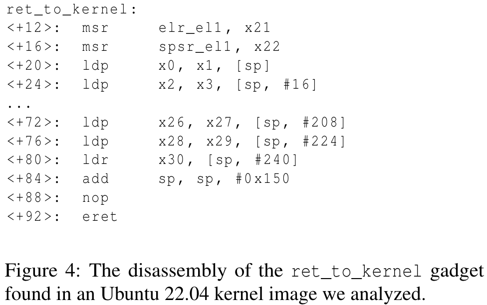
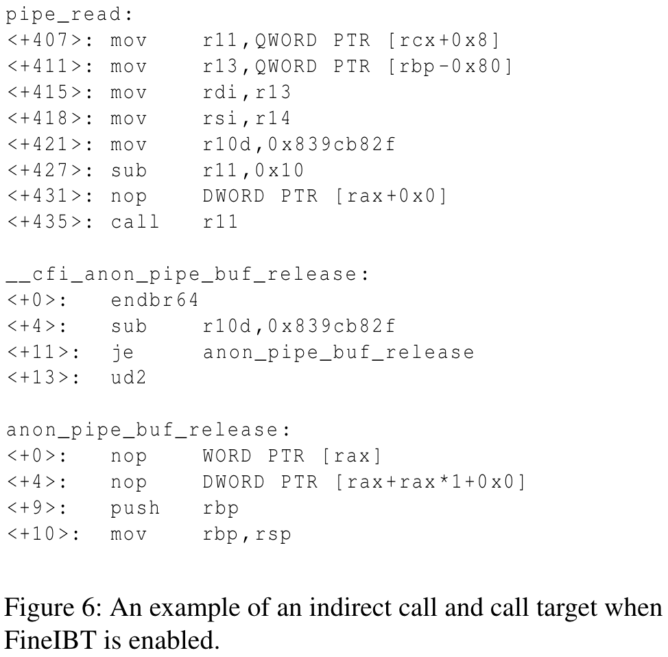

# 系统寄存器劫持：通过策反系统寄存器破坏内核完整性

## 摘要

Linux内核一直是安全研究人员与防护开发者之间的重要战场：前者不断识别新的漏洞利用技术，后者持续开发保护内核免遭攻击的缓解措施。这场攻防战持续演进——去年，谷歌内核漏洞研究计划（KernelCTF）为提交独特利用技术的研究人员发放了44笔奖金，其中多数技术针对控制流劫持漏洞。然而，内核控制流劫持漏洞利用的时代可能即将终结：作为Linux内核当前默认的控制流完整性防护方案，FineIBT已能阻断所有已知的控制流劫持利用技术。

本文提出系统寄存器劫持（System Register Hijacking）技术，这一被长期忽视的攻防前沿为内核环境中的控制流劫持漏洞利用开辟了新路径。我们通过全面研究通常被忽略的系统寄存器，针对x86-64架构（如cr0、cr3、gs寄存器）和aarch64架构（如pan、elr_el1、vbar_el1寄存器）分别提出多种强大的利用技术，以不同方式突破内核安全防护。虽然所有技术都为攻击者提供了新途径，但其中基于x86-64架构swapgs指令的利用技术尤为突出——它既不需要控制通用寄存器也不需要控制栈空间，使其成为当前已知**最强大的内核利用原语之一**。据我们所知，这是**首个能绕过FineIBT防护的利用技术**，不仅证明了该技术的威力，也揭示了控制流劫持漏洞仍具有现实威胁。

在开发这些技术的同时，我们提出了针对多数攻击的防护方案。尽管部分技术难以完全防御，但我们提出的swapgs防护方案能以低于1%的性能代价恢复FineIBT的安全防护效能。

## 一、介绍

Linux系统在全球设备和基础设施中的占比持续攀升：超过85%的智能手机、40%的服务器以及90%的云基础设施均运行Linux内核[33,39]。这种广泛普及性使Linux成为攻击者日益关注且具有高回报价值的目标。与此同时，Linux内核的复杂性意味着其永远无法完全杜绝漏洞——截至2024年9月，已有1,250个Linux内核漏洞被收录为CVE编号[18]，其中多数漏洞成功利用后可导致攻击者劫持Linux内核的控制流。

控制流劫持技术能够将内存破坏漏洞转化为强大的攻击武器。虽然发现并消除这些漏洞至关重要，但强化Linux内核防护以提升漏洞利用难度同样具有战略意义。过去十年间，Linux内核的漏洞利用防护机制快速发展，诸多缓解措施已广泛部署以阻挠成功且稳定的漏洞利用。防御方陆续提出并实施了多项针对控制流劫持技术的防护方案：管理者模式执行保护（SMEP）、管理者模式访问保护（SMAP）、内核地址空间布局随机化（KASLR）、控制寄存器固定（CR-Pinning）以及非执行物理映射（NX-Physmap）等防护技术，显著提高了控制流劫持攻击的成功门槛。

然而尽管Linux内核部署了这些利用缓解措施，攻击者仍不断发现新的绕过技术。典型知名利用技术包括：返回用户空间代码（ret2usr[44]）、向用户空间栈进行栈转换（pivot2usr[20]）、返回"物理映射"中的用户空间代码（ret2dir[36]）以及重用渗入内核栈的用户空间数据（retspill[62]）。由于这些技术能从根本上改变漏洞的威胁等级（例如使原本不可利用的漏洞变得可利用），它们受到学术界和工业界的重点关注。这种关注的重要成果之一是谷歌推出的内核漏洞奖励计划KernelCTF[25]——该计划基于利用技术的新颖性而非底层漏洞本身对安全研究者进行奖励（即研究者可通过在已知漏洞上应用新技术获得kCTF奖励）。过去一年中，谷歌kCTF计划已收录44个独特成功利用案例，这些案例均针对部署了实验性防护措施（即主线内核尚未包含或默认未启用的防护机制）的Linux内核"强化版"实例发起攻击。

数年前，Google Project Zero团队曾公布一个通过覆写cr4系统寄存器[23]来禁用SMAP和SMEP的Linux漏洞利用方案，使得内核控制流可被重定向至用户空间控制的内存区域。尽管当时该技术已被认识到其强大威力，但我们意识到这实际上揭示了Linux内核漏洞利用的一种全新思维方式。**传统内核漏洞利用在指令层面往往与用户空间利用相似**：它们使用通用寄存器来索引内核内存或向内核内部API（如commit_creds或copy_from_user）传递参数。然而**内核还使用用户空间无法访问的特殊寄存器**——系统寄存器。这些寄存器控制着CPU功能（如SMAP和SMEP）、内存结构（如页表、线程本地存储）以及关键CPU操作（如中断处理程序）。

其中多数寄存器（如cr0和cr4）完全无法从用户空间访问，部分寄存器（如EFLAGS）虽在用户空间存在，但在内核模式具有特殊含义（EFLAGS中的AC标志位可禁用SMAP）。受Google利用cr4的案例启发，我们推测其他系统寄存器也可能产生类似的利用效果。本文深入分析了系统寄存器劫持（SRH）这一新型利用技术类别，该技术可绕过Linux内核中的多种防护机制。我们系统评估了Linux内核中所有涉及系统寄存器访问的x86-64和aarch64指令，分析攻击者在控制流劫持中运用这些指令可能产生的效果，通过实证验证这些技术（及其变体）的可行性，明确其前提条件，并统计其在内核中的分布规模（通过gadget数量衡量）。

**最终我们在x86-64和aarch64架构上总结出七种利用技术（包括已知的cr4劫持技术及六项新技术）：其中四种技术仅需在控制流劫持点掌握寄存器控制权，两种需要部分栈控制能力，最后一种既不需要栈控制也不需要寄存器控制——这代表着Linux内核环境下的"最坏情况"利用技术，可适用于x86-64架构上的任何控制流劫持漏洞**。更重要的是，这项基于swapgs指令并劫持KERNEL_GSBASE_MSR系统寄存器的技术能够绕过FineIBT防护机制。据我们所知，swapgs系统寄存器劫持技术是首个也是目前唯一能通用应用于启用FineIBT防护内核的控制流劫持漏洞利用技术。

我们随后针对所发现的大部分技术提出了防护方案。我们为其中四种技术（包括swapgs）设计了专项防护措施，而第五种技术只能通过安全虚拟机监视器进行防御。基于popf指令禁用SMAP的技术目前尚无已知有效防护方案。最后，我们评估了针对swapgs技术所提防护方案的性能影响——该方案以平均低于1%的防护性性能开销为FineIBT恢复了安全防护效能。

研究贡献。综上所述，本文作出以下贡献：
* 提出系统寄存器劫持技术类别：首次系统性地提出利用内核专属系统寄存器实现攻击目标的漏洞利用技术体系，并通过测量多版本Linux内核镜像中相关gadget的分布规模验证其普遍性。
* 实证验证技术可行性：通过基于漏洞内核模块的概念验证（PoC）开发证实SRH技术的可行性，并利用真实漏洞展示swapgs技术的有效性——首次实现针对最新FineIBT防护机制的通用前向边绕过方案。
* 提出防护方案与挑战分析：针对多数SRH技术提出相应防护方案，并深入探讨防护这些技术弱点时面临的内在挑战。

## 二、背景

在深入探讨攻击细节之前，我们首先简要概述Linux内核的安全机制以及与所提出的系统寄存器劫持（SRH）攻击相关的体系结构特性。

### 2.1 控制流劫持

Linux内核中实现本地权限提升的常见利用技术是通过内存破坏漏洞篡改内核堆上的函数指针或函数表指针。这使得攻击者能够劫持间接跳转或调用的控制流，将其从预定目标重定向至攻击者控制的目标，从而破坏前向控制流边。

然而即便成功劫持控制流，要维持足够长时间的控制以实现权限提升仍非易事。传统方法通过栈指针转换（stack pivoting）将前向控制流劫持转换为内核中的ROP链执行——即将栈指针转换至内核堆上受控地址。这需要特定的栈转换gadget（例如pop rsp; ret;或mov rsp, <攻击者控制寄存器>; ret;）。实际应用中，堆栈转换技术难以实现，因为可行的转换gadget取决于控制流劫持点的系统状态。因此我们认为该技术具有高度复杂的前提条件。

以mov rsp, rax; ret; gadget为例，其前提条件是：（1）rax寄存器需持有攻击者控制的栈地址；（2）攻击者需在rax指向的内存区域拥有足够空间部署ROP载荷。

ret2dir技术[36]在发表时发现：内核的物理内存映射区域（physmap）位于固定地址且完全处于可读-可写-可执行状态。当时SMEP防护机制（用于阻止内核控制流转至用户空间）尚属新兴技术，而该技术通过返回到内核physmap中与用户空间载荷页面对应的同义地址（而非直接使用用户空间地址），实现了对SMEP的有效绕过。

KEPLER方案[57]提出了一种双阶段攻击：首先通过控制流劫持触发栈溢出。该技术首先通过针对copy_to_user调用的攻击诱导内核栈内容泄露，从而获取内核栈金丝雀值（stack canary），随后利用基于copy_from_user的gadget实现栈溢出。

RetSpill技术[62]通过降低成功实现控制流转换的前提条件，对传统堆栈转换方法进行了改进。其核心思想是：转换至内核栈上受控内存区域的前提条件远比转换至堆内存更容易满足。该技术的可行性依赖于存在可执行栈调整的ROP gadget（例如add rsp, x; ret;），且攻击者控制的数据恰好被溢出到rsp+x位置的内核栈中。这种方法既可作为短ROP链直接实现权限提升，也可作为跳板转换至其他位置的长ROP链。

### 2.2 控制流完整性

Linux内核支持一种基于软件的控制流完整性（CFI）解决方案，称为kCFI[45]，旨在防范前向控制流劫持。kCFI在编译时为函数及发生间接控制流的位置分配标签，随后通过比对调用点与目标函数的标签来确保跳转目标的合法性。已有研究[62]发现，kCFI下的部分间接控制流未进行目标验证，这使得其在该方面属于不完整的防护机制。**目前主流Linux桌面和服务器发行版尚未启用kCFI，但Android系统已默认开启**。

现代Intel x86-64处理器支持基于硬件的CFI防护：通过IBT（间接分支追踪）实现前向边保护，通过影子栈（Shadow Stack）实现后向边保护。**IBT的工作原理是确保前向控制流跳转目标必须以endbr64指令开头，否则会触发异常**。Linux内核当前支持内核级IBT[3]，提供稀疏但覆盖前向边的CFI保护；同时引入了更细粒度的前向边CFI方案FineIBT[21, 63]，在启用IBT的基础上为间接调用点增加了软件校验机制。

**影子栈（Shadow Stack） 的工作原理是在内存中维护一个独立的返回地址栈，该栈无法通过常规内存访问修改。当从普通栈弹出的返回地址与影子栈弹出的地址不匹配时，系统会触发错误**。目前，Linux 内核尚未支持硬件加速的影子栈机制。尽管近期有研究提出了一种可能的实现方案 [43]，但尚未开源。

在 Clang [6] 和 GCC [2] 中，已为 AArch64（ARM64） 架构提供了纯软件实现的影子栈支持。此前，Clang 曾为 x86-64 提供过 SoftwareCallStacks 实现，但官方文档 [6] 指出，该功能因性能和安全问题已被移除。目前，AArch64 的软件影子栈功能已在 Ubuntu 等主流发行版中启用。

### 2.3 KASLR绕过

与用户空间的 ASLR（地址空间布局随机化） 类似，Linux 内核也会对其内存区域的虚拟地址进行随机化，即 KASLR（内核地址空间布局随机化）。然而，KASLR 已被多次证明在 x86-64 [17, 27, 55] 和 AArch64 [34] 架构上极易受到微架构侧信道攻击的影响。因此，在本研究的 本地提权（Local Privilege Escalation, LPE） 攻击场景中，我们认为 KASLR 的防护作用可以忽略不计。  

函数级 KASLR（FG-KASLR）[42] 试图通过增加熵值来提高安全性，使得仅通过侧信道泄露内核基地址不足以完全绕过内核代码区域的 KASLR 保护。然而，该缓解措施尚未被合并到上游内核中。即便如此，最新的 FG-KASLR 也无法有效抵御我们提出的攻击，因为**它并未随机化内核入口点代码相对于内核基地址的位置**。

### 2.4 SMAP和PAN绕过

现代 x86-64 处理器支持 SMAP（Supervisor Mode Access Prevention，管理模式访问防护），而 AArch64 处理器则支持 PAN（Privileged Access Never，特权访问禁止）。这些机制的核心策略是：除非显式允许，否则内核不得访问用户空间内存。**在 x86-64 上，内核可以通过设置 EFLAGS 寄存器中的 Alignment Check（AC）位 或通过控制寄存器临时禁用 SMAP 来访问用户内存。而在 AArch64 上，内核可通过向 PAN MSR（Machine Specific Register）写入 0 来临时允许用户空间访问**。

这些机制的目标是防止攻击者诱骗内核使用位于用户控制内存中的伪造数据结构或栈。然而，**这一防护机制可通过 Linux 内核的 identity-mapped 内存区域（physmap） 绕过**。physmap 是物理内存到虚拟地址空间的直接映射，攻击者可通过探测 physmap 中与用户控制内存对应的区域，使内核误用用户空间内存。因此，在 本地提权（Local Privilege Escalation, LPE） 攻击场景下，若能定位 physmap 中的用户可控内存（通常视为既定条件），则 SMAP/PAN 的防护作用可被视为无效。

### 2.5 内核页表隔离

内核页表隔离（KPTI） 是一种最初为防范 预取与故障计时侧信道攻击（Prefetch and Fault Timing sidechannels）[26] 而提出的缓解措施。**该机制通过为内核模式和用户模式分配独立的页表，试图增强用户空间与内核空间之间的隔离性**。最终，KPTI 作为应对 Meltdown [40] 漏洞的软件缓解方案被集成到 Linux 内核主线。默认情况下，Linux 内核仅在受 Meltdown 影响的系统（即 2018 年前生产的 Intel CPU 系统）上启用 KPTI。然而，许多近年出现的 瞬态执行侧信道攻击（如 Retbleed [53]、Phantom [54]、BHI [11]）均未被 KPTI 有效遏制。

### 2.6 x86-64 FSGSBASE扩展

现代 x86-64 CPU 支持一项名为 FSGSBASE [31] 的扩展指令集，该指令集新增了直接读写 FSBase 和 GSBase 寄存器的指令。值得注意的是，这些指令也允许用户态应用程序在非特权模式下使用。在 FSGSBASE 出现之前，修改 GSBase 和 FSBase 寄存器的主要方式是通过 arch_prctl 系统调用，该系统调用会执行完整性检查。然而，启用 FSGSBASE 后（现代 Linux 系统默认启用），通过 wrgsbase 或 wrfsbase 指令写入 GSBase 或 FSBase 时，不会进行任何完整性检查。过去，任意设置 GSBase 寄存器的能力 曾导致基于 x86-64 的操作系统出现安全漏洞 [32]。这表明，尽管 FSGSBASE 提供了性能优化，但也可能引入新的攻击面，尤其是在缺乏适当防护机制的情况下。

### 2.7 x86-64 Per-CPU变量

Linux内核通过x86-64架构的gs段寄存器访问per-CPU变量，具体表现为使用诸如mov rax, gs:0x28这类指令。基于gs段寄存器偏移量的寻址操作，其实际地址计算依赖于GSBase寄存器的当前值。per-CPU变量中存储着关键数据与结构体，包括当前线程的栈地址、栈金丝雀（stack canary）以及任务结构体（task struct）——后者保存着当前线程的凭证信息及其他安全相关数据。如第2.6节所述，用户态应用程序可通过wrgsbase指令直接操作GSBase寄存器。在内核态与用户态切换时，系统通过swapgs指令实现用户态gsbase值与内核态gsbase值之间的转换。

### 2.8 ROP特权指令

在ROP（返回导向编程）中使用特权指令本身并非创新之举，但在现代内核漏洞利用中，仅有少数特权指令会成为攻击目标。过去，**谷歌Project Zero团队曾提出通过返回native_write_cr4来禁用SMEP和SMAP的攻击方案**[23]，但该技术随后被CR-Pinning防护机制所遏制。随着该gadget被有效缓解，目前尚未观察到涉及其他特权指令的新型攻击技术。**在现代ROP攻击链中，仅swapgs、popf、iret和sysret这几条系统指令较为常见，且其用途完全局限于通过切换回用户模式来优雅地终止ROP攻击链，而非增强漏洞利用的能力**。

### 2.9 系统寄存器

通用寄存器（GPRs）与系统寄存器是CPU架构中相辅相成的核心组件。通用寄存器作为CPU内部的高速临时存储单元，具有多用途特性，在指令执行过程中承载算术运算、逻辑操作及数据存取等广泛任务，其设计允许CPU指令集直接访问以实现高效数据处理。**系统寄存器则属于专用寄存器范畴，负责管控CPU内部运行状态——包括系统状态监测、硬件资源配置及系统管理关键功能**（如中断处理、内存管理和运行模式配置），通常涵盖状态寄存器、控制寄存器等特殊功能寄存器，其运作机制与通用寄存器形成鲜明对比。

## 三、威胁模型

在我们的威胁模型中，我们设想了三种不同的攻击场景：

* **基础场景**。该场景针对部署了常见防护机制的Linux内核，包括SMEP、SMAP、KPTI、NX-physmap、CR Pinning、STATIC_USERMODE_HELPER、RANDKSTACK和栈金丝雀（STACK CANARY）。这套防护组合参照了主流桌面内核配置（如Ubuntu内核配置）而建立。鉴于Linux内核中控制流完整性（CFI）方案的快速演进（如第2.2节所述），CFI方案在标准内核中的部署已迫在眉睫。因此本研究除标准内核外，还专门探讨了系统寄存器在启用CFI防护的内核中的安全影响。
* **FineIBT防护场景**。该场景在基础场景所有防护机制之外，额外启用FineIBT防护方案。
* **kCFI防护场景**：该场景在基础场景所有防护机制基础上，额外启用kCFI防护方案。

## 四、系统寄存器劫持

我们提出一类名为"系统寄存器劫持"的技术，**其核心是利用控制流劫持原语来执行修改安全敏感系统寄存器的指令**。在研究x86-64指令集时，我们发现系统寄存器通常因两个原因具有安全敏感性：**要么控制着安全特性的状态，要么控制着内存中安全关键结构的地址**。

劫持控制安全特性的寄存器可能会在给定CPU线程上临时或永久禁用该特性，从而为后续攻击铺平道路。以cr4寄存器为例，修改该寄存器可以永久禁用当前CPU线程的SMEP和SMAP等多项安全特性。

**通过篡改控制关键结构地址的寄存器，攻击者能够将这些地址重定向至伪造的结构体，从而获得与目标结构相关的控制能力**。这类结构体可能包含系统执行过程中使用的代码或数据地址。以IDTR（中断描述符表寄存器）为例，该寄存器存储着IDT（中断描述符表）的基地址，而IDT规定了各类中断、陷阱和异常触发时应当跳转的代码地址。若攻击者能够篡改IDTR中的地址，便可操控中断描述符并使其指向任意指定代码地址。

为识别x86-64架构中能够修改安全敏感系统寄存器的指令，我们首先参考《Intel软件开发手册》第3A卷第2.1.6节"系统寄存器"[30]梳理了现有系统寄存器清单，随后筛选出与安全特性或结构地址相关的寄存器，最终确定可修改这些寄存器安全相关字段的指令。例如，lmsw指令仅能修改cr0寄存器的低16位，而这些位均不涉及安全特性。通过此方法，我们共识别出15条可修改安全敏感寄存器的指令（见表1首列）。

针对aarch64架构，我们采用了差异化研究方法。由于该架构存在诸多版本变体，我们选择以Linux内核实际使用的系统寄存器集合为研究对象。通过扫描多个内核镜像中MSR指令（aarch64架构写入系统寄存器的专用指令）的出现模式，我们提取出内核写入操作的寄存器集合，并结合ARM架构手册[8]进一步筛选出可从EL1（内核模式）写入且具有安全敏感性的寄存器。最终我们确定了8条可修改安全敏感寄存器的指令（见表1首列）。

## 五、评估

为评估Linux内核中可修改系统寄存器的潜在指令片段（gadget）的普遍性，我们在Capstone反汇编引擎的Rust绑定基础上开发了扫描脚本。该脚本通过分析运行中内核.text段的内存转储，逐字节尝试反汇编，并通过字符串匹配识别所有能修改安全敏感系统寄存器的指令。我们刻意采用这种简单直接的分析方法（而非依赖现有ROP gadget查找工具），以避免因指令长度或控制流条件等限制而遗漏潜在gadget。

**由于内核的自修补机制（self-patching）的复杂性，准确统计内核镜像中的潜在gadget数量具有挑战性。其中影响最大的是"alternatives"机制——该机制会根据CPU特性动态替换指令**。例如.text段原始内容不会包含stac/clac等依赖SMAP特性的指令，这些指令仅在运行时被动态植入。虽然可通过解析内核镜像的.altinstructions段并结合源码分析静态模拟该机制[48]，但我们选择直接分析已应用alternatives的内存转储以保证准确性。实验采用QEMU 6.2.0的-cpu max参数确保CPU特性一致性。

我们针对四个内核构建版本（Ubuntu通用版、Ubuntu AWS版、Fedora Core版和Fedora企业版Linux Next）各自最近的五个主要版本进行了大规模评估。

### 5.1 x86-64评估

我们对x86-64架构潜在指令片段的测量结果汇总于表5。本次分析包含了可修改EFLAGS.AC标志位的指令（该标志控制SMAP特性的启用状态）。由于popf指令的单字节操作码特性，我们检测到其出现频率极高。*但需要指出的是，大量包含popf的指令片段因地址未对齐而无效，执行时会触发无效操作码异常*。

在Fedora企业版Linux Next（ELN）构建版本中，我们观察到异常多的wrmsr指令片段。经深入分析发现，与其他内核构建版本不同，ELN版本中存在大量重复函数实例。例如，在其他构建中仅出现一次的native_write_msr函数，在6.11版ELN构建中竟存在十个独立实例。这种代码重复现象很可能是导致wrmsr指令片段数量激增的根本原因。

### 5.2 aarch64评估

我们对aarch64架构潜在指令片段（gadget）的测量结果汇总于表7。由于该架构强制要求4字节指令对齐，整体检测到的潜在指令片段数量显著少于其他架构。

最常见的指令片段涉及内核态页表寄存器ttbr0_el1和ttbr1_el1。值得关注的是，与其他构建版本相比，Fedora ELN构建中这类指令片段数量异常稀少。通过溯源发现，与其他版本不同，ELN构建未对copy_from_user等用户内存访问函数进行内联优化，而这些函数恰好包含对ttbr0_el1和ttbr1_el1的写入操作——这直接导致了ELN构建中相关指令片段的稀缺现象。

### 5.3 gadget验证

为评估这些潜在指令片段在漏洞利用中的实际有效性，我们使用基于符号执行的ROP指令片段分析工具angrop[7]对所有候选片段进行了验证。我们在angrop分析流程后增加了验证环节，**以剔除那些虽能正常返回却无法有效控制系统寄存器的片段**——例如当片段内对同一寄存器进行多次写入时，首次写入结果会被后续写入覆盖的情况。

**由于angrop基于缺乏系统指令精确建模的angr[51]框架，当前分析可能存在漏报**：例如angr尚未支持stac/clac指令，导致符号执行在此类指令处中断。我们通过修改angr中间表示临时添加了对部分指令的支持，但可能仍存在未覆盖的指令类型。值得注意的是，**angrop无法自动识别系统调用入口点作为有效指令片段**（但如第6节所述，这些实为高价值利用点），因此我们新增了模式匹配机制，专门检测"先执行swapgs指令，再从gs相对地址加载栈指针"的代码模式，此类片段已计入swapgs指令片段的最终统计。

在x86-64架构中，我们将所有iret指令片段视为有效，**因为该指令既能从栈中弹出EFLAGS寄存器值又具备返回功能**。同时，我们判定所有clac指令片段无效——虽然它能修改EFLAGS.AC标志位，但仅能清除该位（即重新启用SMAP），而无法禁用SMAP防护。类似地，在aarch64架构中我们排除了向PAN MSR写入1的指令片段，**因为这种操作反而会激活该安全特性而无法实现禁用**。

*此次验证分析旨在呈现有效指令片段数量的下限值，而之前的测量结果代表上限值*。尽管存在漏报可能，我们仍在所有分析的内核构建中发现了大量有效指令片段。x86-64与aarch64架构的验证结果分别呈现在表6和表8中。值得关注的是，这些有效片段包括可修改cr4/cr0的x86-64指令片段（这些寄存器本应受CR-Pinning机制保护）以及能禁用PAN的aarch64指令片段，这表明现有防护机制存在被绕过的风险。

## 六、系统寄存器劫持技术

根据我们对系统寄存器及其修改指令片段的分析，我们开发出新型前向控制流劫持技术，并发现了针对已知cr4寄存器劫持技术的新指令片段。这些技术的实施条件因目标指令和具体指令片段实例而异，我们仅针对满足以下条件的场景提出技术方案：**指令片段需具有较少的寄存器依赖性，这些依赖要么可通过控制流劫持点的可控参数满足，要么能通过结合栈转移（stack pivot）至ROP链的方式实现**。

### 6.1 x86-64：swapgs栈转换

swapgs指令 通常出现在内核的入口、出口以及中断处理代码中，其作用是交换 GSBase 和 KernelGSBase 这两个系统寄存器的值。由于用户态程序可通过 wrgsbase 指令（x86-64 FSGSBASE 扩展允许用户态访问）设置 GSBase，当内核执行 swapgs（如图1所示）时，KernelGSBase 会被替换为用户态设定的值。  

利用 swapgs gadget 的最终效果是，内核访问的 per-CPU变量 的内存位置会被重定向至攻击者控制的地址。不过，某些 swapgs gadget（如 swapgs; ret）在实际利用中存在限制——由于栈金丝雀（stack canary）存储在 per-CPU 变量中，若调用该 gadget 的函数随后返回，内核会因栈检查失败而触发 panic。  

我们发现，许多 swapgs gadget 在 swapgs 指令后会紧接着从 per-CPU 变量读取一个值并写入 栈指针寄存器（例如内核从用户态进入时切换内核栈的场景）。若劫持控制流至这类代码位置，攻击者可通过篡改 per-CPU 变量中的栈指针值，实现 栈转移（stack pivot），从而为后续 ROP 攻击奠定基础。

值得注意的是，这类指令片段无需控制通用寄存器，仅依赖被恶意篡改的GSBase寄存器即可生效，且适用于任何在执行过wrgsbase的线程上下文中触发的控制流劫持原语。

**该技术实现的关键在于攻击者需要在内核地址空间中伪造per-CPU结构体并使GSBase指向该结构**。我们通过两种方式满足该条件：要么泄露受控页面的内核地址，要么采用透明大页（THP）喷射技术——由于THP在物理内存中以2MB对齐，攻击者可借此向内核物理内存映射的大范围区域填充受控内容。而稳定定位受控页面在物理内存映射中的地址，还需要获知内核物理内存映射的基地址，该信息可通过内存泄露或侧信道攻击[17,28]（如第2节所述）获取。

要使该技术成功实施，*伪造的GSBase结构必须至少包含内核栈指针和指向task_struct的指针*（位于特定偏移处），以避免在页错误处理程序中触发双重错误。我们发现一种稳定的实现方法是：**故意让代码访问未映射的内存以触发页错误，并在页错误处理程序即将返回中断时覆盖栈内容**。当页错误处理程序执行时，栈会被覆盖，从而导致其返回流程被劫持，转而执行攻击者指定的ROP链。该ROP链需要通过swapgs; ret指令片段恢复原始的GSBase值，随后执行提权所需的操作（如调用commit_creds(init_cred)），最后通过iret或sysret指令将控制流返回用户空间。

### 6.2 x86-64：CR0劫持

**cr0系统寄存器包含多个关键位域，用于控制分页机制、写保护（Write Protect, WP）等核心内核功能的启用状态**。通过劫持cr0寄存器，攻击者可绕过WP保护机制，从而获得向内核可访问的任何内存区域（包括本应只读的内核代码段）执行写入操作的能力。虽然CR-Pinning防护机制（最初用于防御cr4劫持）后续已扩展至保护native_write_cr0函数[23]，旨在阻止攻击者禁用该防护，但我们发现仍存在未被缓解的cr0控制指令片段（如图2所示）。值得注意的是，由于native_write_cr0函数被提前加固，迄今尚未出现实际利用CR0劫持的攻击案例，但我们的研究表明相关威胁依然存在。

### 6.3 x86-64：CR4劫持

我们在分析中发现，**即便在已加固的native_write_cr4函数之外，当前内核中仍存在多个可执行mov cr4指令的代码片段**。

以图3所示的sev_verify_cbit汇编函数为例，该函数包含可直接操控cr4寄存器的有效指令片段，使得攻击者能够永久禁用当前CPU线程上由cr4控制的所有安全特性（包括SMEP和SMAP等）。这类指令片段为攻击者提供了两阶段攻击的可能：首先利用该片段关闭关键安全防护，随后返回用户空间执行提权ROP链——这种攻击模式与Google Project Zero[23]先前披露的技术方案完全吻合。这一发现证实，仅对native_write_cr4函数进行加固并不能彻底消除cr4劫持风险，内核中仍散布着未被防护的敏感指令片段。

### 6.4 x86-64：popf扩展+RetSpill

popf指令能够设置EFLAGS寄存器中的AC标志位——该标志位由内核控制，用于在执行copy_from_user等函数时临时禁用SMAP检查。尽管具备这一强大能力，该指令除CTF竞赛[60]外尚未见诸实际漏洞利用。

最新提出的**RetSpill技术[62]利用溢出到内核栈的数据作为ROP指令片段**，通过栈调整指令片段将栈指针转移到这些寄存器。**该技术的局限在于可控制的栈数据量相当有限：论文指出平均仅能获得11个指令片段**。虽然这通常足以完成常规提权操作，但在需要突破容器或命名空间沙箱的场景下，较长的ROP链往往无法适配溢出的寄存器数据。**此时，popf; ret指令片段可通过临时禁用SMAP检查来扩展ROP链，随后利用另一个指令片段将栈指针转移到用户空间内存中更长的ROP链**——仅需0x18字节可控数据即可按需扩展攻击链。

### 6.5 x86-64：IDT劫持

**早期漏洞利用技术[46]曾通过覆盖中断描述符表（IDT）条目实现shellcode执行，但现代内核中该技术已失效——因为IDT所在内存区域被设置为只读**。虽然针对Xen虚拟机监控程序的漏洞利用研究[14]曾探讨过通过lidt指令重定位IDT的技术，但该技术在前向控制流劫持场景下的应用尚未被探索，更无人讨论在SMEP和SMAP同时启用时的IDT劫持可行性。  

**我们发现包括native_load_idt在内的多个指令片段可用于重定位IDT地址**。当IDT被劫持指向用户控制的内存页后，内核会进入一种特殊状态：IDT由用户控制而代码仍在内核态执行。此时若将ROP指令片段写入伪造的IDT并触发相应中断，攻击者便能以近乎完全控制寄存器的方式执行任意代码。在*此模式下，通常会导致漏洞利用失败或触发内核panic的异常/错误均可被重定向至攻击者指定的地址，从而消除其负面影响*。例如，通过将缺页异常（Page Fault）的IDT条目指向一个立即从异常返回的指令片段，攻击者可令内核忽略空指针解引用等内存访问违规行为，而非交由内核正常处理。

### 6.6 aarch64：PAN劫持

我们发现部分aarch64内核中存在类似msr pan, #0的指令片段，可用于禁用特权访问禁止（PAN）防护机制——这与x86-64架构中通过popf或mov cr4禁用SMAP的技术原理相似。该技术可用于实施pivot2usr[20]攻击：先禁用PAN防护，再将栈指针转移至用户空间内存。在Ubuntu内核的实测案例中，需额外链接另一个指令片段来设置链接寄存器（Link Register）才能完成攻击链的构建。

### 6.7 aarch64：SPSR_EL1劫持

该技术利用了一个特定的指令片段（位于图4所示的ret_to_kernel函数中），该片段通过栈数据设置SPSR_EL1和所有通用寄存器，并以eret指令结束。**这种片段可用于信号返回导向编程（SROP）[13]式攻击——通过控制所有通用寄存器来操纵目标方法的参数**。  

**当eret指令执行时，SPSR_EL1寄存器用于恢复处理器状态（PSTATE），而PSTATE包含PAN MSR位**。因此，该片段不仅能控制通用寄存器，还可通过设置SPSR_EL1来禁用PAN防护。若将SPSR_EL1配置为在eret时禁用PAN，同时通过elr_el1（控制eret后的指令指针）跳转至一个将栈转移至用户空间的指令片段，攻击者便可继续执行ROP链或链式调用更多ret_to_kernel片段，从而逐步扩大攻击面。

## 七、技术验证

既然我们已经发现了几种新的利用系统寄存器劫持的利用技术，我们试图验证每种技术都可以被攻击者利用。

### 7.1 PoC

我们通过开发概念验证（PoC）漏洞利用程序评估了每种系统寄存器劫持（SRH）技术的可行性，具体方法包括创建故意存在漏洞的内核模块，并利用该模块结合SRH技术实施内核攻击。多数技术需要以栈控制作为前置条件（通常通过ROP实现），例如popf技术需要通过栈顶值设置EFLAGS寄存器。我们在模块中植入了可提供ROP能力、控制流劫持和内核地址泄露的漏洞原语（如图5所示即为实现ROP的漏洞示例），成功为第6节所述的所有技术构建了PoC。对于涉及特性寄存器（如CR4）的技术，PoC会先禁用相应防护机制，再通过本应被该机制阻断的攻击步骤（例如使用ret2usr[44]技术）验证防护已失效；对于涉及系统数据结构（如IDT）的技术，PoC会将结构地址劫持至受控内存，随后通过触发异常（如除零错误）调用恶意描述符来延续攻击流程。各PoC的稳定性评估结果详见表2。

### 7.2 真实漏洞评估

我们进一步分析了所有公开的KernelCTF漏洞利用代码[24]（均实现本地提权攻击），并人工识别了每例攻击使用的提权技术类型，同时评估了在启用KERNEL_IBT/FineIBT防护后这些漏洞利用是否仍然有效。研究发现，在40个分析样本中仅有5例采用纯数据攻击（Data-Only Attack）而非控制流劫持技术。这意味着当前绝大多数漏洞利用方案将在此类防护下失效，从而迫使未来攻击者放弃目前阻力最小的控制流劫持路径。

为验证swapgs栈转移技术（可绕过IBT/FineIBT）的实用性，我们选取表3所列的6个现有漏洞的KernelCTF利用代码，将其原始栈转移技术替换为swapgs栈转移技术。实验表明，只要攻击者能完全控制GSBase寄存器值，所有漏洞利用均可成功适配该技术。

在评估过程中，我们对比了技术改造前后漏洞利用的稳定性，发现大多数案例的稳定性未受影响，而CVE-2024-26925的稳定性从100%降至88%，成为波动最显著的案例。

## 八、案例研究

在这一部分中，我们讨论了使用swapgs栈转换技术移植现有漏洞的具体例子，并提供了一个使用该技术绕过FineIBT的例子。

### 8.1 CVE-2024-26925

我们对CVE-2024-26925的现有漏洞利用代码进行了改造，使其适配kCTF环境并采用swapgs栈转移技术。改造过程包含39行新增代码、25行删除代码，同时引入了一个195行的头文件，该文件封装了技术实现所需的模板代码——包括透明大页（THP）喷射、用于劫持伪造栈返回地址的线程控制逻辑，以及恶意GSBase值的设置功能。头文件中定义了五个需根据目标内核调整的关键参数：三个per-cpu变量偏移量、一个pop rsp; ret栈转移指令片段地址，以及用于覆写栈转移指令的目标返回地址偏移量。通过该技术方案，攻击线程仅需写入0x10字节数据（包含转移指令和ROP链地址）即可完成栈指针转向预置ROP链的操作，相比直接写入完整ROP链（通常远超0x10字节）大幅降低了内存写入量。

漏洞利用文件的主要改动包括调用模板函数的8行新增代码、ROP链数据格式转换，以及移除原有ROP链实现代码，最终在保证攻击效能的同时显著提升了利用稳定性。

### 8.2 CVE-2024-1085

在将该漏洞利用改造为采用swapgs栈转移技术的过程中，我们在主利用文件中新增了48行代码并删除了27行。我们引入了与第8.1节所述相同的头文件，并根据实际情况调整了关键参数值。值得注意的是，本例中的per-cpu变量偏移量和栈偏移量均与CVE-2024-26925利用案例保持一致，因此头文件中唯一需要修改的是pop rsp; ret指令片段的地址值。

与先前案例类似，主要改造工作集中在将原始ROP链转换为兼容我们头文件函数的格式，这种模块化改造方式再次验证了该技术在不同漏洞场景下的通用性。

### 8.3 绕过(Fine)IBT

在本案例研究中，我们探讨了swapgs栈转移技术绕过KERNEL_IBT和FineIBT防护机制的能力。研究发现，该技术不仅无需控制通用寄存器，更具备一项独特优势：能够完全规避现有基于IBT的内核防护方案。

图6展示了启用FineIBT时间接控制流目标的汇编示例——**每个控制流目标都通过以__cfi_前缀开头的桩函数实现防护，这些函数以endbr64指令起始（使其成为IBT下的有效目标），并附加了基于哈希的软件检查以确保控制流来源合法**。

然而我们发现，**当内核编译启用FineIBT防护时，入口点虽包含endbr64指令（如图1所示），却未实施验证控制流来源的软件检查**。这一疏漏使得内核入口点在FineIBT环境下仍成为有效攻击目标，而包含完整校验的桩函数仅存在于潜在间接调用点，其严格限制反而凸显了入口点的防护薄弱性。

截至本文撰写时，自Linux内核6.2版本引入FineIBT支持以来的所有内核版本均受此绕过技术影响。如第9节所述，可通过软件层面阻止用户在调用内核代码时将内核地址存储于GSBase寄存器来缓解该问题，但导致该绕过成功的架构级根源——即启用IBT时内核入口点必须以endbr64指令开头这一硬件要求——无法通过软件修复。在我们的评估中，除本文描述的swapgs栈转移技术外，未发现其他利用入口点突破FineIBT的方案。

为验证该技术的有效性，我们选取Linux内核CVE-2024-41009漏洞[4]的现有提权利用代码[12]进行改造。

由于KVM尚未合并对CET的虚拟化支持，且QEMU也缺乏CET模拟功能，我们在启用FineIBT的物理机系统（配备Intel i7-1185G7处理器和自编译的6.6.32内核）上进行实验。结果显示，通过将攻击目标指向entry_SYSCALL_compat入口点执行swapgs栈转移的改造利用代码，在FineIBT防护环境下仍能成功提权至root权限。在启用与未启用FineIBT的两种环境下各进行50次测试，攻击成功率均达100%。作为对比，原始利用代码在KernelCTF环境中的50次测试同样保持100%成功率。

## 九、缓解机制

本节将探讨针对已发现技术的防护方案。对于支持IBT（如近期发布的Intel处理器）且已启用FineIBT（x86-64主线内核构建的新默认CFI方案）或kCFI的系统，现有攻击技术大多可通过阻断攻击者的控制流劫持而失效。而对于不支持IBT的系统（如ARM平台、老旧Intel处理器及当前AMD处理器），以及不愿启用kCFI的内核发行版，我们提出以下自定义防护方案。

### 9.1 swapgs缓解

为防御swapgs栈转移攻击，我们提出对来自用户空间的GSBase值实施校验机制。该技术可通过禁止执行用户空间地址范围外的GSBase值的系统调用实现完全防护。*我们新增的防护措施通过rdmsr指令读取KERNEL_GSBASE_MSR寄存器值，并校验其是否处于用户地址范围内，否则向用户空间返回新增的错误码EWRGSBASE*。

该方案已在Linux Kernel v6.11-rc7实现，经Phoronix基准测试[1]验证平均仅引入0.91%的性能开销（详见表4）。替代方案如保存、清零及恢复KERNEL_GSBASE_MSR虽能保持系统调用行为不变（不新增错误码），但额外的rdmsr/wrmsr操作会导致更高性能损耗。

### 9.2 cr0和cr4缓解

对于未缓解的cr0和cr4小部件，我们建议扩展CR-Pinning来包含这些情况。

### 9.3 lidt缓解

针对lidt指令片段的防护方案可通过强制其值始终设置为固定虚拟地址（在现代PML4 Linux系统中该地址恒为0xfffffe0000000000）来实现。具体措施为：*在执行任何lidt指令后进行数值校验，若发现异常则立即重置其值*，此方法能有效阻止该指令的恶意利用。

### 9.4 MSR pan和MSR spsr_el1缓解

在我们分析的内核构建版本中，有效的msr pan指令片段数量极少，多个内核构建中甚至完全不存在可禁用PAN的指令片段。uaccess_enable_privileged函数是PAN劫持指令片段的常见来源。虽然每个uaccess_enable_privileged调用理论上都应配套对应的uaccess_disable_privileged调用，但由于这些函数未被内联优化，导致uaccess_enable_privileged可能被滥用。*最直接的缓解方案是对这些函数实施强制内联*，确保每个uaccess_enable_privileged调用后必定跟随uaccess_disable_privileged调用。

如第6.7节所述，spsr_el1技术同样可操控PAN特性状态。根据ret_to_kernel函数的常规使用方式，可通过ARM指针认证（Pointer Authentication）机制保护其返回目标。这种防护要求攻击者必须能够对指针进行签名才能利用该指令片段，从而显著提高攻击难度。

### 9.5 popf缓解

针对基于popf指令的攻击技术，*目前尚未找到明确的防护方案*。该技术通过ROP链临时绕过SMAP防护的特性本质上难以缓解——由于该指令在内核中广泛存在，完全消除其风险几乎不可能。即便在正常代码执行流程中，我们也难以判定特定场景下EFLAGS寄存器的AC位是否应该被设置。最初选择通过EFLAGS的AC位控制SMAP的初衷是为了简化实现和推广，但这一设计在攻击者能够实现前向控制流劫持和ROP攻击的场景下，意外削弱了SMAP的防护效果。

## 十、讨论

在指令片段发现方面，我们并未设计专门的SRH指令片段扫描工具。现有ROP/JOP扫描工具虽能有效识别常见指令片段，却难以捕捉复杂控制流。基于符号执行的工具（如angrop[7]）虽能更好追踪控制流，但对系统指令语义的支持不足。实验表明angrop能有效检测大量有效SRH指令片段，但无法完整覆盖本文讨论的所有类别，因此我们如第5.3节所述在其结果基础上实施了额外验证。

针对部分理论上敏感但实际难利用的系统寄存器，我们发现fsbase寄存器因内核未使用而天然免疫攻击，而lldt/ltr指令则因架构限制难以滥用——这两个指令修改的段选择子包含特权级（bit 1-0）、表类型标志（bit 2）及描述符表索引（bit 3-15）。Linux虽允许通过modify_ldt和set_thread_area系统调用添加自定义描述符，但描述符偏移量由索引值乘8计算获得，这种架构设计从根本上阻断了通过未对齐描述符的恶意利用。此外，LDT/GDT的段限长机制也阻止了越界选择子的设置，最终使修改ldt/tr的指令片段失去利用价值。

在寄存器利用可行性评估中，cr3寄存器被判定为不切实际的攻击目标。虽然页表条目正成为内核内存破坏攻击的热门目标[47,56]，但针对页表基址寄存器cr3的劫持研究却未见同等关注。我们曾探索通过伪造页表劫持cr3的可能性，但鉴于该技术需要极其详尽的内核地址空间知识才能成功实施，最终认定其不具备现实攻击价值。

所提技术存在若干局限性。除swapgs栈转移技术外，其余技术均需以寄存器控制或栈控制作为前置条件。就寄存器控制而言，部分指令片段依赖的寄存器在控制流劫持点极少被控制，这就要求攻击者要么使用额外指令片段来设置寄存器，要么在将内存破坏转化为控制流劫持的过程中，筛选出那些能够控制必要寄存器的目标堆对象。至于栈控制，攻击者必须已经通过将栈转移至用户控制内存实现了ROP，或者依赖内核代码在劫持发生前将用户数据存入栈中。

虽然无需前置条件的swapgs栈转移技术会降低漏洞利用的稳定性，但如第7.2节所述，在大多数情况下其稳定性仍保持较高水平。在技术适用性方面，启用FineIBT防护时，swapgs栈转移技术是唯一适用于通用前向控制流劫持的技术，但其他技术可与之组合使用以绕过安全特性或劫持其他系统结构。而在启用kCFI的场景中，该技术的适用性会有所降低——仅当发现未受保护的间接调用时才可能生效，例如刻意通过编译器注解或内联汇编隐藏控制流的EFI运行时服务调用[5]。由于kCFI不防护后向控制流劫持，若攻击者能劫持返回地址，该技术仍可作为通用栈转移方案使用（而非kCFI绕过方案）。

在技术优化方面，swapgs栈转移技术已被证明具有高度通用性，很可能适用于自动化漏洞利用生成场景。当前需要人工完成的工作包括：识别若干per-cpu变量偏移量、确定伪造栈的覆写偏移位置、构建提权ROP链，以及将控制流目标替换为系统调用入口点等。这些工作所需的操作量不大，且有望实现自动化。

## 十一、相关工作

内核安全特性绕过研究。过去十年间，内核安全问题研究持续深入。在安全特性绕过方向，Chen等人[15]通过内核弹性对象突破KASLR等防护，Liu等人[41]则利用内核页表隔离（KPTI）的设计缺陷实现KASLR绕过。Hund团队[29]开发了自动化系统以突破内核代码完整性保护，Kemerlis等人[35]通过隐式页框共享技术绕过内核隔离机制。此外，侧信道攻击也被用于突破SMAP和内核ASLR等防护[19,27]。  

内核提权技术演进。多种内核提权技术被提出，例如DirtyCred[38]通过交换特权与非特权内核凭证实现提权，SCAVY[9]可自动发现Linux内核中的内存破坏目标。为应对这些威胁，研究者提出多种防护方案：PrivGuard[49]保护敏感内核数据免受提权攻击，其他工作[52,59]通过监控系统调用特权变化和随机化安全标识符来缓解提权风险。  

内核内存破坏研究。在漏洞发现方面，K-Miner[22]框架可系统化挖掘内存破坏漏洞，SCAVY[10]能自动识别Linux内核中的提权攻击目标。防护技术中，多内核内存（MKM）[37]方案保护内核代码与数据免受破坏，Kuzuno等人[50]则对内存破坏攻击的防护技术进行了系统分类。  

漏洞利用能力升级。多项研究致力于提升漏洞利用能力：KEPLER[58]通过自动生成单次利用链简化漏洞利用过程，Zeng等人[61]通过系统研究内核堆利用可靠性问题提升攻击稳定性，SLAKE[16]则通过操控slab分配器增强内核漏洞可利用性。然而现有工作均未聚焦于通过篡改系统寄存器提升攻击影响的技术路径，这为内核漏洞利用技术的演进留下了新的探索空间。

## 十二、总结

现代Linux内核漏洞利用技术高度依赖前向控制流劫持。本研究发现，控制流完整性（CFI）机制的引入对前向控制流劫持构成显著威胁，进而导致大多数依赖该技术的攻击手段失效。通过对多架构系统寄存器及其相关指令的深入分析，我们发现了一种可绕过x86-64内核默认CFI方案FineIBT的技术。同时，我们提出了其他可劫持系统寄存器的技术，这些技术与ROP结合能有效降低漏洞利用难度。最后，我们提出了针对这些技术的防护方案。我们通过六个真实漏洞案例系统评估了swapgs栈转移技术的能力与稳定性，在裸机环境中验证了其突破FineIBT防护的有效性，并对潜在缓解措施进行了性能评估。