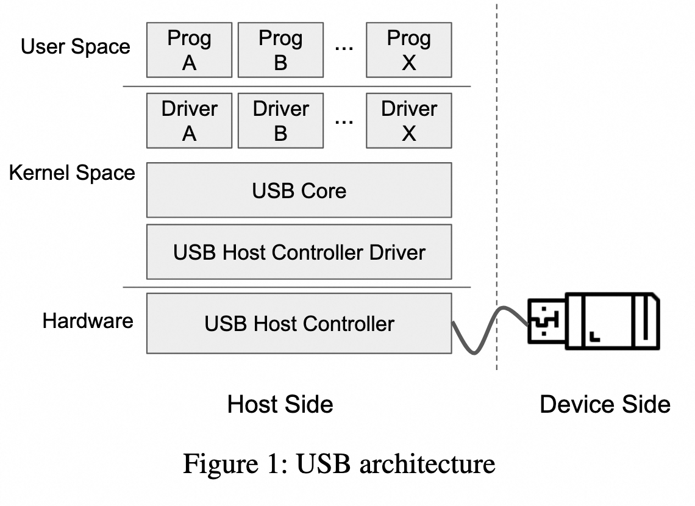
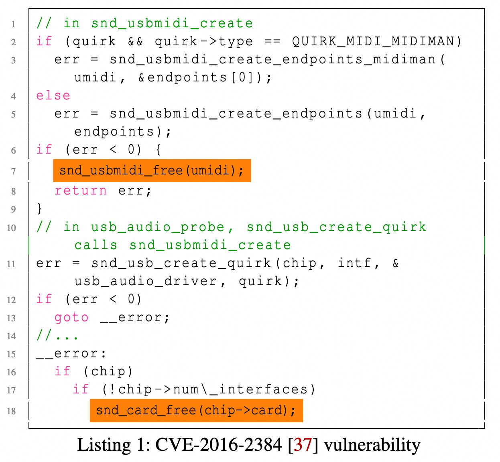
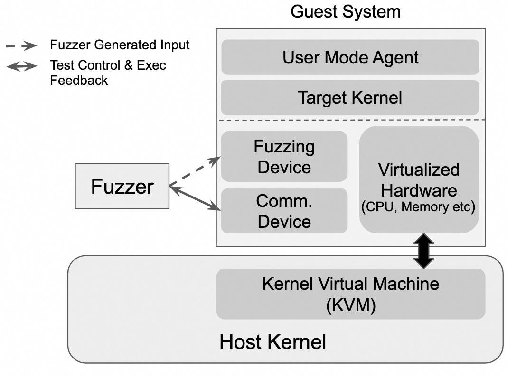
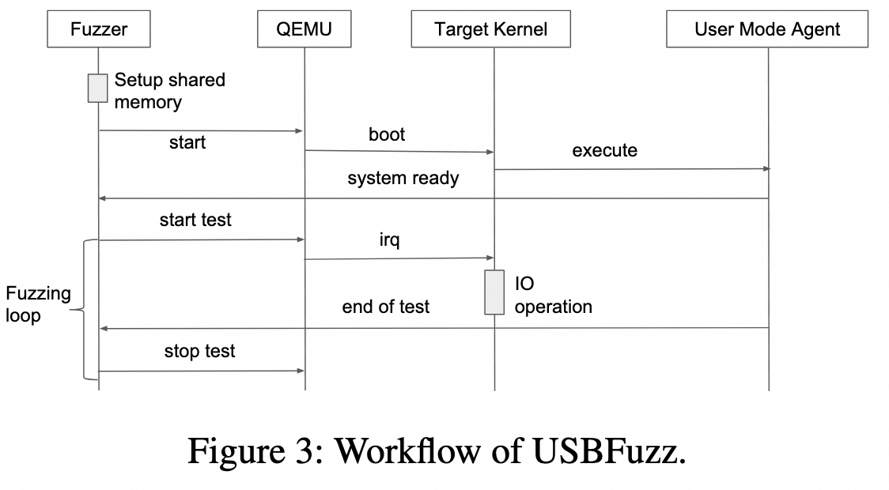
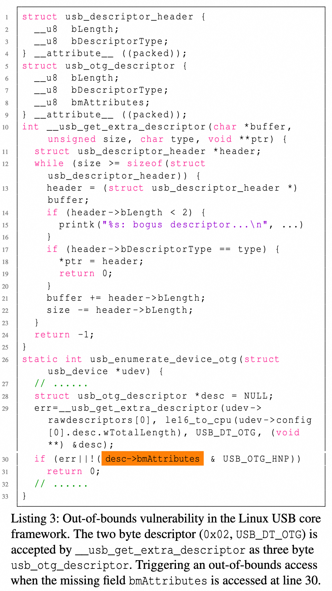
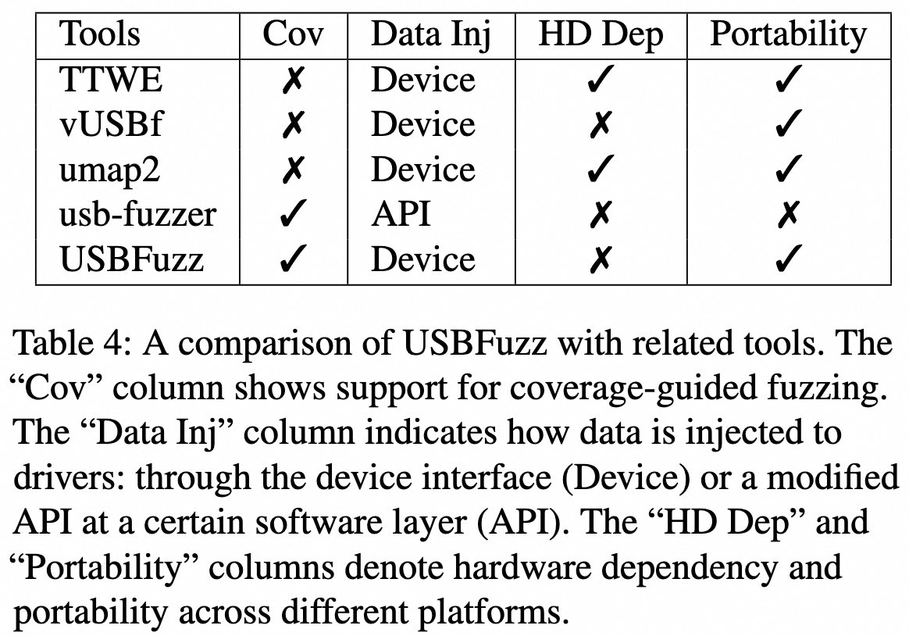

# USBFuzz: A Framework for Fuzzing USB Drivers by Device Emulation

* [paper](https://www.usenix.org/system/files/sec20-peng_0.pdf)
* [github](https://github.com/HexHive/USBFuzz)

## 摘要

通用串行总线（USB）用于将外部设备连接至主机。此接口使操作系统内核及设备驱动面临恶意设备攻击的风险。遗憾的是，内核与驱动在开发时遵循了一种默认信任所有连接设备的安全模型。驱动程序设计初衷是应对硬件故障，而非抵御恶意攻击。同样，对驱动程序进行安全测试颇具挑战，因输入需跨越硬件与软件的界限。尽管模糊测试是最广泛应用的漏洞发现技术，依赖于向程序提供随机数据，但将其应用于设备驱动面临难题，因需克服硬件与软件间的屏障，并向测试中的驱动提供随机设备数据。

我们提出了 USBFuzz，一个便携、灵活且模块化的模糊测试框架，用于测试 USB 驱动程序。**其核心在于使用一个<u>软件模拟的</u>USB 设备，在驱动执行 I/O 操作时为其提供随机的设备数据**。由于该模拟 USB 设备在设备级别运行，因此将其移植到其他平台非常直接。通过 USBFuzz 框架，我们实现了以下三种测试方法：
 (i) 在 Linux 内核的各类 USB 驱动（包括 USB 核心、USB 声音和网络驱动）中应用 **覆盖率引导**的模糊测试；
 (ii) 在 FreeBSD、MacOS 和 Windows 上通过 跨平台传播（由 Linux 输入作为种子）进行 基础模糊测试；
 (iii) 针对一个 USB 网络摄像头驱动程序进行 聚焦模糊测试。
USBFuzz 共发现了 26 个新漏洞，其中包括 Linux 各个子系统（USB 核心、USB 声音和网络）中 16 个具有高安全影响的内存漏洞，FreeBSD 中 1 个漏洞，MacOS 中 3 个漏洞（其中两个导致意外重启，一个导致系统冻结），以及 Windows 8 和 Windows 10 中 4 个漏洞（导致蓝屏死机），此外还包括 Linux USB 主机控制器驱动中的 1 个漏洞 和一个 USB 摄像头驱动中的 1 个漏洞。针对 Linux 漏洞，我们修复并提交了 11 个漏洞，并获得了 10 个 CVE 编号。

## 一、简介

通用串行总线（USB）提供了一种易于使用的接口，用于将外部设备连接到主机计算机。USB 的广泛应用得益于其多样化的功能，包括对宽广带宽范围的支持、即插即用功能以及供电能力。USB 几乎无处不在，它在商用个人电脑、智能电视和手机等设备上都得到了支持。此外，软件技术如 USBIP [46] 和 usbredir [43] 允许一个机器上的 USB 设备远程连接到另一台机器。

USB 的普遍性和外部可访问性导致了巨大的攻击面，可以从不同类别进行探索：(i) USB 设备的完全访问权限（例如著名的“自动运行”攻击，允许 USB 存储设备在插入时启动程序），(ii) 利用物理设计缺陷的电气攻击 [65]，以及 (iii) 利用主机操作系统中的软件漏洞 [29]。针对完全访问权限的攻击可以通过重新配置操作系统并采用定制化防御措施（例如禁用“自动运行”、GoodUSB [58]、USBFilter [60] 或 USBGuard [45]）来解决，而硬件攻击则可以通过改进接口设计来防范。我们仅专注于主机操作系统中的软件漏洞，因为这些问题难以发现且具有高安全影响。

类似于从文件中读取输入的用户空间程序，设备驱动程序从连接的设备中获取输入。如果无法正确处理意外输入，就会导致内存漏洞（如缓冲区溢出、释放后使用或双重释放错误），并造成灾难性后果。由于设备驱动程序直接在内核或特权进程中运行，驱动程序的缺陷具有严重的安全性。历史上，由于硬件被认为是可信的且难以被篡改，这一攻击面并未受到应有的关注。主机端软件在实现时隐含地信任设备，而未意识到潜在的攻击威胁。此外，由于从设备端提供意外输入的难度较大，驱动程序也未能进行全面测试。如今，借助可编程的USB设备（如FaceDancer [13]），利用USB设备驱动程序中的漏洞发起攻击变得轻而易举。

遗憾的是，现有的防御机制在保护有漏洞的驱动程序免受恶意USB设备侵害方面十分有限。基于数据包过滤的机制（如LBM [59]）可以保护主机系统免受已知攻击的侵害，但可能无法防御未知攻击。其他缓解措施（如Cinch [1]）则提议通过在隔离环境中运行有漏洞的设备驱动程序来保护主机操作系统免受利用攻击。然而，由于这些缓解措施本身的复杂性和对硬件的依赖性，它们并未被实际部署。

防御机制的最佳替代方案是发现并修复漏洞。模糊测试（Fuzzing）是一种通过向软件输入随机生成的数据来广泛寻找漏洞的自动化软件测试技术。覆盖引导的模糊测试（Coverage-guided fuzzing），作为最先进的模糊测试技术，有效地发现用户空间程序中的漏洞[33,73]。近年来，研究人员开发了多种内核模糊测试工具（例如syzkaller[16]、TriforceAFL[19]、trinity[22]、DIFUZE[10]、kAFL[48]或RAZZER[21]），用于对系统调用参数进行模糊测试，并在流行的操作系统内核中发现了许多漏洞[35,39,40,52,53,74]。

然而，**对设备驱动程序进行模糊测试颇具挑战性，原因在于难以从设备提供随机输入**。专用的可编程硬件设备（如FaceDancer[13]）成本高昂且不具备扩展性，因为一个设备只能用于模糊测试一个目标。更重要的是，由于每次测试都需要进行物理操作（如连接和断开设备），在真实硬件上实现模糊测试的自动化十分困难。一些解决方案对内核进行了调整。例如，**内核模糊测试工具syzkaller[16]包含一个usb-fuzzer[14]扩展，通过扩展的系统调用向USB栈注入随机数据。PeriScope[50]则在DMA和MMIO接口处注入随机数据。这些方法不具备可移植性，与特定的操作系统和内核版本紧密耦合，且需要深入理解硬件规范及其在内核中的实现**。此外，由于它们在IO栈的某一特定层注入随机数据，某些代码路径无法被测试，导致未测试代码中可能存在漏洞（如第6.2节所示）。vUSBf[49]通过重新利用网络化的USB接口[43]向驱动程序注入随机数据，缓解了理解硬件规范的需求。然而，vUSBf与内核的耦合度过低，仅支持“哑”模糊测试，而无法收集覆盖率反馈。

我们引入了USBFuzz，一个廉价、便携、灵活且模块化的USB模糊测试框架。**USBFuzz的核心在于使用一个模拟的USB设备，向虚拟化内核提供模糊测试输入。在每次迭代中，模糊器通过虚拟连接到目标系统的USB设备执行测试，当驱动程序进行IO操作时，将模糊器生成的输入转发给待测驱动。虚拟化内核中可选的辅助设备允许外部模糊器与模糊目标高效同步覆盖率map**。

由于其模块化设计和便携式设备模拟，USBFuzz可以根据不同环境需求定制，用于模糊测试各种USB驱动程序。我们支持在Linux内核中进行覆盖引导的模糊测试，或在尚未支持覆盖率收集的内核中进行“哑”模糊测试。类似地，USBFuzz既可以进行广域模糊测试，也可以专注于特定驱动程序。**广域模糊测试覆盖完整的USB子系统及广泛范围的驱动程序，注重广度而非深度。聚焦模糊测试则针对某个特定驱动程序的功能（例如网络摄像头驱动）**。

借助USBFuzz框架，我们针对Linux内核中广泛范围的USB驱动程序应用了覆盖引导的模糊测试——这一最先进的模糊测试技术。在九个近期的Linux内核版本中（这些版本已经经过了大量模糊测试），我们在我们的基准研究中发现了16个新的高安全影响的内存漏洞，以及20个已知的漏洞。复用在模糊测试Linux驱动程序时生成的种子，我们借助USBFuzz对FreeBSD、MacOS和Windows上的USB驱动程序进行了模糊测试。截至目前，我们在FreeBSD中发现了一个漏洞，在MacOS中发现了三个漏洞（其中两个导致意外重启，一个导致系统冻结），以及在Windows中发现了四个漏洞（导致蓝屏）。我们将USBFuzz应用于特定的USB网络摄像头驱动程序，并在Linux主机控制器驱动程序中发现了一个漏洞。最后，我们在一个Linux USB摄像头驱动程序中发现了一个新的漏洞。总计，我们发现了26个新漏洞和20个已知漏洞。本文的主要贡献如下：
1. USBFuzz的设计与实现：一个 portable（便携）、modular（模块化）且flexible（灵活）的框架，用于对操作系统内核中的USB驱动程序进行模糊测试。USBFuzz可以根据目标操作系统的需求进行定制，支持覆盖引导的模糊测试或“哑”模糊测试，聚焦不同的测试重点。我们的原型支持Linux、FreeBSD、MacOS和Windows。
2. 针对Linux内核的驱动程序聚焦覆盖率收集机制的设计与实现：**该机制允许在中断上下文中进行覆盖率收集**。
3. 在我们的评估中，我们在Linux、FreeBSD、MacOS和Windows中发现了26个新漏洞。在FreeBSD、Windows和MacOS中发现漏洞，凸显了我们跨系统移植工作的强大效果，同时也证明了USBFuzz的便携性。

## 二、背景

USB 架构实现了一种复杂但灵活的通信协议，当主机与不可信设备通信时，该协议会带来不同的安全风险。模糊测试（fuzzing）是一种常用的用于发现软件安全漏洞的技术，但现有的最先进的模糊测试工具并未专门针对外设驱动程序中的缺陷进行设计。

### 2.1 USB 架构

通用串行总线（Universal Serial Bus，USB）作为一种行业标准，被引入用于连接商品计算设备及其外设设备。自其诞生以来，USB 标准经历了多个版本（1.x、2.0、3.x）的演进，带宽不断增加以适应更广泛的应用需求。目前已有超过 10,000 种不同的 USB 设备 [54]。**USB 采用主从架构，分为单一的主机端和潜在的多个设备端**。设备端作为从设备，实现其自身的功能。主机端则作为主设备，管理所有与其连接的设备。**所有数据通信都必须由主机端发起，设备端未经主机端请求不得发送数据**。

USB 架构的最显著特点是允许一个主机管理不同类型设备。USB 标准定义了一组每种 USB 设备都必须响应的请求，其中最重要的是设备描述符（包含供应商和产品 ID）和配置描述符（包含设备的功能定义和通信要求），以便主机端软件可以根据这些描述符使用不同的驱动程序为不同设备服务。

**主机端采用分层架构，基于硬件的主机控制器（见[图1](image/figure-1.png)）提供了物理接口（使用根集线器组件），并支持多设备访问。主机控制器驱动程序为访问物理接口提供了一个硬件无关的抽象层。在主机控制器驱动程序之上的 USB 核心层负责为连接的设备选择合适的驱动程序，并提供与 USB 设备通信的核心例程。针对各个 USB 设备的驱动程序（位于 USB 核心之上）首先根据提供的描述符初始化设备，然后与主机 OS 的其他子系统进行交互。用户空间程序使用各内核子系统提供的 API 与 USB 设备进行通信**。

USB 驱动程序由两部分组成：(i) 初始化驱动的 probe 例程，以及 (ii) 与主机 OS 的其他子系统（如音频、网络或存储）进行交互的功能例程，并在设备拔出时注销驱动程序。**现有的 USB 模糊测试工具仅专注于 probe 例程，忽略了其他功能例程，因为 probe 函数在设备插入时会自动调用，而其他功能例程通常由用户空间程序驱动**。

### 2.2 USB 安全风险

USB 接口暴露了从外接外设访问内核的通道，因此构成了一个攻击面。近年来，已设计出多种基于 USB 的攻击手段，旨在破坏计算机系统的安全性。我们对现有的基于 USB 的攻击进行了分类，如下所示：
1. C1. 针对隐式信任的攻击：作为硬件接口，操作系统和 USB 标准都默认信任连接的设备。然而，一系列基于 USB 的攻击（如 [9, 36, 61]）通过重新编程设备固件，使其看似普通的 USB 闪存驱动器，却能够执行额外任务，例如键盘记录（BadUSB [27]）、注入按键和鼠标动作、安装恶意软件、窃取敏感信息（USB Rubber Ducky [6]）、安装后门程序，或覆盖 DNS 设置（USBDriveby [23]）。
2. C2. 电气攻击：在此类攻击中，攻击者利用 USB 电缆中的电源线（Vbus）向主机发送高压信号，从而对主机硬件造成物理损坏。USBKiller [65] 是此类攻击中最为人熟知的例子。
3. C3. 针对软件漏洞的攻击。攻击者利用 USB 栈或设备驱动程序中的漏洞。例如，CVE-2016-2384 [37] 报告的 Linux 内核漏洞中，一个恶意的 USB-MIDI [2] 设备（具有错误的端点）可以触发双重释放错误（一个出现在第 7 行，另一个出现在第 18 行，当包含对象 chip->card 被释放时）。与 [代码1](image/listing-1.png) 类似的内存错误可能具有灾难性后果，因为设备驱动程序以特权模式运行（要么在内核空间中，要么作为特权进程），从而允许攻击者完全控制主机系统。针对上述漏洞的利用可实现完全由攻击者控制的代码执行 [29]。由于连接到 USB 的设备可能在主机系统看来表现为任意设备，因此 USB 接口将攻击者控制的输入暴露给任何通过 USB 驱动程序连接到内核的服务或子系统。类似的漏洞利用也针对 Windows 的存储系统 [31]

**这些安全风险源于一个基本假设：硬件难以修改且可以被信任**。一方面，由于 USB 将硬件设备连接到计算机系统，安全问题既不是 USB 标准设计的一部分，也不是主机端软件实现的考虑因素，因此针对信任模型（C1）和电气攻击（C2）成为了可能。另一方面，**设备驱动程序的开发人员往往会对从设备侧读取的数据做出假设，例如描述符始终是合法的**。这种假设导致了从设备侧读取到意外数据时可能会被不当处理的问题。即使开发者试图处理意外值，正如最近披露的漏洞所展示的 [15]，由于在开发过程中难以提供详尽的异常数据，代码通常未经充分测试。换句话说，编写设备驱动程序时，程序员可以推测可能会遇到意外输入，但由于无法创建提供此类错误输入的任意硬件，结果导致错误处理代码路径未经充分测试。

然而，最近的研究从根本上改变了这一基本假设。某些 USB 设备固件存在漏洞，允许攻击者控制设备和总线上发送的消息。此外，随着近年来无线 USB [70] 和 USBIP [46] 等技术的采用，USB 接口暴露给了网络设备，使得基于 USB 的攻击变得更加容易，转变为网络攻击。最后，可重编程的 USB 设备（例如 FaceDancer [13]）允许在软件中实现任意 USB 设备。

### 2.3 针对 USB 接口的模糊测试

鉴于这些安全风险，已经出现了几款专门针对 USB 接口的模糊测试工具。本节将简要分析现有的这些模糊测试工具，并以此推动我们的工作。

第一代 USB 模糊测试工具主要针对设备级别。vUSBf [49] 使用了一种网络化的 USB 接口（usbredir [43]），而 umap2 [18] 则借助可编程硬件（FaceDancer [13]）将随机的硬件输入注入到主机的 USB 栈中。尽管这些工具易于移植到其他操作系统上，但它们属于简单的模糊测试工具，无法利用覆盖率信息来指导输入的变异，因此效率较低。

最近的 usb-fuzzer [14]（基于内核模糊测试工具 syzkaller [16] 的扩展）结合了自定义的软件实现主机控制器和覆盖率引导的模糊测试技术，将模糊输入注入到 Linux 内核的 I/O 栈中。通过采用覆盖率引导的模糊测试技术， usb-fuzzer 已经发现了 Linux 内核 USB 栈中的许多漏洞 [14]。然而， usb-fuzzer 与 Linux 内核紧密耦合，导致其难以移植到其他操作系统上。所有现有的 USB 模糊测试工具仅专注于驱动的探测例程（probe routines），而不支持对驱动中剩余的功能例程进行模糊测试。

现有 USB 模糊测试工具的现状促使我们构建一个灵活且模块化的 USB 模糊测试框架，使其能够移植到不同的环境中，并且可以轻松定制以应用覆盖率引导的模糊测试（在尚未支持覆盖率收集的内核中）或简单的模糊测试，同时允许对广泛的探测例程进行模糊测试，或者专注于特定驱动的功能例程。

## 三、威胁模型

我们的威胁模型假设攻击者通过USB接口攻击计算机系统，利用主机软件栈中的软件漏洞实现目标，例如特权提升、代码执行或拒绝服务。攻击通过USB总线发送预先准备好的字节序列来实施，具体方式包括将恶意USB设备连接到物理USB接口，或劫持网络化USB接口的连接（例如在USBIP [46]或usbredir [43]中）。

## 四、设计

设备驱动程序同时处理来自设备端和内核的输入。内核通常是可信的，但设备可能会提供恶意输入。USBFuzz的目标是通过反复测试USB驱动程序来发现其中的漏洞，**不使用从设备端读取的实际输入，而是通过我们的模糊测试工具生成随机输入**。**关键挑战在于如何将模糊测试生成的输入传递给驱动程序代码**。在介绍我们的方法之前，我们先讨论现有的方法及其各自的缺点。

**方法一：使用专用硬件**。一个直接的解决方案是使用专用硬件，在驱动程序请求时返回可定制的数据。对于USB设备而言，FaceDancer [13] 是现成的解决方案，并且已被umap2 [18] 使用。这种方法遵循真实硬件中的数据路径，因此能够覆盖完整的代码路径，并生成可重现的输入。然而，这种基于硬件的方法存在几个缺点。首先，专用硬件部分会产生硬件成本。虽然单个FaceDancer的价格仅为85美元，不算特别昂贵，但模糊测试活动通常需要在10到1000个核心上运行，导致硬件成本显著增加。类似地，在服务器中心将物理设备连接到模糊测试集群也会带来额外的复杂性。其次，基于硬件的方法不具备扩展性，因为一个设备一次只能针对一个目标进行模糊测试。**硬件成本和缺乏扩展性使得这种方法变得昂贵**。最后，这种方法难以自动化，因为每次测试迭代都需要进行硬件操作（例如，将设备连接到目标系统或从目标系统断开）。

**方法二：在I/O栈中进行数据注入**。这种方法通过修改内核，在I/O栈的某个特定层向驱动程序注入模糊测试数据。例如，syzkaller [16] 中的**usb-fuzzer通过一个软件主机控制器（dummy hcd）将模糊数据注入到USB栈中，从而替代硬件主机控制器的驱动程序**。PeriScope [50] 则通过**修改MMIO（内存映射I/O）和DMA（直接内存访问）接口，向驱动程序注入模糊测试生成的输入**。与基于硬件的方法相比，这种方法具有成本低廉、可扩展性强且能够自动化的特点，以适应模糊测试的需求。然而，这种解决方案在可移植性方面存在困难，因为其实现与特定的内核层（有时甚至是内核版本）紧密结合。此外，它需要对硬件规格及其在内核中的实现有深入的理解。由于输入是在I/O栈的特定层注入的，这种方法无法对代码路径进行端到端的测试，因此可能会遗漏未经过测试的代码路径中的漏洞（如我们在第6.4节所示）。

**设计目标**。在评估上述方法后，我们提出了以下设计目标：
1. G1. 低成本：解决方案应具有成本效益且与硬件无关。
2. G2. 可移植性：解决方案应能够移植到其他操作系统和平台上，避免与特定内核版本深度耦合。
3. G3. 最少知识要求：驱动程序、USB设备与其他系统组件之间的交互复杂且可能因设备而异。解决方案应尽量减少对USB标准和设备的深入了解需求。

**USBFuzz的方法**。从整体上看，USBFuzz通过模拟USB设备向设备驱动程序提供随机输入。目标内核（运行被测试设备驱动程序的内核）在虚拟机（VM）中运行，而模拟的USB设备被集成到虚拟机中。虚拟机中的虚拟机监视器（hypervisor）会透明地将客户内核驱动程序的读/写请求转发到模拟设备（而非真实硬件），且无需对目标内核的USB系统进行任何修改。另一方面，模拟的USB设备使用模糊测试生成的输入来响应内核的IO请求，而不是遵循设备的规范。

作为一种基于软件的解决方案，**模拟设备不会产生任何硬件成本**，且具有高度可扩展性。我们可以通过轻松运行多个虚拟机实例来并行模糊测试多个目标内核实例，从而满足 G1——低成本。由于我们的解决方案实现了模拟硬件设备，因此它与特定内核或版本解耦。一种**模拟设备的实现可以用于为不同平台上运行的不同内核上的设备驱动程序提供随机输入**，从而满足 G2——可移植性。此外，**由于该解决方案在设备级别工作，无需了解内核中的软件层知识**。基于成熟的模拟器（如 QEMU），开发人员只需理解数据通信协议即可，从而满足 G3——最少知识要求。

基于以上目标，我们设计了 USBFuzz，这是一个模块化的框架，用于模糊测试 USB 设备驱动程序。[图2](image/figure-2.png) 展示了 USBFuzz 的整体设计。以下列表总结了其主要组件的高级功能：

**模糊测试器（Fuzzer）**：模糊测试器作为主机操作系统上的**用户空间进程**运行。该组件主要负责以下任务：(i) 对传递给目标内核设备驱动程序的数据进行变异；(ii) 监控和控制测试执行过程。

**虚拟机系统（Guest System）**：虚拟机系统是一个运行目标内核的虚拟机（包含待测试的设备驱动程序）。它为执行虚拟机代码提供支持，同时模拟模糊测试设备以及支持通信的设备。

**目标内核（Target Kernel）**：目标内核包含待测试的代码（尤其是设备驱动程序），并运行在虚拟机系统中。当内核中的驱动程序处理从模拟模糊测试设备读取的数据时，这些驱动程序就会被测试。

**模糊测试设备（Fuzzing Device）**：模糊测试设备是虚拟机系统中的一个模拟 USB 设备。它通过模拟的 USB 接口与虚拟机系统连接。然而，与根据硬件规格提供数据不同，它会在目标内核对其执行 I/O 操作时，将模糊测试器生成的数据转发给主机（如第 4.1 节所示）。

**通信设备（Communication Device）**：通信设备是虚拟机系统中的一个模拟设备，旨在促进虚拟机系统与模糊测试器组件之间的通信。它共享一个内存区域，并在模糊测试器组件与虚拟机系统之间提供同步通道。此外，共享的内存区域还用于在基于覆盖率的模糊测试中共享覆盖率信息（如第 4.2 节所示）。

**用户模式代理（User Mode Agent）**：这是一个在虚拟机系统中以守护进程形式运行的用户空间程序。它负责监控测试执行过程（如第 4.3 节所示）。可选地，在聚焦模糊测试期间，它可以被定制以在模糊测试设备上执行额外操作，从而触发驱动程序的功能例程（如第 6.4 节所示）。

USBFuzz 的模块化设计，结合模拟的模糊测试设备，使得在不同操作系统上对 USB 设备驱动进行模糊测试成为可能，并且可以根据目标系统灵活配置不同的模糊测试技术。例如，可以使用基于覆盖率的模糊测试来利用反馈机制，或者采用无反馈的“哑”模糊测试（dumb fuzzing）来探索某些提供的 USB traces（哑模糊测试在没有覆盖率信息的情况下非常有用）。在这项工作中，我们对 Linux 内核应用了覆盖率导向的模糊测试（如第 4.4 节所述），并利用从 Linux 模糊测试中生成的输入作为种子，对 FreeBSD、MacOS 和 Windows 进行了交叉授粉式的哑模糊测试（如第 4.5 节所示）。

### 4.1 提供模糊测试硬件输入

我们的输入生成组件对 AFL 进行了扩展，AFL 是目前最受欢迎的基于覆盖率的突变模糊测试引擎之一。AFL [72] 使用文件来传递模糊测试生成的输入与目标程序之间的通信内容。模糊测试设备会根据 USB 设备驱动程序的读取请求，返回文件中的内容。

如 § 2.1 所述，当 USB 设备连接到计算机时，USB 驱动框架会读取设备描述符和配置描述符，并使用相应的驱动程序与设备进行交互。然而，**根据 USB 堆栈的实现方式不同，设备描述符和配置描述符可能会被多次读取（例如，Linux 内核会在设置 USB 设备地址之前和之后分别读取设备描述符）**。为了提高模糊测试的效率，并考虑到与简单的用户空间模糊测试相比，吞吐量相对较低（见 § 6.3），我们对这两个请求进行了独立处理：在模糊测试设备初始化时，它们会从一个独立的文件（或模糊测试生成的文件）中加载一次，之后当驱动框架接收到相应的读取请求时，会返回相同的描述符。其余的所有请求则会从当前模糊测试生成文件的位置读取字节，直到文件中没有数据可用为止；如果数据不可用，设备会返回无数据。**需要注意的是，我们使用从设备侧读取的数据对设备驱动程序进行模糊测试，而对设备的写入操作会被忽略**。

这种设计使得模糊测试既可以是广域的，也可以是聚焦的。**通过允许模糊测试引擎对设备描述符和配置描述符进行变异（从模糊测试生成的文件中加载它们），我们可以对通用的USB驱动框架以及适用于各种设备的驱动程序进行广域模糊测试；而通过将设备描述符和配置描述符固定到某个特定设备或设备类别（从单独的配置文件中加载它们），我们可以专注于对单个驱动程序进行模糊测试（聚焦模糊测试）**。这种灵活性支持了不同的测试场景，例如可以在USB驱动框架和所有已部署的USB设备驱动程序中寻找漏洞，或者在开发阶段用于测试某个特定USB设备的驱动程序。我们在第6.4节展示了针对USB摄像头驱动程序的聚焦模糊测试。

### 4.2 模糊器 – 客户机系统通信

与所有现有的模糊器一样，USBFuzz中的模糊器组件需要与目标代码通信，以实现对测试的控制、收集覆盖率信息等目的。如[图2](image/figure-2.png)所示，模糊器组件运行在客户机系统之外，无法直接获取目标系统的信息。通信设备旨在促进模糊器与客户机系统之间的通信。

在覆盖率引导的模糊器中，覆盖率信息需要从客户机系统传递给模糊器。为了避免重复的内存复制操作，我们**使用QEMU通信设备将位图（模糊器进程中的一个内存区域）映射到客户机系统中**。一旦客户机系统完全初始化，位图将被映射到目标内核的虚拟内存空间，这样目标内核中的插桩代码可以将覆盖率信息写入其中。由于位图在模糊器进程中也是一个共享内存区域，模糊器组件可以立即访问这些信息，从而避免了内存复制操作。

此外，**模糊器组件需要在每次模糊测试迭代中与客户机系统中运行的用户模式代理进行同步**（见第4.3节）。为了减少繁重的进程间通信（IPC）操作，我们在通信设备中添加了一个控制通道，以便用户模式代理和模糊器组件之间的同步更加高效。

### 4.3 测试执行与监控

现有内核模糊测试工具通过目标内核的进程抽象来执行测试。它们遵循一种迭代模式，即对于每次测试，创建一个进程，执行、监控该进程，并等待进程终止以检测测试结束。在USBFuzz中，由于测试是通过模糊测试设备进行的，因此**在每次迭代中，测试会从虚拟连接模糊测试设备（模拟的模糊测试设备）到客户机系统开始。随后，内核会收到一个针对新USB设备的请求，由内核设备管理的低端部分处理，加载必要的驱动程序并初始化设备状态**。然而，如果没有内核的支持（例如通过类似于exit系统调用的进程抽象），监控内核与设备交互过程中的执行状态（例如是否触发了内核漏洞）会面临挑战。

在USBFuzz中，**我们采用了一种经验方法来监控内核对测试的执行情况：通过检查内核的日志消息**。例如，当一个USB设备连接到客户机系统时，如果内核能够处理设备的输入，内核会记录包含一组关键词的日志消息，这些关键词表明与设备交互的成功或失败。否则，如果内核无法处理设备的输入，内核可能会冻结或指示触发了某个漏洞。**USBFuzz的用户模式代理组件会从虚拟化的目标系统内部监控测试的执行状态，并与模糊器组件同步其状态，以便记录触发漏洞的输入并继续进入下一次迭代**。

为了避免每次迭代都重新启动客户机系统，USBFuzz提供了一种持久化模糊测试技术，类似于其他内核模糊测试工具（如syzkaller [16]、TriforceAFL [19]、trinity [22]或kAFL [48]）。在这种技术中，运行中的目标内核会被重复用于多次测试，直到内核冻结，此时模糊器会自动重启内核。

### 4.4 Linux上的覆盖率引导模糊测试

到目前为止，USBFuzz框架为不同操作系统上的USB设备驱动模糊测试提供了基本支持。然而，为了实现覆盖率引导的模糊测试，系统必须收集执行覆盖率。覆盖率引导的模糊器会跟踪测试输入触发的代码覆盖率，并对那些能够触发新代码路径的有趣输入进行变异。

对于内核空间中的驱动代码，覆盖率收集是一个具有挑战性的任务。一方面，**设备侧的输入可能会在不同的上下文中触发代码执行**，因为驱动程序可能包含在中断和内核线程中运行的代码。另一方面，**由于内核执行多任务处理，单一线程中执行的代码可能会被其他与当前输入无关的代码执行所抢占**，例如由定时器中断或任务调度触发的代码执行。据我们所知，Linux内核仅通过kcov [67]的静态插桩支持覆盖率收集。然而，**kcov的覆盖率收集仅限于单个进程，忽略了中断上下文和内核线程**。为了在Linux内核的USB设备驱动中实现覆盖率引导的模糊测试，我们**扩展了kcov的静态插桩，并设计了一个类似AFL的边覆盖率方案**。为了在不同上下文中收集覆盖率，（i）将之前执行的代码块保存在每个代码执行线程（中断或内核线程）的上下文中，从而避免由于代码执行流被抢占而导致的边转换混淆；（ii）将插桩限制在与USB相关的代码中：USB核心、主机控制器驱动程序以及USB设备驱动程序。

## 五、实现细节

USBFuzz框架的实现扩展了多个开源组件，包括QEMU [4, 57]（我们在其中实现通信设备和模拟的USB设备）、AFL [72]（我们对其进行修改以针对USB设备进行测试，通过从虚拟化内核收集覆盖率信息并与我们的用户模式代理交互）以及kcov [67]（我们扩展了它以跟踪整个USB栈的边覆盖率，包括中断上下文）。我们从头开始实现用户模式代理。整个系统的流程图展示了各组件之间的交互，如[图3](image/figure-3.png)所示。以下各节将详细讨论各个组件的实现细节。

**当模糊器启动时，它会为位图分配一块内存区域，并将其导出为共享内存区域，QEMU启动时会用它来初始化通信设备。目标内核启动后，用户模式代理运行并通知模糊器开始测试**。

**在模糊循环的每一次迭代中，模糊器通过虚拟连接模糊设备到目标系统来启动测试。随着模糊设备的连接，内核开始与设备进行交互并加载相应的USB驱动程序。加载的USB驱动程序在与模糊设备交互时接受模糊输入进行测试。用户模式代理通过扫描内核日志监控执行情况，并将测试结果通知模糊器。模糊器通过虚拟断开模糊设备与目标系统的连接来完成测试**。

### 5.1 通信设备

USBFuzz框架中的通信设备实现了模糊器组件与目标系统之间的轻量级通信，包括共享位图区域以及用户模式代理与模糊器组件之间的同步。**通信设备的实现基于 QEMU 中的 IVSHMEM（虚拟机间共享内存）设备** [56]，这是一种在 QEMU 中模拟的 PCI 设备。模糊器组件的共享内存区域会被导出到 guest 系统中，作为 IVSHMEM 设备的内存区域，并映射到 guest 系统的虚拟内存空间中。**通过一个寄存器（BAR2，即内存或 I/O 空间的基址寄存器），实现了模糊器组件与用户模式代理之间的通信通道**。

> TODO: 了解一下IVSHMEM[56]。

### 5.2 模糊器

**模糊器通过两条管道与虚拟机进行通信：一条控制管道和一条状态管道。模糊器通过控制管道向虚拟机发送消息以启动测试，并通过状态管道接收虚拟机的执行状态信息。在虚拟机一侧，注册了两个回调函数以实现与模糊器组件的交互。其中一个回调函数在接收到控制管道的新消息时，会将模糊器生成的输入附加到一个新的模糊设备实例上，并将其连接到虚拟机监视器（hypervisor）。另一个回调函数则在通过通信设备接收到用户模式代理的执行状态信息时，断开模糊设备与虚拟机监视器的连接，并通过状态管道将执行状态信息转发给模糊器。**

### 5.3 模糊测试设备

模糊测试设备是USBFuzz框架中的关键组件，用于实现对内核硬件输入空间的模糊测试。它在QEMU设备仿真框架中被实现为一个虚拟的USB设备，并模仿了现实场景中受攻击者控制的恶意设备。**管理程序（Hypervisors）拦截了客户机内核的所有设备读写请求。客户机操作系统内核的每一次读写操作都会被分派到仿真设备实现中注册的函数，这些函数根据硬件规范执行操作并返回数据给内核。模糊测试设备通过注册“读”函数，将生成的模糊测试数据转发给内核**。具体来说，设备驱动程序读取的字节会依次映射到模糊测试生成的输入，除了设备和配置描述符，这些描述符会单独处理（如第4.1节所述）。

### 5.4 用户模式代理

用户模式代理设计为在客户机操作系统中以守护进程方式运行，并在目标操作系统启动时自动启动。它基于内核日志监控测试执行状态，并通过通信设备将信息传递给模糊测试器。初始化完成后，它会通知模糊测试器目标内核已准备好进行测试。

在Linux和FreeBSD上，我们的用户模式代理组件监控内核日志文件（Linux上的/dev/kmsg，FreeBSD上的/dev/klog），并扫描其中的错误消息，以识别内核漏洞或测试结束的信号。如果检测到任何事件，它会通过通信设备驱动程序导出到用户空间的设备文件，通知模糊测试器停止当前迭代并进入下一步。错误消息的集合借鉴自syzkaller的报告包[44]。在Windows和MacOS上，由于内核在设备连接/断开时缺乏明确的信号，我们的用户模式代理使用固定超时（MacOS上为1秒，Windows上为5秒）来让设备完成初始化。

### 5.5 适配 Linux kcov

为了将覆盖率引导的模糊测试应用于 Linux 内核的 USB 驱动程序，我们采用静态插桩技术来收集目标内核的覆盖率信息。该实现基于已得到 Linux 内核支持的 kcov [67]，并根据我们的设计需求进行了以下修改。

USBFuzz 通过扩展 kcov 实现了类似 AFL [72] 的边覆盖率方案。我们的修改支持多线程和中断处理程序中的多条执行路径，解决了非确定性问题。每当非确定性发生时，我们会保存之前的代码块。对于进程，我们在 struct task（Linux 内核中的进程控制块数据结构）中保存 prev_loc（如 [代码2](image/listing-2.png) 所示），而对于中断处理程序，我们将 prev_loc 保存在堆栈中。每当非确定性发生时，当前的 prev_loc 会被溢出（在内核线程的 struct task 中，或在中断处理程序的堆栈中），并设置为覆盖率map中的一个明确位置，从而将非确定性问题与特定位置关联起来。当执行恢复时，溢出的 prev_loc 会被重新加载。需要注意的是，这种精心设计使我们能够跟踪中断（以及嵌套中断）的执行，并将它们的覆盖率分开记录，避免通过虚假更新污染覆盖率map。

> 疑问：这一步的目的是什么？为什么要这么做？为什么prev_loc会被溢出？等。

**插桩代码经过修改，将覆盖率信息写入通信设备的内存区域，而不是每个进程的缓冲区。我们还修改了 Linux 构建系统，以限制插桩仅针对感兴趣的部分代码**。在我们的评估中，我们将覆盖率跟踪范围限定在与 USB 子系统相关的所有内容，包括主机控制器和设备驱动程序。

## 六、评估

我们对 USBFuzz 的各个方面进行了评估。首先，我们在 Linux 内核的 USB 框架及其设备驱动程序（广域模糊测试）上对我们的基于覆盖率的模糊测试实现进行了全面评估。第 6.1 节介绍了发现的漏洞，第 6.3 节介绍了性能分析。其次，我们根据代码覆盖率和漏洞发现能力将 USBFuzz 与 syzkaller 的 usb-fuzzer 扩展进行了比较（第 6.2 节）。在第 6.4 节中，我们通过模糊测试（i）FreeBSD、MacOS 和 Windows 上的 USB 驱动程序（广域模糊测试）；（ii）一个网络摄像头驱动程序（聚焦模糊测试），展示了 USBFuzz 的灵活性。最后，我们在第 6.5 节中展示了在 Linux 内核的 USB 核心框架中发现的一个漏洞。

**硬件和软件环境。**我们在一个小型集群上执行评估，其中四个节点均运行 Ubuntu 16.04 LTS 和 KVM 超级管理程序。每个节点配备 32 GB 内存和带 Intel VT [20] 支持的 Intel i7-6700K 处理器。

**Guest OS 准备。**为了评估 FreeBSD、Windows 和 MacOS，我们使用了带有未经修改的内核和在用户空间运行的用户模式代理组件的虚拟机镜像。在评估 Linux 时，目标内核进行了以下定制：（i）我们根据第 5.5 节所述适应 kcov；（ii）我们将所有 USB 驱动程序配置为内置；（iii）我们启用了内核地址asan（KASAN）[25,26]以提高漏洞检测能力。在运行时，为了检测测试触发的异常行为，我们通过自定义内核参数[62]配置内核在出现“oops”时恐慌或打印警告。

**种子准备。**为了启动模糊测试，我们创建了一组 USB 设备描述符作为种子。我们利用 syzkaller [16] 从 Linux 内核[64]中提取的一组预期标识符（设备、供应商、产品和协议）和匹配规则，以及支持设备的规则。一个脚本将数据转换为一组包含设备和配置描述符的文件，作为模糊测试的种子。

...

### 6.5 案例研究

在本节中，我们讨论了 USBFuzz 在 Linux 内核 USB 核心框架中发现的一个新漏洞。根据 USB 标准，为了支持扩展功能，设备可以在标准描述符之外定义其他自定义描述符。由于每个描述符的长度不同，USB 标准规定描述符的前两个字节用于表示描述符的长度和类型（如[代码3](image/listing-3.png) 中的 usb_descriptor_header 所示）。所有描述符都必须遵循相同的格式。例如，OTG（USB On-The-Go，这是一个近期扩展，允许 USB 设备作为主机 [69]）描述符（如[代码3](image/listing-3.png) 中的 usb_otg_descriptor 所示）有三个字节，因此一个正确的 OTG 描述符必须以 0x03 字节开头。

描述符是从设备中读取的，因此不能被信任，必须进行清理（sanitization）。在 Linux 内核中，__usb_get_extra_descriptor 是 USB 核心驱动程序用于解析自定义描述符的函数之一。如[代码3](image/listing-3.png) 所示，该代码简单地扫描从设备侧读取的数据（缓冲区参数），并返回第一个匹配给定类型（类型参数）的描述符。

然而，当处理恶意构造的描述符时，这种实现方式存在漏洞。通过提供一个比其实际长度更短的描述符，攻击者可以触发越界内存访问。例如，一个仅包含两个字节的无效 OTG 描述符（缺少第三个字节）会被 __usb_get_extra_descriptor 接受并当作有效描述符处理。如果访问了缺失的字段（如[代码3](image/listing-3.png) 中第 30 行的 bmAttributes 读取操作），就会发生越界内存访问。

根据缺失字段的访问方式，这一漏洞可能以不同形式被利用。例如，读取缺失字段可能导致信息泄露；而向缺失字段写入数据则会破坏内存，从而为更复杂的攻击（如拒绝服务或代码执行）提供可能。尽管我们的模糊测试器（fuzzer）仅触发了越界读取问题，但越界写入也可能存在。

### 6.6 模糊测试其他外围接口

外围接口代表了一个具有挑战性的攻击面。USBFuzz 可以扩展到 QEMU 支持的其他外围接口。要在 USBFuzz 中添加对新的外围接口的支持，分析人员需要完成以下步骤：(i) 为该接口实现一个模糊测试设备，并将其读取操作适配为将模糊器生成的数据转发到待测驱动程序；(ii) 适配模糊器，使其能够通过将新模糊测试设备附加到/从虚拟机中移除来启动/停止测试；(iii) 适配用户模式代理组件，使其能够根据内核日志检测测试的结束。

SD 卡 [3] 是一个由 QEMU 良好支持的接口，并且与 USB 类似，也暴露了相同的安全威胁。SD 卡在许多商用 PC 和嵌入式设备中非常常见。我们扩展了 USBFuzz，以实现对 SD 卡驱动程序的模糊测试。实现所需的代码改动较少：编写模糊测试设备需要 1,000 行代码，适配模糊器需要 10 行代码，适配用户模式代理需要 20 行代码。

经过适配后，我们对 SD 卡接口进行了 72 小时的模糊测试。由于 SD 协议相较于 USB 协议更为简单（命令和长度固定），且驱动程序数量有限，我们在 Linux 和 Windows 上运行了多个模糊测试 campaign 后，并未发现任何漏洞。

## 七、相关工作

在本节中，我们将讨论旨在保护主机操作系统免受恶意设备攻击的相关工作。

**防御机制**。作为一种替代方法，防御机制通过阻止主动利用漏洞的行为来保护内核，而非单纯依赖于发现和修复漏洞。例如，Cinch [1] 通过在隔离的虚拟化环境中运行设备驱动程序来保护内核，将可能存在漏洞的内核驱动程序 sandbox 起来，并对内核与驱动程序之间的交互进行净化。SUD [5] 则通过将驱动程序代码隔离到用户态进程，并利用 IOMMU（输入输出内存管理单元）限制驱动程序与设备的交互，从而保护内核免受易受攻击设备驱动程序的威胁。基于规则的授权策略（如 USBGuard [45]）或 USB 防火墙（如 LBM [59] 和 USBFILTER [60]）通过阻止来自设备侧的已知恶意数据包来实现防护。

然而，Cinch [1] 和 SUD [5] 严重依赖硬件支持（如虚拟化和 IOMMU 模块），尽管它们的有效性已被验证，但由于其固有的局限性和复杂性，尚未被广泛应用。基于规则的授权策略或 USB 防火墙可能会限制设备访问，仅允许已知设备连接，或丢弃已知恶意数据包，因此它们能够防御已知攻击，但可能无法检测未知攻击。这些缓解措施保护了目标系统免受漏洞利用的威胁，但并未解决潜在的底层漏洞。
USBFuzz 则通过发现漏洞来保护目标系统，使开发者能够修复这些漏洞。

**测试设备驱动程序**。我们从多个维度对现有的设备驱动模糊测试工作进行分类：对覆盖率引导的模糊测试的支持、如何将模糊处理的设备数据注入到被测试的驱动程序中，以及在不同平台间的硬件依赖性和可移植性。对覆盖率引导的模糊测试的支持会影响漏洞发现的有效性，而将设备数据注入目标驱动程序的方法则决定了可移植性。硬件依赖性会带来额外的硬件成本。

[表4](image/table-4.png)总结了相关工作。工具如TTWE [66]和umap2 [18]依赖于物理设备，并且不支持覆盖率引导的模糊测试。虽然通过一个模拟的设备接口消除了硬件依赖性以实现数据注入，但vUSBf [49]也不支持覆盖率引导的模糊测试。usb-fuzzer [14]（一个syzkaller [16]的扩展）支持覆盖率引导的模糊测试，并通过扩展的系统调用将模糊器生成的输入传递给设备驱动程序。然而，其实现依赖于对Linux内核USB栈中模块（如gadgetfs [42]和dummy-hcd [51]模块）的修改，因此不具备可移植性。相比之下，USBFuzz能够在不同平台间移植，并集成了覆盖率反馈（只要内核导出这些信息）。

Sylvester Keil等人提出了一种基于模拟设备的WiFi驱动模糊测试工具[24]。尽管他们也模拟了一个设备，但他们的系统不支持覆盖率引导的模糊测试。他们专注于模拟单个WiFi芯片的功能（如Atheros AR5212 [28]）。由于硬件和固件是闭源的，他们通过逆向工程提取了必要的组件。相比之下，USBFuzz无需进行固件逆向工程，并支持内核中所有USB驱动程序。在并行研究中，PeriScope [50]通过修改内核中的DMA和MMIO API，提出了一种针对WiFi驱动程序的覆盖率引导模糊测试方法。IoTFuzzer [7]则专注于物联网设备固件中的内存漏洞。这些工具要么依赖于物理设备，要么无法利用覆盖率反馈来指导模糊测试。此外，AVATAR [71]平台通过协调模拟器与真实硬件的执行，实现了对驱动程序的动态分析。

**符号执行**。S2E [8]平台为QEMU增加了选择性符号执行支持。一些工具通过将设备侧读取的数据转换为符号值（例如SymDrive [47]和DDT [30]）扩展了S2E，用于分析设备驱动程序。Potus [38]同样使用符号执行向USB设备驱动程序注入错误数据。

与我们的方法类似，符号执行消除了硬件依赖性。然而，由于路径爆炸和约束求解成本，符号执行的高开销和可扩展性问题使其受到限制。进一步地，Potus由用户空间的操作控制，因此无法覆盖探测例程。相比之下，USBFuzz采用动态方法，避免了这些限制，并同时针对探测例程和功能例程进行测试。

## 八、结论

USB接口是攻击面的一种，通过它可以利用宿主操作系统中的软件漏洞。现有的USB模糊测试工具效率低下（例如简单的模糊测试工具如vUSBf），不具备可移植性（例如syzkaller usb-fuzzer），并且只能触达驱动程序的探测功能。我们提出了一种灵活且模块化的USBFuzz框架，用于模糊测试操作系统内核中的USB驱动程序。USBFuzz能够跨不同操作系统进行模糊测试，利用Linux上的覆盖率引导模糊测试，以及在尚未支持覆盖率收集的其他内核上进行简单的模糊测试。USBFuzz支持广泛的模糊测试（针对完整的USB子系统和多种USB驱动程序），同时也支持针对特定设备驱动程序的定向模糊测试。

基于USBFuzz框架，我们对Linux内核的USB栈及其驱动程序应用了覆盖率引导的模糊测试（一种最先进的模糊测试技术）。在对Linux内核的九个最新版本进行初步评估时，我们发现了16个新的内存漏洞，而这些内核此前已经经过了广泛的模糊测试。复用Linux模糊测试生成的种子数据，我们利用USBFuzz对FreeBSD、MacOS和Windows上的USB驱动程序进行了简单的模糊测试。截至目前，我们在FreeBSD上发现了一个漏洞，在MacOS上发现了三个漏洞，在Windows上发现了四个漏洞。最后，我们专注于一个USB网络摄像头驱动程序，进行了定向模糊测试，并在Linux内核的XHCI驱动中发现了另一个漏洞。迄今为止，我们已修复了11个新的漏洞，并获得了10个CVE编号。USBFuzz的代码已开源，可访问https://github.com/HexHive/USBFuzz。
